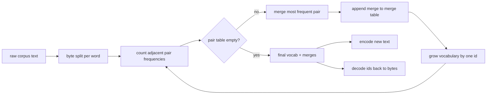
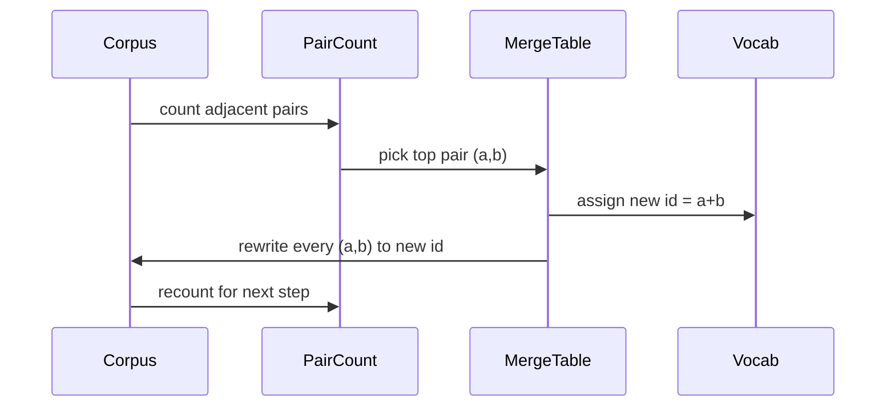

# BPE Tokenizer From Scratch

> Bytes in, ids out, ids back to the same bytes. Build the tokenizer that every modern text model still starts from.

**Type:** Build
**Languages:** Python
**Prerequisites:** Phase 04 lessons, Phase 07 transformer lessons
**Time:** ~90 minutes

## Learning Objectives
- Train a Byte-Pair Encoding vocabulary from a raw text corpus by repeatedly merging the most frequent adjacent symbol pair.
- Implement a deterministic merge table and apply it to fresh text to produce a stream of subword ids.
- Round-trip arbitrary UTF-8 input to ids and back without information loss.
- Reserve and protect special tokens (`<|endoftext|>`, `<|pad|>`) so they survive training and decoding.
- Reason about why a byte-level alphabet is the right floor for a general-purpose tokenizer.

## The frame

A language model never sees text. It sees integers. The map from a string to a list of integers and back is the tokenizer. Get this layer wrong and every loss curve in the training run is measuring the wrong thing.

The dominant family of subword tokenizers for general text models is Byte-Pair Encoding. The idea is small. Start from a known alphabet. Find the adjacent symbol pair that appears most often in the training corpus. Merge it into a new symbol. Repeat until the vocabulary reaches the target size. Encoding new text reuses the same merge list in the same order.

We will build the byte-level variant. The alphabet is the 256 raw bytes, not Unicode code points. That choice is what lets the tokenizer handle any UTF-8 input without falling back to an unknown token.

## The pipeline

The training side and the inference side share the merge table. That sharing is the contract. If you change the merge order at inference, you decode a different stream of ids.

## The byte alphabet

The first 256 ids are reserved for the raw bytes 0x00 through 0xFF. That guarantees every input string can be expressed in the vocabulary before any merge happens. After the byte block we reserve a small range for special tokens. The training loop never proposes those ids as merge targets because we keep them out of the pretokenized stream entirely.

The pretokenizer splits the corpus on whitespace and punctuation boundaries before training sees it. Without that split the BPE merge step would happily learn merges that cross word boundaries and the vocabulary fills up with whole common phrases. With the split, merges stay inside a word and the result generalizes.

## The training loop

For each training step the loop does three things. It walks every word in the corpus and counts how often each adjacent pair of current symbols appears, weighted by how often the word itself appears. It picks the pair with the highest count. It rewrites every occurrence of that pair into a single new symbol whose id is the next free slot in the vocabulary. Then it records the merge.

The cost of each step is linear in the size of the corpus expressed as a list of symbol sequences. For a million words and a target vocabulary of ten thousand ids the loop runs to completion in seconds because the symbol sequences shrink as merges land.

## Encoding fresh text

Inference does not call the merge counter. It applies the merge table in the same order it was learned. For a fresh word the encoder starts from the byte split. It scans the current sequence for the lowest-ranked merge (the earliest one that applies). It performs that merge. It scans again. The loop ends when no merge in the table applies to the current sequence.

The ordering by rank is the property that makes encoding deterministic and matches the training behavior on the same input. A merge that was learned first sits at the top of the table and gets applied first. If two merges could apply at the same position, the lower-rank one wins.

## Special tokens

Special tokens are ids that the byte stream can never produce. We reserve them by hand. Two are enough for this lesson.

- `<|endoftext|>` separates documents during pretraining. It tells the model "a new document starts here, do not let the previous one's context leak in."
- `<|pad|>` fills out short sequences so a batch can be a rectangular tensor. The loss mask hides it during training.

The encoder accepts a flag to allow special tokens in the input. With the flag off, the strings `<|endoftext|>` and `<|pad|>` get tokenized as the bytes that spell them out. With the flag on, the literal strings get mapped to their reserved ids and are not subject to any merge.

## Round-trip guarantee

Encoding then decoding must return the input bytes exactly. The decoder concatenates the byte expansion of every id in order. Since every id is either a raw byte or the concatenation of two previously known ids, the recursive expansion always terminates in raw bytes. Decoding then returns the UTF-8 string that those bytes spell.

The test suite in this lesson checks that property on an unseen sentence, on a sentence with a Unicode emoji, and on a sentence that contains a literal `<|endoftext|>` token.

## What this lesson does not do

It does not build a regex-driven pretokenizer in the style of the largest production tokenizers. The pretokenizer here is a small whitespace and punctuation split. It is enough to produce sensible merges on a small training corpus and the contract with the rest of the lesson chain stays the same. The next lesson treats the tokenizer as a black box and builds the sliding-window dataset on top of it.

It does not parallelize the pair counter. A loop in Python over a corpus of a few thousand words finishes in well under a second. For larger corpora the obvious move is to count pairs per word in parallel and reduce.

## How to read the code

`main.py` defines four objects. `BPETokenizer` holds the vocabulary, the merge table, and the special-token table. `train` is the training loop. `encode` is the inference path. `decode` is the byte concatenation. The demo at the bottom trains a small tokenizer on a built-in corpus, encodes a held-out sentence, decodes the ids back, and prints both. The tests in `code/tests/test_bpe.py` pin the round-trip property, the special-token reservation, and the merge ordering.

Run the demo. Then change the target vocabulary size in the demo from 300 to 600 and watch how the encoded length of the held-out sentence drops. That curve is the BPE compression curve.
