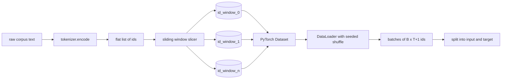
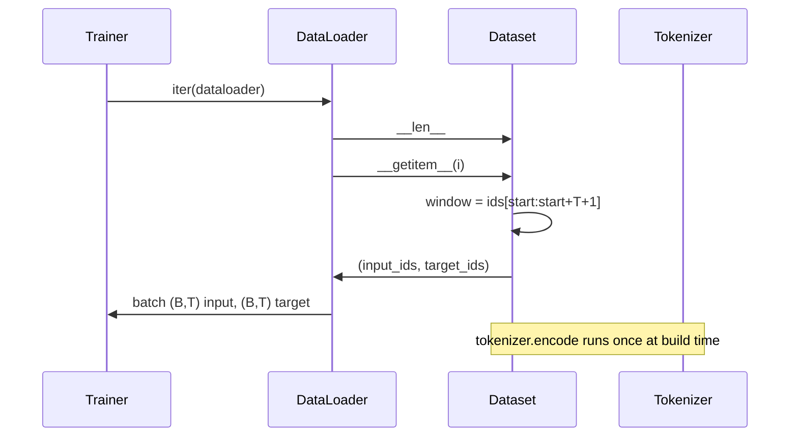

# Tokenized Dataset with Sliding Window

> A pretraining run is a function from token ids to gradients. This lesson builds the conveyor that feeds the ids in.

**Type:** Build
**Languages:** Python
**Prerequisites:** Phase 04 lessons, Phase 07 transformer lessons, Lesson 30 of this phase
**Time:** ~90 minutes

## Learning Objectives
- Convert a raw corpus into a stream of token ids by calling the tokenizer once.
- Slice the id stream into fixed-length windows with a configurable overlap stride.
- Build a PyTorch Dataset that returns input and target tensors for next-token prediction.
- Wrap the dataset in a DataLoader with a deterministic shuffle seeded per epoch.
- Reason about the trade-off between stride, redundancy, and effective dataset size.

## The frame

A pretraining run reads one batch of token ids at a time and updates the model. The shape of each batch is fixed by the training contract. For a causal language model, the batch holds `(B, T)` input ids and `(B, T)` target ids where the target is the input shifted left by one. The job of the data pipeline is to produce that contract on demand, in a deterministic and reproducible way, from a corpus that may be several gigabytes of raw text.

This lesson builds the pipeline. The tokenizer from the previous lesson turns text into a long flat list of ids. A sliding window slices that list into training examples. A custom Dataset exposes the examples as tensors. A DataLoader batches them and shuffles them with a known seed.

## The shape contract

A causal LM consumes ids of shape `(B, T)` where `B` is the batch size and `T` is the context length. The target at position `t` is the input at position `t+1`. That means every training example covers `T+1` raw ids. The window stride controls how much overlap exists between consecutive examples.

The slicer never overlaps with the boundary of the corpus. If the last window does not have enough ids to fill `T+1` positions, the slicer drops it. Padding the tail with `<|pad|>` is also a valid choice but it complicates the loss mask. For this lesson we drop.

## Why a sliding window

A pretraining corpus is one long stream of ids. If the model only saw non-overlapping windows, every training example would teach it the same `T` boundaries. Adjusting the stride moves those boundaries around so the model sees more diverse predict-next-token tasks.

A stride of `T` produces non-overlapping windows. A stride of `T // 2` produces fifty-percent overlap and doubles the effective dataset. A stride of `1` produces maximum overlap and increases the dataset by a factor of `T`. The cost is more compute per epoch. The benefit is more boundary diversity. Most pretraining runs use a stride equal to the context length because the corpus is already much larger than the model can finish in one epoch, so the boundary diversity argument is weaker.

## The Dataset class

A PyTorch Dataset has two required methods. `__len__` returns the number of examples. `__getitem__` returns one example as a pair of tensors. Our Dataset stores the encoded id stream and the stride. Indexing into it computes the start of the window on the fly so the memory cost is one copy of the id stream regardless of how many examples the stride produces.

The shift-by-one happens inside `__getitem__`. The Dataset returns `(input, target)` where `input = window[:-1]` and `target = window[1:]`. Both are PyTorch long tensors. The training loop treats them as ground truth.

## Deterministic shuffle

A DataLoader with `shuffle=True` reads from a PyTorch random generator. By passing an explicit `torch.Generator` seeded per epoch, we get the same shuffle every time the run is restarted. That property matters when you want to compare two runs that differ only in a single hyperparameter. Without a seed, two runs see the data in different orders and the loss curves diverge for reasons unrelated to the change.

The seed contract in this lesson is simple. `epoch_seed = base_seed + epoch_index`. The base seed is passed at construction. The epoch index is incremented by the trainer at the top of each epoch. A re-run with the same base seed always sees the same order in every epoch.

## Batch sampler

The default sampler in PyTorch picks indices uniformly at random with replacement disabled. That is what we want for pretraining. For finetuning on a small dataset the contract is the same. The DataLoader assembles a batch by calling `__getitem__` `B` times and stacking the results. Because every example is the same length by construction, no padding logic is needed.

The lesson keeps `num_workers=0` for simplicity. In a production run the workers parallelize the `__getitem__` calls. With our pipeline that is mostly a no-op because the work is just a slice of an in-memory tensor, but the same Dataset API supports workers cleanly.

## Counting examples

For an id stream of length `N`, a context length `T`, and a stride `S`, the number of examples is `max(0, 1 + (N - (T + 1)) // S)`. The lesson exposes that calculation as a static method on the Dataset so the trainer can compute total steps per epoch without iterating.

## What this lesson does not do

It does not stream from disk. The corpus is encoded fully in memory and held as a single tensor. For a corpus of a few million ids that is well under a hundred megabytes and is the right shape for the lesson. Disk streaming is a separate concern that plugs in by replacing the storage but keeps the Dataset contract.

It does not handle multiple documents. The corpus is treated as one continuous id stream. The next-document boundary is encoded by inserting `<|endoftext|>` ids when the corpus is built from multiple documents. The model learns to predict around the boundary.

## How to read the code

`main.py` defines two classes and one helper. `SlidingWindowDataset` is the PyTorch Dataset. `make_dataloader` returns a configured DataLoader with a seeded generator. `_encode_corpus_to_ids` is the one-shot tokenizer call. The demo at the bottom builds a small tokenizer in-process, encodes a built-in corpus, constructs the dataset and dataloader, prints one batch, and asserts the shape contract. The tests in `code/tests/test_dataset.py` pin the window count formula, the shift-by-one property, the deterministic shuffle, and the stride trade-off.

Run the demo. Then change the context length from 16 to 32 and watch how the number of examples per epoch falls. That number is your steps-per-epoch budget.
