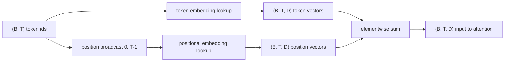
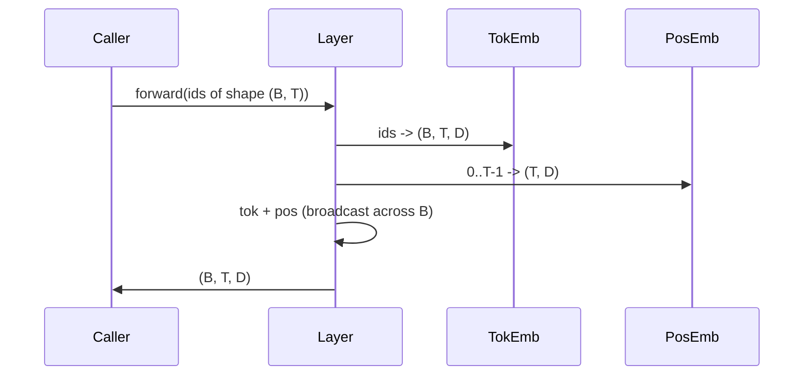

# Token and Positional Embeddings

> Ids are integers. The model wants vectors. Two lookup tables sit between them, and the choice of the positional one shapes what the model can learn.

**Type:** Build
**Languages:** Python
**Prerequisites:** Phase 04 lessons, Phase 07 transformer lessons, Lessons 30 and 31 of this phase
**Time:** ~90 minutes

## Learning Objectives
- Build a token-embedding lookup table that maps vocabulary ids to dense vectors.
- Build a learned positional-embedding lookup table indexed by position.
- Build a fixed sinusoidal positional embedding indexed by position with no parameters.
- Compose token and positional embeddings into a single input for a transformer block.
- Contrast learned and sinusoidal embeddings on length generalization and parameter count.

## The frame

The model's first contact with a token id is a row lookup in the token-embedding matrix. The matrix has one row per vocabulary id and one column per model dimension. The lookup returns a vector that the rest of the model treats as the meaning of the id. Backprop updates the rows that were used in the forward pass. Over training the geometry of those rows learns to encode similarity in directions.

Token ids alone have no order. The model needs a second signal that tells it position one is different from position seventeen. The two dominant choices for that signal are a learned positional embedding (a second lookup table, one row per position) and a fixed sinusoidal positional embedding (a math formula with no parameters). The choice has consequences. A learned table is a parameter and is bounded by the maximum context length the model was trained on. A sinusoidal table is parameter-free in theory and the formula extends to any position, but this lesson's `SinusoidalPositionalEmbedding` precomputes a fixed table at `max_context_length` and its `forward` raises past that bound; both modules therefore enforce a maximum context length here. The model may still struggle past its training length even when the table is large enough to index.

This lesson builds both and composes them with the token embedding into a single input for the next lesson's attention block.

## The shape contract

The input to the embedding stage is a batch of token ids of shape `(B, T)`. The output is a tensor of shape `(B, T, D)` where `D` is the model dimension. Every batch element has the same context length `T`. Every position has the same vector dimension `D`.



The composition is a sum, not a concatenation. Summing keeps `D` constant through the network and lets the model decide on a per-feature basis whether the token meaning or the position dominates at each layer.

## The token embedding matrix

The token embedding is a parameter tensor of shape `(V, D)` where `V` is the vocabulary size. PyTorch exposes it as `nn.Embedding(V, D)`. At init the entries are drawn from a small Gaussian, traditionally with mean zero and standard deviation around `0.02` for transformer-scale models. The exact init matters less than that it stays consistent across runs.

The forward pass is a single indexing operation. PyTorch maps `(B, T)` int64 ids to `(B, T, D)` floats by gathering rows. The backward pass accumulates gradients only into the rows that were touched in the forward pass. Two rows that never appeared in the batch receive zero gradient on that step.

A subtle detail. The token embedding and the output projection at the end of the model often share weights (weight tying). When that happens, every backward pass touches every row of the embedding through the output side. The lesson here exposes both as separate modules but the same matrix could play both roles in a full model.

## The learned positional embedding

The learned positional embedding is a second `nn.Embedding` of shape `(max_context_length, D)`. The lookup is keyed by position id `0, 1, 2, ..., T-1`. The forward pass broadcasts that position vector across the batch dimension.

The downside of the learned table is that it cannot be queried at position `T` if the model was only trained up to position `T-1`. The row does not exist. Production decoder-only models that use this scheme bake the maximum context length into the architecture and refuse to process longer inputs.

## The sinusoidal positional embedding

The sinusoidal positional embedding is a function from position to vector. Position `p` and feature `i` produce

```python
angle = p / (10000 ** (2 * (i // 2) / D))
emb[p, 2k]     = sin(angle)
emb[p, 2k + 1] = cos(angle)
```

The function has no parameters. Every position has a unique vector. The wavelength varies geometrically across feature dimensions, so the lower dimensions encode coarse position and the higher dimensions encode fine position.

The property that follows from the choice of `sin` and `cos` together is that the vector at position `p + k` is a linear function of the vector at position `p`. That gives the attention layer an easy path to learning relative-position offsets. The model does not need a separate parameter to express "look five tokens back."

The lesson computes the full sinusoidal table once at construction and indexes into it at forward time.

## The composition

The input pipeline does three things in order. Read the token ids. Look up the token vectors. Add the positional vectors. Return the sum.



The broadcasting in the sum step replicates the `(T, D)` positional tensor along the batch dimension. PyTorch handles that automatically because the positional tensor has shape `(1, T, D)` after unsqueeze.

## Contrastive analysis

The lesson runs both variants on the same inputs and prints two diagnostics.

The first is parameter count. The learned variant adds `max_context_length * D` parameters on top of the token embedding. The sinusoidal variant adds zero.

The second is the cosine similarity between embeddings at neighbouring positions. The sinusoidal variant has a smooth and predictable decay because the function is continuous. The learned variant at initialization has near-random similarity because the rows are drawn independently. After training, the learned variant typically develops a similar smooth structure, but it has to discover that structure from data.

## What this lesson does not do

It does not build rotary positional encoding (RoPE) or AliBi. Those are the modern choices in production transformers. They both follow the same shape contract as the embeddings here (apply a position-dependent transformation to vectors of shape `(B, T, D)`) but they apply at the attention-projection step rather than at the input. The next lesson builds the attention block, and one of the optional extensions is to fold rotary into the query-key projections there.

It does not train the embedding. Training requires a loss, which requires a model output, which requires attention and an LM head. That is the next lesson and the one after.

## How to read the code

`main.py` defines three modules. `TokenEmbedding` wraps `nn.Embedding(V, D)`. `LearnedPositionalEmbedding` wraps `nn.Embedding(L, D)`. `SinusoidalPositionalEmbedding` precomputes the table and exposes it as a buffer. `EmbeddingComposer` ties a token embedding and a positional embedding together. The demo at the bottom prints the shapes, the parameter counts, and the neighbour-position similarity diagnostic. The tests in `code/tests/test_embeddings.py` pin shape, broadcast behaviour, parameter count, and the sinusoidal formula.

Run the demo. Then change the model dimension `D` from 64 to 32 and watch how the sinusoidal wavelength bands change.
