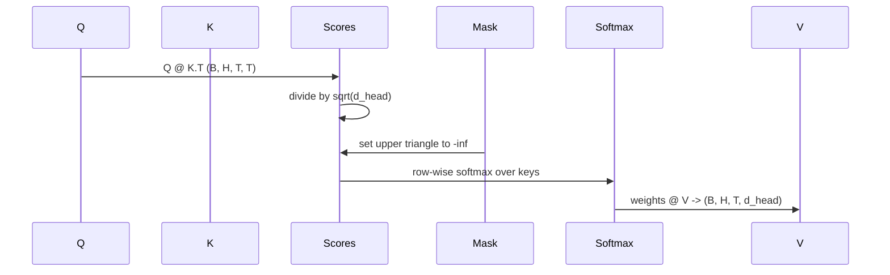

# Multi-Head Self-Attention

> One linear projection, three views, H parallel heads, one mask. The attention block as the model actually uses it.

**Type:** Build
**Languages:** Python
**Prerequisites:** Phase 04 lessons, Phase 07 transformer lessons, Lessons 30 through 32 of this phase
**Time:** ~90 minutes

## Learning Objectives
- Implement a batched Query/Key/Value projection as a single linear layer split into H heads.
- Compute scaled dot-product attention with the correct normalization and dtype handling.
- Apply a causal mask that prevents a position from attending to future positions.
- Inspect per-head attention weights for a fixed input and reason about what each head looks at.
- Train a small attention block on a toy task and watch the loss fall as the heads specialize.

## The frame

Attention is the function that lets a token's representation pull information from other tokens in the same sequence. Self-attention means queries, keys, and values are all derived from the same input. Multi-head means the projection is split into H parallel attention problems whose outputs are concatenated and projected back.

The efficient implementation pattern is one linear layer that projects from `D` to `3 * D` and gets sliced into three views, then reshaped into H heads of size `D // H` each. The matmul, softmax, and weighted sum happen as batched tensor operations so the heads run in parallel on the accelerator.

This lesson builds that block. It also adds the causal mask so the same code works as the attention layer in a decoder-only language model. The next lesson stacks the block into a full transformer and the lesson after trains it.

## The shape contract

The input is `(B, T, D)`. The output is `(B, T, D)`. The mask is `(T, T)` or broadcastable to it. Inside the block the intermediate tensors have shape `(B, H, T, d_head)` where `d_head = D // H`. The constraint is `D % H == 0`.

```mermaid
flowchart LR
    A["(B, T, D) input"] --> B[Linear D -> 3D]
    B --> C["split into Q, K, V"]
    C --> D["reshape to (B, H, T, d_head)"]
    D --> E["scores = Q @ K.T / sqrt(d_head)"]
    E --> F[apply causal mask]
    F --> G[softmax over keys]
    G --> H["context = weights @ V"]
    H --> I["reshape to (B, T, D)"]
    I --> J[output Linear D -> D]
    J --> K["(B, T, D) output"]
```

The two linear layers (the QKV projection and the output projection) are the only parameters in the block. The mask, the softmax, the matmuls, and the reshapes are all parameter-free.

## The QKV split

The naive implementation has three separate linear layers, one each for Q, K, and V. The efficient one has a single layer that outputs `3 * D` features and splits the result. The two are mathematically equivalent because three separate matrix multiplications by `(D, D)` weights are exactly one matrix multiplication by a `(3D, D)` weight stacked from them.

The efficient version is faster because the accelerator launches one matmul instead of three. It is also easier to initialize because the three sub-matrices live in the same parameter tensor and can be initialized together.

## The head reshape

After the split, each of Q, K, V is `(B, T, D)`. To turn that into H parallel attention problems, we reshape to `(B, T, H, d_head)` and transpose to `(B, H, T, d_head)`. The head dimension now sits next to the batch dimension so PyTorch treats the per-head attention as a batched operation across `B * H` independent instances.

The d_head dimension stays last so the score matmul `Q @ K.transpose(-2, -1)` contracts it. The result is `(B, H, T, T)` per-head attention scores.

## Scaling

The scores get divided by `sqrt(d_head)` before softmax. Without that scaling, dot products grow as `d_head` grows and push the softmax into a regime where one entry has almost all the mass and the others are vanishingly small. The gradients in that regime are tiny and learning stalls. Dividing by `sqrt(d_head)` keeps the variance of the scores roughly constant across head sizes.

## The causal mask

A decoder-only language model can only condition on the past when predicting the next token. The mask enforces that. Concretely, before the softmax, every entry above the diagonal of the `(T, T)` score matrix gets replaced by negative infinity. After softmax those positions get weight zero.

We register the mask as a buffer at construction so it lives on the same device as the model and is not part of the gradient graph. The mask covers the maximum context length the block will ever see. At forward time we slice the top-left `(T, T)` corner.

## The output projection

After per-head context vectors `(B, H, T, d_head)`, we transpose back to `(B, T, H, d_head)`, reshape to `(B, T, D)`, and apply a final `(D, D)` linear projection. The output projection lets the model mix the heads. Without it, the H heads would only ever recombine through later layers and the block would be artificially constrained.

## Attention weight inspection

The lesson exposes a `return_weights=True` flag on the forward pass. When set, the block returns the per-head attention weights of shape `(B, H, T, T)` alongside the output. The demo prints a heatmap of one head's weights on a short input so you can see the causal-triangle structure and the per-position focus.

In a trained model, different heads learn different patterns. Some heads attend to the immediately previous token. Some heads attend to the start of the sequence. Some heads spread attention almost uniformly. The inspection hook is the entry point for that interpretability work.

## The training demo

The demo at the bottom of `main.py` wires the attention block to a tiny LM head and trains the whole thing on a repeat task. Each row of the input is a single random id replicated across the context. The target is the input shifted by one, so the model must learn that the next token is the same as the previous token. The loss is cross-entropy. With H=4, D=32, T=12, and a vocabulary of 64, the loss falls from random (around `log(64) ~ 4.16`) down to well under `1.0` over three epochs on CPU.

The point of the demo is not to train a useful model. The point is to confirm the gradients flow through every piece of the block and the heads learn something on a problem where the answer is obvious.

## What this lesson does not do

It does not add a feed-forward block. The transformer layer in a real model is attention followed by a two-layer MLP with a residual connection and layer norm around each. The next lesson adds those.

It does not implement rotary or AliBi positional encoding. Both apply at the QKV projection step in the same block, but they are a separate teaching unit. The block as built here is compatible with either by transforming Q and K before the matmul.

It does not implement KV cache for inference. Caching keys and values across forward passes is the optimization that makes autoregressive decoding fast. It changes the shape contract on the K and V tensors but not on Q. It belongs in the inference lesson.

## How to read the code

`main.py` defines `MultiHeadSelfAttention`. The class holds two linear layers and a registered mask buffer. The forward pass projects, reshapes, scores, masks, softmaxes, weights, reshapes, and projects again. The demo at the bottom builds a small model that wraps the attention with token and positional embeddings and an LM head, trains it on a copy task for three epochs, and prints the loss curve and a per-head attention heatmap. The tests in `code/tests/test_attention.py` pin the shape contract, the causality property, the softmax property, the head-split property, and the gradient flow.

Run the demo. Then increase `n_heads` from 4 to 8 (keeping `d_model=32`, so `d_head=4`) and watch the heatmap change.
