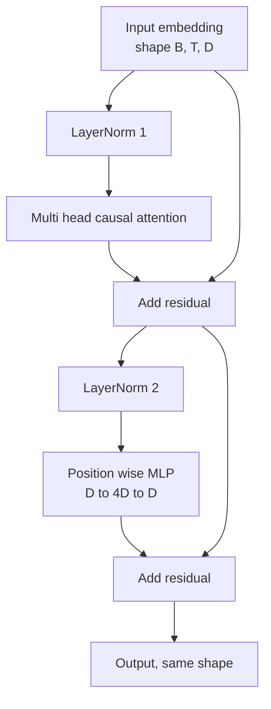
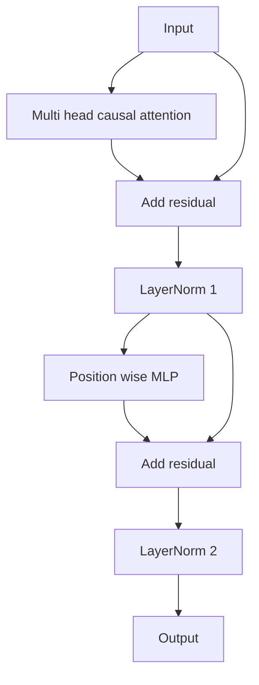

# Transformer Block from Scratch

> One block is the unit of every modern decoder LLM. Layer norm, multi head attention, residual, MLP, residual. The pre-LN variant trains stably without warmup. The post-LN variant is what the original paper shipped. This lesson builds both, side by side, and shows which one survives a 12 layer stack at common learning rates.

**Type:** Build
**Languages:** Python
**Prerequisites:** Phase 19 lessons 30 to 33 (tokenizer, embeddings, attention math, batched data loader)
**Time:** ~90 minutes

## Learning Objectives

- Build a transformer block in PyTorch from the four moving pieces: LayerNorm, multi head causal attention, residual connections, position wise MLP.
- Place the LayerNorms in two configurations (pre-LN and post-LN) and explain why one trains stably without warmup.
- Implement causal masking inside the multi head attention so token `i` cannot see tokens `j > i`.
- Track gradient flow through both variants on a 12 layer stack and read the result without hand waving.
- Reuse the block as a drop-in unit when the next lesson assembles a 124 million parameter GPT.

## The Problem

A transformer is one block repeated. Get the block wrong once, repeat it twelve times, and you ship a model that diverges in the first epoch or that needs warmup hacks the rest of the way. The two failure modes you will see in this lesson are not exotic. They show up the first time a learner stacks blocks naively. One is the attention layer attending to the future. The other is the LayerNorm placed where it cannot tame the residual signal at depth.

The fix is mechanical once you see it. The block has exactly two residual paths and exactly two normalization positions. Choose the positions correctly and the rest of the stack is just bookkeeping.

## The Concept

Every decoder only transformer block is a function that takes a tensor of shape `(batch, sequence, embedding)` and returns a tensor of the same shape. Inside, two sublayers do the work.



This is the pre-LN variant. The LayerNorm sits inside the residual branch, before the sublayer. The residual connection carries the unnormalized signal forward.

The post-LN variant moves the LayerNorm to after the residual add.



Shape is identical. Training behavior is not. With post-LN, the gradient that flows back through the residual path must pass through the LayerNorm. At depth twelve and learning rate `3e-4`, that gradient shrinks fast enough to need a warmup schedule. Pre-LN leaves the residual path unnormalized, so gradients propagate cleanly to the embedding layer. Pre-LN is the configuration GPT-2 onward ships with for that reason.

### Causal multi head attention

The attention sublayer projects the input three ways into query, key, value tensors. Each is reshaped from `(B, T, D)` to `(B, H, T, D/H)` where `H` is the head count. Scaled dot product attention computes `softmax(Q K^T / sqrt(d_k))` per head, masks the upper triangle to negative infinity, applies the mask via softmax, then multiplies by `V`. Heads are concatenated back into a single `(B, T, D)` tensor and projected once more. The mask is the only piece that makes the model causal. Forget the mask and you train a model that cheats.

### The MLP

The position wise MLP applies the same two layer network to every token independently. The hidden width is four times the embedding width, the activation is GELU, and a dropout follows the second linear. No tokens talk to each other inside the MLP. All token mixing happens in attention.

### Residual connections do two things

They make the gradient path additive across depth, which keeps the gradient norm in scale through twelve layers. They also let each block learn an additive update to the running representation rather than a full replacement. Both effects are why the block scales.

## Build It

`code/main.py` implements:

- `class LayerNorm` with learnable scale and shift, biased eps, applied per token vector.
- `class MultiHeadAttention` with `num_heads`, `head_dim = d_model // num_heads`, fused QKV projection, registered causal mask, attention and residual dropout.
- `class FeedForward` with two linear layers, GELU activation, dropout.
- `class TransformerBlock` with a `pre_ln` flag that toggles between the two variants.
- A demo that builds a 6 layer pre-LN stack and a 6 layer post-LN stack with identical inputs and prints (a) output shape, (b) gradient norm at the embedding after one backward pass.

Run it:

```bash
python3 code/main.py
```

Output: shape check on both stacks, gradient norms side by side. The pre-LN stack's embedding gradient is order of magnitude larger than the post-LN stack at the same learning rate, which is the empirical signal pre-LN trains without warmup.

## Stack

- `torch` for the tensor math, autograd, and `nn.Module` plumbing.
- No `transformers`, no pretrained weights. The block is implemented from primitives.

## Production patterns in the wild

Three patterns turn the textbook block into something you can ship.

**Fused QKV projection.** Three separate linear layers cost three kernel launches and three matmuls. One linear layer of width `3 * d_model` does the same work in one launch, then splits the output along the last axis. The fused path is faster on every accelerator and matches what reference implementations of GPT-2, LLaMA, and Mistral all ship.

**Registered causal mask buffer.** The mask depends only on the maximum context length. Allocate it once at construction with `register_buffer`, slice the active window per forward pass, and skip the per-call allocation. Forgetting this turns the mask into an allocator hot spot at long context.

**Dropout in two places, not three.** Dropout belongs after the attention softmax (attention dropout) and after the second linear of the MLP (residual dropout). A dropout on the residual itself breaks the additive identity that lets the gradient flow at depth. Some early implementations got this wrong and paid for it with brittle training.

## Use It

- The block in this lesson plugs straight into the GPT assembly in lesson 35 without modification.
- The pre-LN variant is what every modern open weights LLM uses. The post-LN variant is what the original 2017 attention paper used. Knowing both is enough to read any decoder architecture you will encounter.
- Swap the GELU for SiLU and you have the LLaMA family activation. Swap the LayerNorm for RMSNorm and you have the LLaMA family normalization. Same skeleton.

## Exercises

1. Add a `bias=False` flag to every linear in the block. Modern open weights LLMs ship without biases on the linear layers. Measure how many parameters you save in a 12 layer 768 dim model.
2. Replace `nn.LayerNorm` with a hand rolled RMSNorm and verify the output shape is unchanged.
3. Add a flag that returns the attention weights for the first head as a `(B, T, T)` tensor. Plot the upper triangle to confirm it is zero after softmax.
4. Build a sanity check that feeds a `(2, 16, 384)` tensor with `H=6` through both variants and asserts the forward outputs are different (for example, `not torch.allclose`) when weights are initialized identically and dropout is set to zero.

## Key Terms

| Term | What people say | What it actually means |
|------|-----------------|------------------------|
| Pre-LN | "Pre norm" | LayerNorm inside the residual branch, before each sublayer; the residual carries the unnormalized signal |
| Post-LN | "Post norm" | LayerNorm after the residual add; what the 2017 paper shipped and what needs warmup |
| Causal mask | "Triangle mask" | The upper triangle of the attention logits set to negative infinity so token i cannot read token j when j is greater than i |
| Fused QKV | "Combined projection" | One linear of width 3D instead of three linears of width D; one kernel, one matmul |
| Residual stream | "Skip connection" | The unnormalized tensor that flows top to bottom through every block; what each block adds to |

## Further Reading

- Phase 7 lesson 02 (self attention from scratch) for the attention math underneath this block.
- Phase 7 lesson 05 (full transformer) for the encoder decoder version of the same skeleton.
- Phase 10 lesson 04 (pre training mini GPT) for the training procedure that this block plugs into.
- Phase 19 lesson 35 (this track) which stacks twelve of these blocks into a GPT model.
