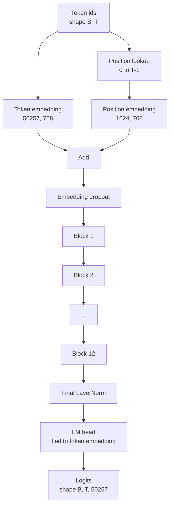
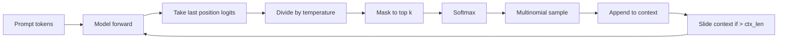

# GPT Model Assembly

> Twelve blocks stacked, a token embedding, a learned position embedding, a final LayerNorm, and a tied language model head. That is the entire 124 million parameter GPT model. This lesson assembles those pieces into a working class, counts the parameters to confirm the model matches the reference 124M shape, and generates text with multinomial sampling, temperature, and top-k.

**Type:** Build
**Languages:** Python
**Prerequisites:** Phase 19 lessons 30 to 34
**Time:** ~90 minutes

## Learning Objectives

- Assemble the transformer block from lesson 34 into a full GPT model: token embedding, position embedding, N blocks, final LayerNorm, language model head.
- Reproduce the 124 million parameter configuration: vocab 50257, context 1024, embedding 768, twelve heads, twelve layers.
- Tie the language model head weights to the token embedding and explain why that saves ~38 million parameters at this scale.
- Generate text from a prompt with multinomial sampling, temperature scaling, and top-k truncation, holding context length with a sliding window.
- Measure parameter count and forward pass cost against the 124M target.

## The Problem

A transformer block does nothing on its own. You need to turn token ids into vectors, mix in positional information, run them through the stack, and project back to vocabulary logits. Forget any one of those four steps and the model either fails to forward, drifts in position information, or cannot speak.

The shape of the model also matters. The reference GPT-2 small is 124 million parameters at exactly the configuration above. The numbers are not magic. Vocab 50257 times embedding 768 is the token table. Position 1024 times 768 is the position table. Twelve blocks at roughly 7 million parameters each is 84 million. The final head reuses the token table by weight tying. Sum the pieces and you land on 124 million. Building a model whose parameter count does not match the reference is a sign you wired something wrong.

## The Concept



Token ids become token vectors. Position ids become position vectors. The two are added and sent through the stack. The final LayerNorm is the one piece outside the blocks that survives every modern variant. The LM head reuses the token embedding matrix, which is what weight tying means.

### Weight tying

The token embedding has shape `(vocab, d_model)`. The language model head needs to project from `d_model` back to `vocab`. Those are transposes of each other. Tying the two means literally the same parameter tensor, used twice. At vocab 50257 and d_model 768, the matrix is 38 million parameters. Untied, you pay for it twice. Tied, you pay for it once and you also get a slightly cleaner gradient signal because the embedding and head update together.

### Position embedding is learned, not sinusoidal

GPT-2 ships a learned position embedding. The position table is one parameter tensor of shape `(1024, 768)`. The model looks up position 0 through T-1 at every forward and adds the lookup to the token embedding. This is the simplest of the position schemes (RoPE, ALiBi, T5 relative bias are the alternatives) and it is what the 124M reference uses.

### Generation: temperature, top-k, multinomial

Generation is autoregressive. At every step, the model returns logits over the full vocabulary at every position. You take the last position only, divide by temperature, optionally mask all but the top k logits to negative infinity, softmax to get probabilities, and sample one token from the resulting distribution.



Three knobs, three different behaviors. Temperature near zero collapses to greedy. Temperature one matches the model's natural distribution. Top-k one is greedy. Top-k forty filters the long tail. The combinations matter; the next lesson on training uses generation as a qualitative eval signal.

## Build It

`code/main.py` implements:

- `class GPTConfig` dataclass with the 124M defaults: `vocab_size=50257`, `context_length=1024`, `d_model=768`, `num_heads=12`, `num_layers=12`, `mlp_expansion=4`, `dropout=0.1`, `use_bias=True`, `weight_tying=True`.
- `class GPTModel` with token embedding, position embedding, embedding dropout, twelve `TransformerBlock`s, final LayerNorm, and an `lm_head` that ties to the token embedding when the flag is set.
- A `count_parameters` helper that returns the unique parameter count (so weight tying is honored in the count).
- A `generate` function that does temperature, top-k, multinomial, and sliding window context.
- A demo that builds the model, prints the parameter count next to the reference 124M, and generates a short sequence from a fixed prompt to show the pipeline ends to end.

Run it:

```bash
python3 code/main.py
```

Output: parameter count alongside the 124M reference, generated token ids from a random prompt, and a confirmation that the LM head and token embedding share storage when tying is on.

To keep the demo fast, the script also runs a tiny config (`d_model=64`, `num_layers=2`) end to end and prints the generated token sequence inline. The 124M config is built but only its parameter count and one forward pass are exercised.

## Stack

- `torch` for the tensor math, autograd, and module plumbing.
- `code/main.py` reimplements the same block pattern from lesson 34 locally.

## Production patterns in the wild

Three patterns make the difference between a model that runs and a model that ships.

**Initialize the residual projections small.** The output projection of attention and the second linear of the MLP both feed directly into a residual add. Initializing those with the same standard deviation as every other linear gives a residual stream that grows with depth and pushes the final LayerNorm into a hot regime. Scale the std by `1 / sqrt(2 * num_layers)` for those two projections; the residual stream stays in a sane range through twelve layers.

**Cache the position id tensor, do not recompute.** `torch.arange(T)` allocates fresh memory at every forward. Allocate once in `__init__` for the maximum context, slice the first T entries per call, and skip the allocator round trip.

**Tie weights at parameter level, not just by copying.** Setting `lm_head.weight = token_embedding.weight` shares the tensor; copying does not. The optimizer needs to update one parameter and the autograd graph needs one accumulation. If you copy, the head drifts away from the embedding and weight tying buys you nothing.

## Use It

- The model class in this lesson is the same shape as the one the next lesson trains.
- Replacing the learned position embedding with RoPE gets you the LLaMA family without touching the block or the head.
- Replacing the GELU with SiLU and the LayerNorm with RMSNorm gets you the rest of the LLaMA family changes.
- The generation function works with any logits source, not only this model. You can pull logits from a pretrained GPT-2 file in lesson 37 and reuse the same generation loop.

## Exercises

1. Untie the LM head from the token embedding and recount parameters. Verify the delta is 50257 times 768 = 38 million.
2. Replace the learned position embedding with a sinusoidal table computed at construction time. Confirm the model still forwards and the parameter count drops by 786,432.
3. Add a `greedy=True` flag to generation that skips sampling and picks argmax. Confirm the sequence is deterministic across runs.
4. Add a `repetition_penalty` knob that divides the logit of any token in the prompt or generated history by a constant before softmax. Show on a fixed prompt that values above one reduce repeat counts in the output.
5. Add `top_p` (nucleus) sampling next to `top_k`. Two-line check that the sum of probabilities of the kept tokens exceeds `top_p`.

## Key Terms

| Term | What people say | What it actually means |
|------|-----------------|------------------------|
| Weight tying | "Tied embeddings" | The LM head and the token embedding share the same parameter tensor; saves vocab times d_model parameters and matches the GPT-2 reference |
| Position embedding | "Learned positions" | A separate table of shape (context length, d_model) added to token vectors; learned end to end |
| Sliding window context | "Context cap" | When the prompt plus generated tokens exceed the context length, drop the oldest tokens so the active window fits |
| Top-k sampling | "K truncation" | Keep the K logits with the highest values, mask the rest to negative infinity, softmax over the remainder |
| Temperature | "Sampling temperature" | Divide logits by T before softmax; T less than 1 sharpens, T equal to 1 keeps the natural distribution, T greater than 1 flattens |

## Further Reading

- Phase 19 lesson 34 for the block this model stacks.
- Phase 19 lesson 36 for the training loop that drives this model with cross entropy loss.
- Phase 19 lesson 37 for loading pretrained GPT-2 weights into this exact architecture.
- Phase 7 lesson 07 (GPT causal language modeling) for the math of next token prediction.
- Phase 10 lesson 04 (pre training mini GPT) for the original training procedure on the same architecture.
