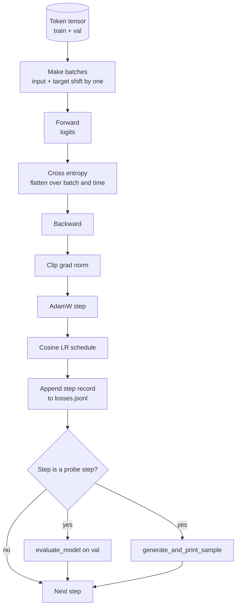

# Training Loop and Evaluation

> A loop that does not measure is a loop that lies. This lesson builds the training loop that drives the GPT model: AdamW with weight decay split, a warmup plus cosine learning rate schedule, a `calc_loss_batch` helper, an `evaluate_model` pass on held out data, a `generate_and_print_sample` qualitative probe every K steps, and a JSONL log of losses you can plot after. The same skeleton trains every decoder LLM you will ever build.

**Type:** Build
**Languages:** Python
**Prerequisites:** Phase 19 lessons 30 to 35
**Time:** ~90 minutes

## Learning Objectives

- Build a training loop that computes cross entropy loss with the correct input and target alignment for next token prediction.
- Configure AdamW with weight decay applied to weight tensors and not to LayerNorm or bias tensors.
- Implement a learning rate schedule with linear warmup and cosine decay, and read the resulting LR over time.
- Evaluate on a held out split with `evaluate_model` so the eval loss is comparable across runs.
- Generate a qualitative sample every K steps with `generate_and_print_sample` to catch divergence before the loss curve does.
- Persist per step loss to JSONL so you can reload, plot, and ship the training log as a deliverable.

## The Problem

A training script that prints the loss but does nothing else fails three ways. It cannot tell you if the loss is decreasing for the right reason (the model could overfit the training set and never learn). It cannot tell you if a divergence is starting (the loss can spike for one step and recover, or one step and crash). It cannot tell you what the model has learned (loss is a scalar; a generated sample is a paragraph). All three failures hide unless the loop measures.

The loop in this lesson measures three ways. Loss on the training batch every step. Loss on a held out batch every K steps. A generated continuation from a fixed prompt every K steps. The training log lands in JSONL so the artifact is the loop's testimony.

## The Concept



The two non-obvious pieces are the loss alignment and the AdamW decay split.

### Loss alignment

The model predicts the next token at every position. If the input batch is tokens `[t0, t1, t2, t3]`, the target batch must be `[t1, t2, t3, t4]`. Cross entropy is computed on the flat shape `(batch * seq, vocab)` against the flat target `(batch * seq,)`. Forget the shift and you train the model to predict itself, which converges to zero loss while learning nothing useful.

### AdamW decay split

Weight decay regularizes weight tensors but not normalization scales or biases. Putting decay on the LayerNorm scale slowly drives the scale to zero and breaks normalization. Putting decay on a bias is mathematically harmless but a waste of cycles. The standard split is: matrix shaped tensors (linear weights, embedding tables) get decay, anything that looks like a scale or shift does not.

### Warmup plus cosine schedule

Warmup ramps the learning rate from zero to the target over a few hundred steps so the optimizer state has time to populate. Cosine decay drops the learning rate back toward zero over the remaining steps so the final phase fine tunes the weights at a small step size. The combination is the most common schedule in open weights LLM training because it removes most of the brittle moments in the first thousand steps and the last thousand steps.

### Held out evaluation

`evaluate_model` runs a fixed number of batches from the validation split, accumulates loss, divides by the batch count, and returns. No gradient. No dropout. The number is reproducible across runs given the same seed and the same split. Reporting the held out loss next to the training loss is how you spot overfitting.

### Qualitative sampling as an early signal

A model whose training loss drops nicely but whose generated samples are all the same token is broken. A model whose loss curve looks flat but whose generated samples sharpen into coherent words is learning. The qualitative probe runs faster than reading the full curve and catches modes the scalar misses.

## Build It

`code/main.py` implements:

- `make_batches(token_ids, batch_size, context_length)` which slices a long token tensor into input and target pairs.
- `calc_loss_batch(model, inputs, targets)` which forwards, flattens, and returns the scalar cross entropy.
- `evaluate_model(model, val_loader, max_batches)` which iterates a fixed number of validation batches with no grad and returns the mean loss.
- `generate_and_print_sample(model, prompt, max_new_tokens)` which runs the lesson 35 generation function on a fixed prompt and prints the result.
- `build_param_groups(model, weight_decay)` which produces the two-group AdamW parameter list.
- `cosine_with_warmup(step, warmup_steps, total_steps, max_lr, min_lr)` which returns the LR at a given step.
- `train(...)` which runs the loop, persists `outputs/losses.jsonl`, and prints the eval loss and a sample every `eval_every` steps.
- A demo that trains a tiny model on synthetic data for a small number of steps, writes a JSONL log, and prints the eval loss and a sample at the probe points. The demo runs in well under a minute on CPU.

Run it:

```bash
python3 code/main.py
```

Output: per step loss line, eval loss every probe step, a generated sample every probe step, and a final `outputs/losses.jsonl` you can load with `json.loads` per line.

## Stack

- `torch` for autograd, optimizer, and modules.
- `main.py` reimplements the lesson 35 `GPTModel` and supporting modules locally.

## Production patterns in the wild

Three patterns turn the textbook loop into something you can leave running overnight.

**Gradient norm clipping is non negotiable.** A bad batch (anomalous data, an LR spike, a numerical edge case) produces a huge gradient that wipes out hours of training. `torch.nn.utils.clip_grad_norm_(params, max_norm=1.0)` after `backward` and before `step` keeps the optimizer in a safe range. The clipping value is a free parameter; one is the default that survives most setups.

**Resumable JSONL logging, not pickled state.** Per step loss records as `{"step": int, "train_loss": float, "lr": float}` lines in JSONL are durable: any crash leaves a readable artifact, you can grep, you can plot with thirty lines of Python, and you can resume training by reading the last step. Pickled state ties you to the exact module layout that produced the file, which is brittle across refactors.

**Eval batches drawn from a fixed slice.** The validation tokens get sliced into batches at script start, not on the fly. Reproducibility depends on the eval batches being identical from run to run; otherwise comparing eval loss between two runs measures the batch shuffle as much as the model.

## Use It

- The loop in this lesson is the same skeleton that trains a 124M model on real data. Swap the synthetic token tensor for a `datasets`-style loader and the loop runs unchanged.
- The JSONL log is the deliverable that turns a training run into evidence. The next lesson uses one to compare a freshly trained checkpoint with a pretrained one.
- The qualitative sample probe is the catch-all that scalar loss cannot replace.

## Exercises

1. Add `weight_decay_groups()` unit tests that confirm scale and bias parameters land in the no decay group and linear and embedding weights land in the decay group.
2. Replace synthetic random tokens with bytes from a small text file so the demo trains on something legible. Verify the generated sample uses characters present in the file.
3. Add a `min_lr` floor of 10 percent of `max_lr` to the cosine schedule and re-plot.
4. Save a checkpoint every `eval_every` steps in addition to the JSONL log. Add a `resume_from` flag that reloads model state and optimizer state.
5. Log per step throughput (tokens per second) next to the loss and confirm it stays in a steady band.

## Key Terms

| Term | What people say | What it actually means |
|------|-----------------|------------------------|
| Loss alignment | "Shift by one" | Input tokens at positions 0..T-1, target tokens at positions 1..T; cross entropy is computed on flattened shapes |
| Decay split | "Two groups" | AdamW receives matrix shaped tensors with weight decay and scale or bias tensors with none |
| Warmup | "Ramp" | The learning rate climbs from zero to its target over a fixed number of steps so the optimizer state can populate |
| Eval batches | "Held out batches" | A fixed slice of the validation token tensor, sliced once at script start, used identically every probe |
| Qualitative probe | "Sample print" | A short generation from a fixed prompt printed every K steps to catch failure modes loss alone hides |

## Further Reading

- Phase 19 lesson 35 for the model the loop drives.
- Phase 19 lesson 37 for loading pretrained weights into the same model.
- Phase 10 lesson 04 (pre training mini GPT) for the procedure on real data.
- Phase 10 lesson 10 (evaluation) for the broader eval surface beyond cross entropy loss.
