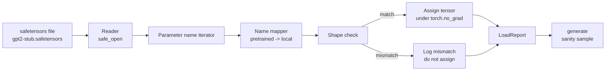

# Loading Pretrained Weights

> Training a 124 million parameter model from scratch is a budget decision; loading a published checkpoint is a Tuesday. This lesson loads pretrained GPT-2 style weights from a safetensors file into the exact architecture from lesson 35, walks the parameter name mapping piece by piece, and sanity generates a continuation to prove the load worked. No network, no third party loaders, no opaque magic.

**Type:** Build
**Languages:** Python
**Prerequisites:** Phase 19 lessons 30 to 36
**Time:** ~90 minutes

## Learning Objectives

- Read a safetensors file with the `safetensors` Python library and inspect the tensor names and shapes.
- Map each pretrained parameter name onto a parameter inside the lesson 35 GPT model.
- Handle the two name conventions that differ between published GPT-2 weights and the model in this track: `wte/wpe/h.N.attn.c_attn/c_proj` and `mlp.c_fc/c_proj` versus the locally named `tok_embed/pos_embed/blocks.N.attn.qkv/out_proj` and `mlp.fc1/fc2`.
- Detect and refuse a shape mismatch with a clear error before any weight assignment happens.
- Generate a short continuation with the loaded weights and confirm the tokens come from the loaded distribution, not the randomly initialized one.

## The Problem

Published weights are not packaged for your architecture. They carry the names the original implementation used. The pretrained file has `transformer.h.0.attn.c_attn.weight` of shape `(2304, 768)`; your model expects `blocks.0.attn.qkv.weight` of shape `(2304, 768)` (which is the same matrix in a different layout convention) or your model uses `nn.Linear` which stores the matrix transposed. The same parameter shows up with three subtly different identities (name, shape, byte layout) and the loader has to reconcile all three.

A loader that copies blindly puts the right tensor in the wrong place and you get a model that generates nonsense. A loader that refuses to copy when the shape differs but logs nothing leaves you guessing which tensor failed to land. The loader in this lesson is explicit: every assignment is logged, every shape is checked, and a `LoadReport` summarizes hits, misses, and shape mismatches so you can read what happened.

## The Concept



The name mapper is just a function from string to string. The shape check is one if. The assignment happens inside `torch.no_grad()` so autograd does not track the load. The report holds the outcome of every name.

### The GPT-2 naming convention

Published GPT-2 weights live under names like:

| Pretrained name | Shape | Meaning |
|-----------------|-------|---------|
| `wte.weight` | (50257, 768) | Token embedding |
| `wpe.weight` | (1024, 768) | Position embedding |
| `h.N.ln_1.weight` | (768,) | LayerNorm 1 scale at block N |
| `h.N.ln_1.bias` | (768,) | LayerNorm 1 shift at block N |
| `h.N.attn.c_attn.weight` | (768, 2304) | Fused QKV linear weight |
| `h.N.attn.c_attn.bias` | (2304,) | Fused QKV linear bias |
| `h.N.attn.c_proj.weight` | (768, 768) | Attention output projection |
| `h.N.attn.c_proj.bias` | (768,) | Attention output projection bias |
| `h.N.ln_2.weight` | (768,) | LayerNorm 2 scale |
| `h.N.ln_2.bias` | (768,) | LayerNorm 2 shift |
| `h.N.mlp.c_fc.weight` | (768, 3072) | MLP fc1 weight |
| `h.N.mlp.c_fc.bias` | (3072,) | MLP fc1 bias |
| `h.N.mlp.c_proj.weight` | (3072, 768) | MLP fc2 weight |
| `h.N.mlp.c_proj.bias` | (768,) | MLP fc2 bias |
| `ln_f.weight` | (768,) | Final LayerNorm scale |
| `ln_f.bias` | (768,) | Final LayerNorm shift |

Two surprises to plan for. The `c_attn`, `c_proj`, `c_fc` linears are stored with the matrix transposed relative to what `nn.Linear.weight` expects. The loader transposes during assignment. The LM head is not in the file at all; the model relies on weight tying with `wte`, so the head is set by aliasing once `wte` lands.

### The local naming convention

The model in this track uses descriptive names:

| Local name | Meaning |
|------------|---------|
| `tok_embed.weight` | Token embedding |
| `pos_embed.weight` | Position embedding |
| `blocks.N.ln1.scale` | LayerNorm 1 scale at block N |
| `blocks.N.ln1.shift` | LayerNorm 1 shift |
| `blocks.N.attn.qkv.weight` | Fused QKV |
| `blocks.N.attn.qkv.bias` | Fused QKV bias |
| `blocks.N.attn.out_proj.weight` | Attention output projection |
| `blocks.N.attn.out_proj.bias` | Output projection bias |
| `blocks.N.ln2.scale` | LayerNorm 2 scale |
| `blocks.N.ln2.shift` | LayerNorm 2 shift |
| `blocks.N.mlp.fc1.weight` | MLP fc1 |
| `blocks.N.mlp.fc1.bias` | MLP fc1 bias |
| `blocks.N.mlp.fc2.weight` | MLP fc2 |
| `blocks.N.mlp.fc2.bias` | MLP fc2 bias |
| `final_ln.scale` | Final LayerNorm scale |
| `final_ln.shift` | Final LayerNorm shift |

The mapping is a fixed function. The lesson ships it as a dict that the loader iterates.

### The stub fixture

Real GPT-2 weights are 0.5 GB. The demo does not download them; it generates a small safetensors fixture at first run, with the exact GPT-2 naming convention and shapes appropriate to a 12-block model at d_model 192 instead of 768. The fixture has the right structure to exercise every code path in the loader. Swap the fixture for the real file and the loader works without modification.

## Build It

`code/main.py` implements:

- A small replica of the lesson 35 `GPTModel` so this lesson is self contained.
- `make_pretrained_to_local(num_layers)` which expands the per-layer entries.
- `load_safetensors(model, path)` which iterates names, maps them, checks shape, transposes the conv1d-style weights, and assigns under `torch.no_grad()`. Returns a `LoadReport`.
- `make_stub_safetensors(path, cfg)` which generates a fixture file with the exact pretrained naming convention.
- A demo that creates `outputs/gpt2-stub.safetensors` on first run, builds a fresh model, captures one generated continuation from random init, loads the stub, captures another continuation, prints both, and verifies the two are different (the load actually changed the model).

Run it:

```bash
python3 code/main.py
```

Output: the fixture path, a per-name load log, a `LoadReport` summary, a continuation before the load, a continuation after the load, and a shape mismatch on a single intentionally bad tensor injected into the fixture so the failure path is exercised.

## Stack

- `safetensors` for the on disk format and a streaming reader.
- `torch` for the model and the assignment math.
- No `transformers`, no `huggingface_hub`, no network calls.

## Production patterns in the wild

Three patterns make the loader survive contact with weights you did not create.

**Always validate the file before any assignment.** Open the file, list every tensor name with its dtype and shape, run the full mapping with shape checks, and only on success start assigning. Half-loaded models are silent failure machines.

**Log every assignment with the source name and the destination name.** When something looks wrong, the log tells you which tensor landed where; the alternative is reading hexdumps. The `LoadReport` dataclass in this lesson tracks `loaded`, `missing`, `unexpected`, and `shape_mismatch` lists and prints a summary at the end.

**The LM head is a weight tying alias, not a separate copy.** Setting `model.lm_head.weight = model.tok_embed.weight` after loading `tok_embed` is the canonical pattern. Copying the embedding matrix into a fresh `lm_head.weight` parameter breaks tying and quietly doubles your parameter count.

## Use It

- The loader works for any safetensors file that uses the pretrained naming convention. Real GPT-2 files (small / medium / large / xl) work without code changes; only the model config differs.
- The same pattern extends to LLaMA, Mistral, Qwen weights once you update the name map. The shape checks and the report stay identical.
- Sanity generation after a load is a quick gate: if the post-load samples look like the pre-load samples, the load did not change the model, which means the mapping silently missed every tensor.

## Exercises

1. Add a `dtype` argument to the loader that casts each tensor to a target dtype (`bfloat16`, `float16`, `float32`) during assignment. Confirm a `float32` model can be downcast to `bfloat16` and still generate.
2. Add an `expected_layers` argument that refuses to load a checkpoint whose `h.N` indices do not match the model's `num_layers`.
3. Plug the loader into the lesson 35 generation function and produce two side by side samples: one from random init, one from the loaded fixture.
4. Add an export path: write the current model state into a fresh safetensors file using the pretrained naming convention. Round trip the loader and confirm the report has zero shape mismatches.
5. Extend `NAME_MAP` to handle the LLaMA naming convention (no biases, RMSNorm, fused qkv layout) and re-run the loader on a stub LLaMA fixture you generate.

## Key Terms

| Term | What people say | What it actually means |
|------|-----------------|------------------------|
| Name map | "Key remapping" | The function from pretrained tensor names to local parameter names; usually a literal dict with one entry per layer index expanded over a loop |
| Shape mismatch | "Bad shape" | The pretrained tensor exists under the mapped name but its dimensions disagree with the local parameter; the loader refuses to assign and logs the pair |
| Transpose-on-load | "Conv1d layout" | Published GPT-2 stores attention and MLP projections in the transpose of what nn.Linear expects; the loader transposes during assignment |
| Weight tying alias | "Shared LM head" | Setting model.lm_head.weight = model.tok_embed.weight so the head and embedding share storage; the head is not in the file because of this |
| Load report | "Coverage summary" | A small dataclass that tracks loaded, missing, unexpected, and shape_mismatch lists; printing it is how you tell whether the load succeeded |

## Further Reading

- Phase 19 lesson 35 for the architecture that receives the weights.
- Phase 19 lesson 36 for the training loop that produces a checkpoint of the same shape.
- Phase 10 lesson 11 (quantization) for what to do with the loaded weights when memory is tight.
- Phase 10 lesson 13 (building a complete LLM pipeline) for the full lifecycle around load and inference.
