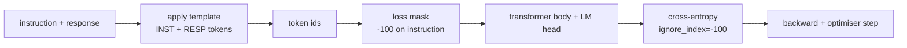
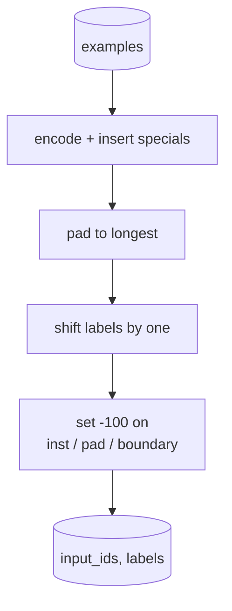
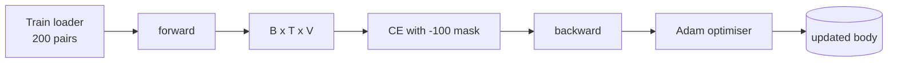

# Capstone Lesson 39: Instruction Tuning by Supervised Fine-Tuning

> A pretrained base model can extend a sequence but cannot follow an instruction. Supervised fine-tuning is the smallest change that fixes this: feed the model paired examples of an instruction and a desired response, and train the body to predict the response tokens. The trick is that you only want the loss to count the response, not the instruction. This lesson builds an Alpaca-style SFT loop with a custom collate function that masks instruction tokens with `ignore_index=-100`, trains on 200 instruction-response pairs, and evaluates on a held-out split using exact-match.

**Type:** Build
**Languages:** Python (torch, numpy)
**Prerequisites:** Phase 19 lessons 30-37 (NLP LLM track: tokenizer, embedding table, attention block, transformer body, pre-training loop, checkpointing, generation, perplexity)
**Time:** ~90 minutes

## Learning Objectives

- Format paired instruction-response data into a single causal sequence with explicit boundary tokens.
- Build a collate function that masks instruction tokens so cross-entropy only counts response tokens.
- Train a tiny transformer body under the SFT objective and watch the eval metric move.
- Implement greedy and temperature-sampled generation that respects the response-start boundary.
- Compute held-out exact-match on generated completions.

## The Problem

A base model trained on next-token prediction has no idea what an instruction is. Show it the string `"What is the capital of France?"` and it will continue the question or invent a new sentence. The model has the language but not the format contract.

The SFT contract is a string template. Every training example becomes a single sequence with three regions:

```text
<INST> What is the capital of France? <RESP> The capital of France is Paris.
```

The boundary tokens are special tokens reserved at training time. The model learns that everything after `<RESP>` is the response and the response is what gets graded. The base model's next-token objective still applies; it is just trained on a corpus where every example has this shape.

But there is a catch. If you feed the entire sequence to a vanilla cross-entropy loss, you are training the model to also predict the instruction tokens. The instruction is given. You want zero gradient on those positions. The fix is the mask.

## The Concept



`ignore_index` is a feature of `torch.nn.functional.cross_entropy`. Any target position equal to `ignore_index` contributes zero loss and zero gradient. The convention in PyTorch is `-100`. The collate function builds two tensors per example: `input_ids` (the full sequence) and `labels` (a copy of `input_ids` with the instruction positions overwritten by `-100`).

The model sees the whole sequence during the forward pass; attention can attend to the instruction. The loss only counts response tokens. This is exactly what you want: condition on the instruction, predict the response.

## The Data

Two hundred instruction-response pairs are generated deterministically in `main.py`. They cover six task types:

- factual single-shot (capital of X)
- arithmetic
- list extraction
- one-sentence summary
- code (print, sort)
- definition

Each task has a templated instruction and a deterministic response. This is intentionally simple. Exact-match is brittle, and the lesson uses a fixture where the right answer is one specific string. Real SFT datasets need fuzzy metrics; the principle is identical.

Splits are 160 train, 40 test. The test set covers all six task types so per-category exact-match can be reported.

## Tokenisation and Padding

The tokeniser is byte-level with three reserved specials:

- `INST_ID = 256`: marks the start of the instruction region.
- `RESP_ID = 257`: marks the boundary between instruction and response.
- `PAD_ID = 258`: padding for variable-length batches.

The sequence is `[INST] inst_bytes [RESP] resp_bytes [PAD]*`. The collate function:

1. Tokenises each example.
2. Pads every example in the batch to the longest sequence in the batch.
3. Builds `labels` = `input_ids` shifted by one (causal LM target), with:
   - The instruction region replaced by `-100`.
   - The padding region replaced by `-100`.
   - The `RESP_ID` boundary position itself replaced by `-100` (you do not train the model to predict the boundary token; it predicts what follows).



The shift is the standard causal trick: position `i` of `input_ids` predicts position `i+1`, so `labels[i] = input_ids[i+1]` (with the final position dropped from the input and the first dropped from the target). The mask is applied after the shift to land on the right positions.

## Training



The loop is the standard PyTorch SFT loop. Adam, learning rate around 3e-4 to 1e-3, ten to twenty epochs on this fixture, no scheduler. The model is small enough (hidden 96, 2 blocks, max length 64) to train to convergence on CPU inside two minutes.

Every fifth epoch the loop runs a tiny eval pass on the held-out set and prints exact-match. Watching exact-match go from 0.0 at epoch one to something like 0.85 at epoch fifteen is the lesson's payoff: you can see the model learning the format and the answers at the same time.

## Generation

At eval time the model gets the instruction prefix `[INST] inst_bytes [RESP]` and generates tokens until either:

- the sequence reaches `max_len`, or
- the model emits a special stop heuristic: two consecutive sentence-ending bytes (`.`, `!`, `?`).

The lesson ships greedy decoding plus an optional temperature sampler. Exact-match uses greedy because temperature would make the metric stochastic. Real systems often sample, then judge fuzzily; that pipeline is lesson 41.

## Exact-Match Evaluation

Exact-match is the strictest text metric. The predicted response string is normalised (lowercase, strip whitespace, collapse double spaces) and compared to the reference response, normalised the same way. The metric is either 1 or 0 per example. The aggregate is the mean.

Real SFT pipelines complement exact-match with token-level F1 (lesson 41) and a judge model. Exact-match remains useful because it is unambiguous; if it says 0.7, exactly 70 percent of test instructions produced the gold response character for character.

## What you will build

The implementation is one `main.py` plus tests.

1. `InstructionTokenizer`: byte-level encoder with reserved specials. Encodes either an instruction prefix or a full pair.
2. `make_dataset`: generates 200 pairs across six task types with a fixed seed.
3. `SFTDataset`: returns `(input_ids, labels)` per example, already mask-prepared.
4. `sft_collate`: dynamic padding, builds the batch tensor, sets `-100` on instruction and pad positions.
5. `TinyGPT`: transformer body plus tied or untied LM head.
6. `train_sft`: the SFT loop, with per-epoch eval hooks.
7. `generate`: causal decode from a prefix, greedy or sampled, with the stop heuristic.
8. `exact_match`: normalised string comparison, returns float in `[0, 1]`.
9. `run_demo`: builds the data, trains for twenty epochs, evaluates, prints a per-category breakdown, exits zero on success.

## Why the mask matters

Without the mask, the loss treats instruction tokens as targets. The model learns to predict the instruction. This is a different objective and produces a worse model in two ways. First, model capacity is wasted reconstructing inputs the user always provides. Second, the response loss is smaller in the gradient sum because instruction tokens outnumber response tokens in most batches; the optimiser's effective learning rate on the part you care about is lower than you intended. The mask is not a polish; it is the objective.

## Stretch goals

- Add a learning-rate warmup followed by cosine decay. SFT is more sensitive to LR than pretraining.
- Add per-token loss logging and plot the loss curve over training. Notice that early epochs are dominated by template tokens (`<RESP>`, common prefixes) and later epochs are dominated by the actual answer tokens.
- Extend the eval to BLEU-1 or chrF. Exact-match underestimates models that produce a paraphrase with the same answer.
- Add a chat template with multi-turn formatting and train on a fixture that includes follow-ups.

The implementation gives you the format contract, the mask, and the loop. The objective change from base model to instruction follower is one collate function.
