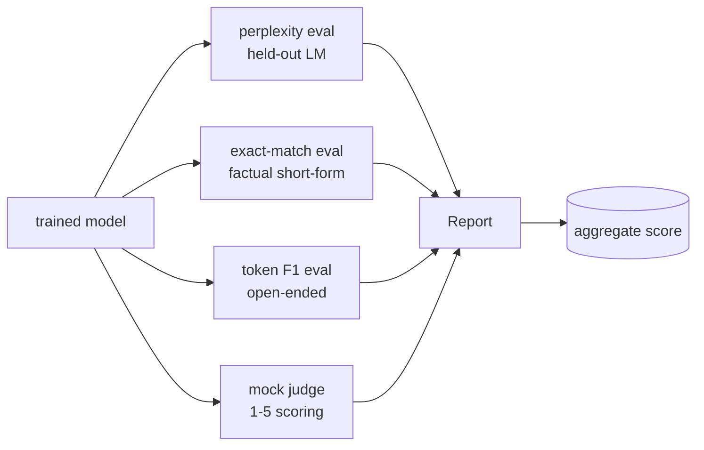
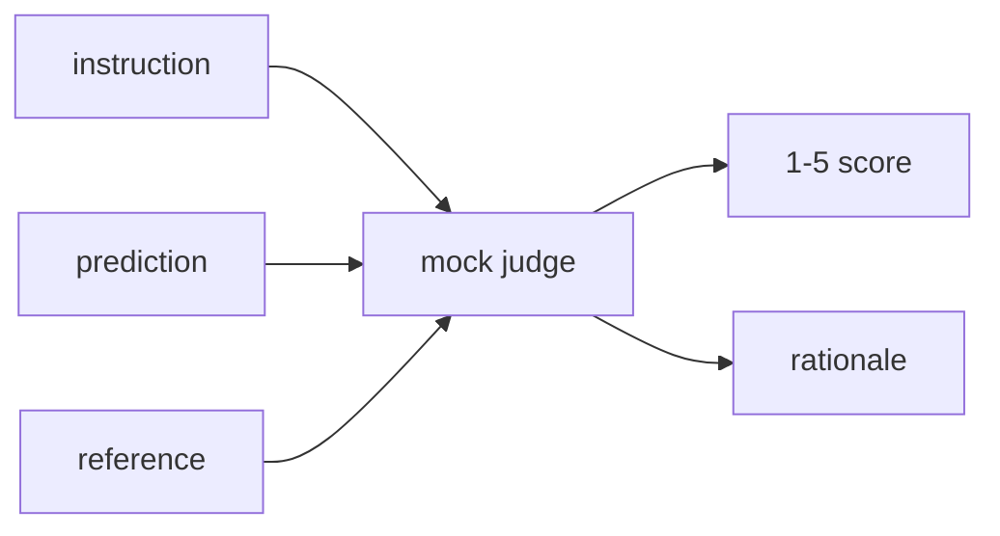
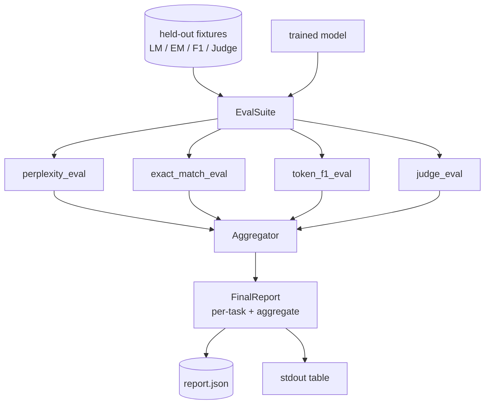

# Capstone Lesson 41: Full Evaluation Pipeline

> Training is the part you can monitor with loss curves. Evaluation is the part you have to design. This lesson builds a unified eval pipeline that takes any trained language model, runs four heterogeneous evals on it, aggregates the results into a per-task report, and ships a local mock LLM-as-judge so the loop runs without a network. The four evals cover the dimensions every shipping model needs: language modelling (perplexity), short-form correctness (exact-match), open-form similarity (token F1), and qualitative scoring (judge).

**Type:** Build
**Languages:** Python (torch, numpy)
**Prerequisites:** Phase 19 lessons 30-37 (NLP LLM track: tokenizer, embedding table, attention block, transformer body, pre-training loop, checkpointing, generation, perplexity)
**Time:** ~90 minutes

## Learning Objectives

- Compute held-out perplexity with masked-token accounting on a tiny transformer.
- Run an exact-match eval on short-form factual prompts.
- Compute token-level F1 between predicted and reference strings with normalisation.
- Build a local mock LLM-as-judge that scores model outputs on a 1-5 scale.
- Aggregate the four evals into a single weighted report with per-task breakdown.

## The Problem

A single metric never describes a language model. Perplexity says how well the model fits the language distribution but says nothing about whether it answers questions. Exact-match says whether the model produces the gold string but punishes correct paraphrases. Token F1 forgives paraphrase but is fooled by lexical overlap with wrong content. LLM-as-judge captures qualitative dimensions but is expensive and stochastic.

The pipeline you actually want has all four. Each eval covers a dimension the others miss. Each runs on a different subset of held-out data shaped for that metric. The final report shows the per-task numbers side by side and an aggregate, so a reviewer can see at a glance which trade-offs the model is making.

This lesson builds that pipeline, end to end, in one file.

## The Concept

Each eval is a function from `(model, dataset) -> EvalResult`. The result carries the metric value, per-example details for inspection, and a name for the aggregate. The pipeline composes them with a config that says which evals to run and how to weight them.

## Perplexity, properly counted

Perplexity is `exp(mean negative log-likelihood per token)`. The implementation has two traps:

- The mean must be over actual token positions, not over batch * sequence. Padding tokens have to be excluded from the denominator or perplexity will look better than it is.
- The model predicts the next token, so logits at position `i` predict the token at position `i+1`. Off-by-one mistakes here are silent: the loss still trains, but the metric becomes meaningless.

The eval computes per-batch sums of `-log p(token)` over non-pad positions and a per-batch token count, then divides at the end. This is numerically safer than averaging per-batch perplexities (which under-weights short sequences) and matches the textbook definition.

## Exact-match, with normalisation

The harness normalises both the prediction and the reference before comparing:

- Lowercase.
- Strip surrounding whitespace.
- Collapse internal whitespace runs to a single space.
- Drop trailing terminal punctuation (`.`, `!`, `?`) if both sides differ only by punctuation.

Normalisation makes exact-match useful in practice. A model that says `"Paris"` is right; one that says `"Paris."` is also right; one that says `"  paris  "` is also right. The metric still requires the answer to be the same string after normalisation.

## Token F1, the right way

Token F1 is the harmonic mean of precision and recall computed over the bag-of-tokens. Steps:

1. Normalise prediction and reference (same rules as exact-match).
2. Split each into a list of tokens (whitespace tokenisation).
3. Count the multiset intersection.
4. Precision = `intersection_count / len(pred_tokens)`. Recall = `intersection_count / len(ref_tokens)`. F1 = harmonic mean.

If both prediction and reference are empty, F1 is 1 (vacuous match). If only one is empty, F1 is 0. This pattern matches the SQuAD evaluation reference and produces stable numbers across paraphrases.

## Local Mock LLM-as-Judge

A real judge is a frontier model behind an API. For this lesson the judge has to run offline. The mock judge is a deterministic scorer that takes an instruction, the model's prediction, and the reference, and returns a score in `{1, 2, 3, 4, 5}` plus a one-line rationale. The scoring rules are explicit:

- 5 if normalised prediction equals normalised reference.
- 4 if token F1 between prediction and reference is at least 0.8.
- 3 if token F1 is in `[0.5, 0.8)`.
- 2 if token F1 is in `[0.2, 0.5)`.
- 1 otherwise.

This is not a real judge, but it has the right interface. Swap in a real model later by changing one function. The pipeline does not care.

## Aggregation

The aggregate is a weighted mean of normalised eval scores. Each eval reports its own number in `[0, 1]`:

- Perplexity: normalise as `1 / (1 + log(perplexity))`. A perplexity of 1 maps to 1, infinity maps to 0.
- Exact-match: already in `[0, 1]`.
- Token F1: already in `[0, 1]`.
- Judge: divide by 5.

Weights are configurable. The default mix is 0.2 perplexity, 0.3 exact-match, 0.3 token F1, 0.2 judge. The choice of weights is a product decision; the lesson exposes the knob so you can experiment.

## Architecture

The `EvalSuite` is a thin orchestrator. Each individual eval is a free function that takes `(model, tokenizer, dataset, config)` and returns an `EvalResult`. The `Aggregator` collects results and produces the final report. The demo prints the table and writes a JSON copy that downstream CI can ingest.

## What you will build

The implementation is one `main.py` plus tests.

1. `TinyGPT`: the same decoder-only architecture used in lessons 38-40, included so the lesson stands alone.
2. `InstructionTokenizer`: byte tokeniser with INST / RESP / PAD specials.
3. Four fixtures: an LM corpus, an EM set, an F1 set, and a judge set. Twenty examples each, deterministic.
4. `perplexity_eval`: returns `EvalResult` with the perplexity value and per-token loss histogram.
5. `exact_match_eval`: returns mean EM and per-example records.
6. `token_f1_eval`: returns mean token F1 and per-example records.
7. `mock_judge` and `judge_eval`: per-example score and rationale, mean score across the set.
8. `Aggregator.normalise`: per-eval normalisation rule.
9. `Aggregator.aggregate`: weighted mean and the assembled report.
10. `run_demo`: trains a tiny model briefly, runs all four evals, prints the report table and writes the JSON, exits zero on success.

## Reading the report

The report has three layers. The top is the aggregate score. Below it are the four per-eval numbers. Below those are the per-example breakdowns for diagnostics. A failing CI run typically wants the aggregate, but a reviewer chasing a regression wants the per-example breakdown to see which inputs the model got wrong.

The JSON dump uses stable keys so a CI dashboard can plot trend lines across versions. The pretty-printed table is for humans staring at the terminal after a training run.

## Stretch goals

- Add a calibration eval: do the model's softmax probabilities match its accuracy? Bucket predictions by confidence and report the empirical accuracy per bucket.
- Add a robustness eval: tag each example with a perturbation (typo, paraphrase, distractor) and report metric drop per perturbation.
- Replace the mock judge with a real model behind an HTTP call. The function signature does not change.
- Add per-task weight learning: instead of fixed weights, fit weights to a target preference order over models.

The implementation gives you the four evals, the aggregator, and the report. Real evaluation pipelines layer many more dimensions on top; the pattern stays the same: one function per eval, one aggregator, one report.
