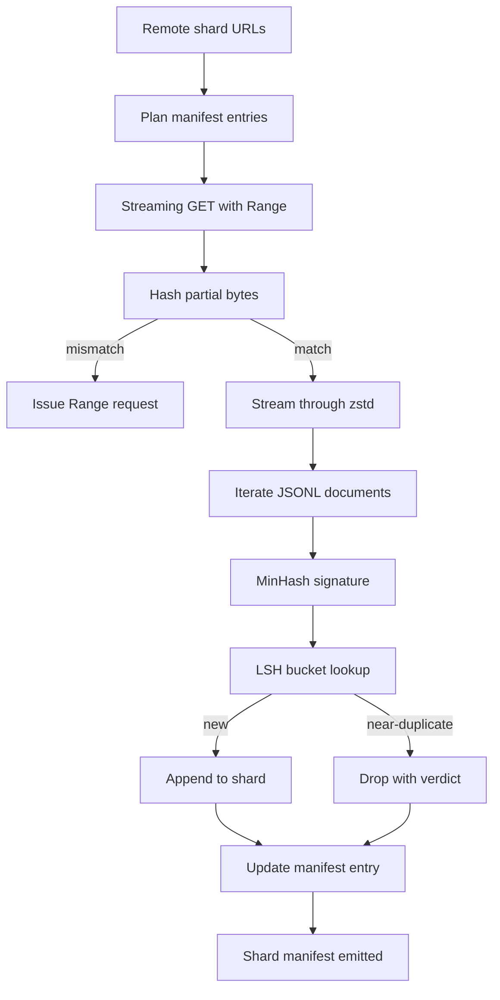

# Large Corpus Downloader

> Training a language model begins long before the first forward pass. The corpus has to land on disk, decompressed, deduplicated, and addressable, with the resume story already worked out before the network drops at 4 percent. This lesson builds a streaming downloader that pulls compressed shards, decompresses on the fly with Zstandard, fingerprints near-duplicates via MinHash plus locality-sensitive hashing, and writes a shard manifest the rest of the pipeline can trust.

**Type:** Build
**Languages:** Python
**Prerequisites:** Phase 19 lessons 30-37
**Time:** ~90 minutes

## Learning Objectives

- Stream remote shards with `urllib` and decompress with `zstandard` without buffering the whole file in memory.
- Resume partial downloads by issuing HTTP `Range` requests against a verified byte offset.
- Build a MinHash signature per document and bucket it with LSH so near-duplicates collide.
- Emit a shard manifest with content hash, byte size, document count, and dedup verdict.

## The Problem

The first time you train on a 200 GB corpus the network drops at percent 41 and the script exits with a `urllib` exception. The second time it drops at percent 78. By percent 99 you have rewritten the loop three times. The two failures you have to design for from minute one are partial-download resume and duplicate document removal. Both have well-known solutions; both are routinely skipped because the pipeline begins as a one-line `requests.get` call that grew teeth.

Resume is an HTTP problem. The server has to honour `Range`, the client has to track verified offset against an on-disk record, and the verified offset has to survive process death. If the offset and the file diverge by even one byte the resumed download writes garbage and the corpus is corrupted in a way that only shows up during tokenization.

Deduplication is a signature problem. Exact-hash dedup misses near-duplicates: the same Wikipedia article shows up with three different boilerplate footers, the same code file with a different license header, the same blog post with a tracking parameter on every link. MinHash plus LSH catches these at sub-linear cost. The cost is one signature per document and one bucket lookup per signature.

## The Concept



### Streaming with `urllib`

The standard-library `urllib.request.urlopen` returns a file-like object. Wrap it in a `zstandard.ZstdDecompressor().stream_reader` and the bytes flow from the network through the decompressor into the document iterator without ever materialising the compressed shard or the decompressed shard in memory. The only memory cost is the line buffer, the MinHash signature for the current document, and the LSH index.

### Resume with `Range`

The downloader writes two files per shard: the shard itself and a `.partial.json` checkpoint. The checkpoint records `verified_bytes`, `expected_size`, `sha256_prefix` (computed over the first `verified_bytes` bytes), and the source URL. On startup the downloader reads the checkpoint, recomputes `sha256_prefix` over the on-disk bytes, and only resumes if the recomputed hash matches. If the hash is wrong the partial is discarded and the download restarts from byte zero. Silent corruption is impossible because the verified bytes are checked, not assumed.

### MinHash plus LSH

MinHash estimates the Jaccard similarity of two sets in fixed space. For a document the set is the shingles (overlapping n-grams) of its text. The signature is `k` minimum hash values, one per independent hash function. Two documents with Jaccard similarity `s` have a probability `s` of agreeing on any single component of the signature.

LSH then groups the `k` components into `b` bands of `r` rows each, where `k = b * r`. Two documents collide in at least one band with probability `1 - (1 - s^r)^b`, which is a sharp threshold around the value of `s` you tune `(b, r)` to. The threshold for typical corpus dedup is `s = 0.8`, which the LSH research literature reaches with `k = 128`, `b = 32`, `r = 4`.

### Shard manifest as a contract

The downloader's only durable output is the manifest. The manifest holds, per shard, the URL, the decompressed byte count, the document count, the unique document count after dedup, and the sha256 of the final shard file. Downstream tokenization reads the manifest, not the directory listing. If a shard is missing or its sha256 is wrong, the manifest tells the next stage to refuse to start. The manifest is the deciding edge between "the data is downloaded" and "the data is downloaded and verifiable".

## Build It

`code/main.py` implements:

- `ShardPlanner` - reads a list of shard URLs and produces planned manifest entries.
- `StreamingDownloader` - opens a `urllib` stream with optional `Range`, writes to a temporary file, updates the `.partial.json` checkpoint on every chunk, and verifies the sha256 prefix on resume.
- `ZstdDocIterator` - wraps the file-like stream in `zstandard.ZstdDecompressor` and yields one document per line.
- `MinHasher` - produces a `k`-component signature for a string using a fixed family of hash seeds.
- `LSHIndex` - buckets signatures by band and reports collisions.
- `Dedup` - combines hasher and index to label each document `keep` or `near_duplicate` along with the matching shard id.
- `ManifestWriter` - collects per-shard stats and writes `manifest.json`.

A demo at the bottom of the file builds a small synthetic corpus on disk, compresses it with `zstandard`, downloads it through a `file://` URL, deduplicates, and prints the manifest.

Run it:

```bash
python3 code/main.py
```

The script exits zero and prints a manifest summary.

## Production Patterns

Four patterns scale this lesson to real corpora.

**Checkpoint before write.** The `.partial.json` must be `fsync`-ed before the bytes are appended to the shard. Otherwise a power loss reverses the order: shard bytes on disk, checkpoint without them, next resume believes it has fewer verified bytes than it does, the duplicated suffix bytes corrupt the file. Checkpoint first, then write. This is the same discipline as a write-ahead log.

**Sharded LSH index.** A single LSH index over the whole corpus does not fit in RAM at the 200 GB scale. Partition the LSH index by the first band hash, store partitions on disk, and consult only the partition a new signature would land in. The cost is one extra disk read per document; the benefit is that the LSH index is no longer a hard memory ceiling.

**Tombstone, not delete.** Dropped duplicates are recorded in the manifest with verdict `near_duplicate` and the shard id of the document they collided with. Deleting them loses the link between the duplicate and its keeper. Tombstoning preserves the audit trail and lets a downstream pass change its mind about the threshold.

**Per-shard sha256 in the manifest, plus a manifest sha256.** The manifest itself gets a content hash. Downstream stages verify the manifest hash before they trust the per-shard entries. Without this the manifest is the silent attack surface: an attacker who can edit a single file can corrupt the whole pipeline.

## Use It

Production patterns:

- **Resume on every CI run.** CI runners are ephemeral. The downloader has to assume a fresh disk on every run and recover from cache or remote. `--cache-dir` is a first-class flag.
- **Dedup before tokenization.** Tokenization is expensive. Running it twice on the same document is twice the cost for the same loss curve. Dedup is upstream of tokenization, not downstream.
- **Manifest as merge gate.** The training run reads the manifest sha256 from a pinned commit. A new dataset version requires a new manifest commit. The link between code and data is git, not folklore.

## Ship It

`outputs/skill-corpus-downloader.md` would, on a real project, describe which URLs feed the downloader, how the checkpoint directory is laid out, what shingle width and `(k, b, r)` triple the dedup uses, and where the manifest lives in version control. This lesson ships the engine.

## Exercises

1. Add a `--shingle-width` flag and measure how the dedup verdict changes at widths 3, 5, 9. Defend the chosen default.
2. Add gzip support next to zstd by sniffing the magic bytes. The downloader should not require the caller to specify the codec.
3. Add a `--resume-only` mode that refuses to start a fresh download if no checkpoint is found. Useful in CI to keep one run from accidentally re-pulling 200 GB.
4. Move the LSH index to a shelf or sqlite file and measure throughput vs the in-memory variant.
5. Add a manifest sha256 check on startup. The downloader should fail closed if the manifest on disk disagrees with the manifest hash in `manifest.lock`.

## Key Terms

| Term | What people say | What it actually means |
|------|-----------------|------------------------|
| Shard | "A file" | A self-contained slice of the corpus with its own sha256, used as the unit of resume and dedup |
| MinHash signature | "Fingerprint" | A `k`-component sketch of a set, where each component is the minimum of one independent hash over the set |
| LSH band | "Bucket" | A group of `r` signature components used as a single bucket key for collision detection |
| Verified bytes | "Resume offset" | Bytes on disk whose sha256 prefix matches the checkpoint; the only safe offset to resume from |
| Manifest | "The index" | The single durable record of what the downloader produced, including content hashes |

## Further Reading

- [RFC 7233](https://datatracker.ietf.org/doc/html/rfc7233) - HTTP Range requests, the resume protocol
- [Zstandard format specification](https://datatracker.ietf.org/doc/html/rfc8478) - frame format that makes streaming decompression safe
- [MinHash](https://en.wikipedia.org/wiki/MinHash) - the signature family this lesson uses
- [Locality-sensitive hashing](https://en.wikipedia.org/wiki/Locality-sensitive_hashing) - the banding scheme behind the dedup threshold
- Phase 19 · 43 - the HDF5 tokenized corpus the downloader feeds
- Phase 19 · 44 - the cosine schedule that trains on the corpus
- Phase 19 · 45 - the AMP loop that consumes the schedule
