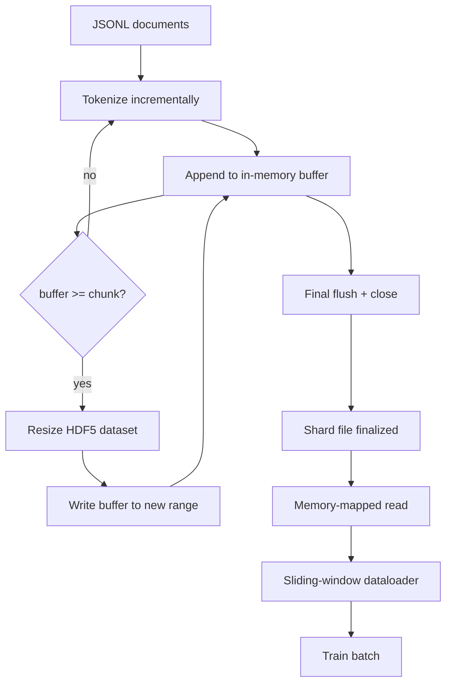

# HDF5 Tokenized Corpus

> The downloaded corpus has to land in a layout the trainer can stream from at line speed. JSONL on disk does not survive 16 dataloader workers. HDF5 with a resizable, chunked integer dataset does. This lesson builds streaming tokenization into a resizable HDF5 dataset, sharded write across multiple files, memory-mapped read at training time, and a sliding-window dataloader that produces fixed-length sequences with the right packing.

**Type:** Build
**Languages:** Python
**Prerequisites:** Phase 19 lessons 30-37
**Time:** ~90 minutes

## Learning Objectives

- Stream documents into a resizable HDF5 integer dataset with deterministic chunking.
- Shard the write across multiple HDF5 files so failure is bounded and parallelism is possible.
- Read tokens back through HDF5's page-cache-backed chunked layout so the dataloader copies into batch buffers only at batch time.
- Implement a sliding-window dataloader that emits fixed-length training sequences with explicit packing rules.

## The Problem

A modern language-model training run reads tokens at hundreds of thousands of samples per second across dozens of workers. JSONL on disk dies at the first cold-cache page fault: the JSON parser is slow, the document boundaries are not addressable, and seeking to "sample 4,217,884" requires scanning the file. Even Parquet, which compresses well, is a poor fit because the trainer does not want columns; it wants a flat token stream with O(1) random access.

HDF5 fits because it offers a chunked, resizable, integer-only dataset whose chunks are page-cache friendly at read time. The trainer asks for a slice of `tokens[3,200,000 : 3,200,8192]` and HDF5 copies the requested hyperslab from the page cache into a freshly allocated NumPy array. The cost is one open file handle and a chunk-sized page-cache footprint per worker, which is negligible compared to the cost of decoding JSONL.

The build problem is making the write side honest. Resizable datasets are easy to misuse: write one document at a time and the HDF5 file is fragmented to the point of unusable. Write all documents in one resize and a process death loses the whole shard. The right discipline is buffer-then-extend, with a buffer size that matches the chunk size, and a sharded write that splits the workload across files so a crash loses at most one shard.

## The Concept



### Resizable HDF5 done right

The token dataset is created with `maxshape=(None,)` and a fixed `chunks=(chunk_size,)`. Writing proceeds by buffering tokens in a NumPy array of length `chunk_size`. When the buffer fills, the dataset is resized by exactly `chunk_size` and the buffer is written into the new range. At end-of-shard the residual buffer is written into a final partial range. Every write is contiguous and chunk-aligned except the last one, which the reader is told to truncate at the recorded `token_count` in the shard's HDF5 attributes.

### Sharded write

A single HDF5 file is a single point of failure. The pipeline writes shards in parallel: each input shard from Phase 19 lesson 42 produces one HDF5 output shard. A `shards.json` index records, per shard, the file path, the token count, the document count, and a sha256 over the tokens. The trainer reads `shards.json` to compute global offsets and to validate the corpus.

### Memory-mapped read

At training time each worker opens its share of HDF5 files in `swmr=True` mode and asks for `tokens[start:stop]`. HDF5's chunk layout makes this a page-cache-backed read once the chunk is hot. The worker never materialises the whole file: the slice is copied into the dataloader's batch buffer, which the dataloader then copies into a pinned-memory training tensor at batch time. The hot path has one syscall per chunk transition; everything else is RAM access.

### Sliding-window dataloader

The dataloader is the only stage that knows about training-sequence length. It picks a random start index in the global token stream, reads `window_size + 1` tokens, and returns `(input, target) = (tokens[:-1], tokens[1:])`. Document boundaries are not enforced: a window may straddle two documents, with an explicit `boundary_token_id` between them so the model learns to use the separator. This is the standard packing rule; it is also the rule a beginner forgets, ending up with a corpus that is 8 percent training boundary tokens and 92 percent natural text.

## Build It

`code/main.py` implements:

- `Tokenizer` - a byte-level deterministic tokenizer good enough for the demo. The interface is `encode(text) -> list[int]` and `vocab_size`.
- `HDF5ShardWriter` - opens a resizable integer dataset, buffers tokens to chunk size, resizes and writes in fixed-size strides, records `token_count` and `sha256` as HDF5 attributes on close.
- `ShardedTokenizationPipeline` - iterates input documents, routes them to a writer, and emits a `shards.json` index.
- `MmapTokenStore` - opens shard files for memory-mapped reads, computes global offsets, exposes a single `get_slice(start, stop)` API.
- `SlidingWindowDataloader` - picks random windows from the global stream and yields `(input_ids, target_ids)` NumPy arrays.

A demo at the bottom of the file builds a tiny in-memory corpus, tokenizes into two shards, opens them via memory map, runs the dataloader for 10 batches, and prints the per-batch shape and a checksum.

Run it:

```bash
python3 code/main.py
```

The script exits zero and prints batch checksums.

## Production Patterns

Four patterns scale this lesson to a real training run.

**Chunk size equals the typical read.** The trainer reads `window_size + 1` tokens per sample. Set the HDF5 chunk to a multiple of `window_size` and reads are page-cache aligned. Mismatched chunks halve the throughput because every sample touches two chunks.

**Token count in attributes, not in the dataset.** The trailing slice of the dataset may be partially full because the chunk size does not divide the document boundary. Store the real `token_count` as an HDF5 attribute on the dataset and have the reader truncate at that value. Without this the reader walks off the end into zero-padded tokens and the model learns to predict zero.

**Sharded sha256 with parallel verification.** Each shard has its own sha256 over the token bytes. The trainer can verify all shards in parallel before training starts. A wrong sha256 fails the run early, not on epoch three after sixteen hours.

**`swmr=True` on both sides, with `libver="latest"` on the writer.** Single-Writer-Multiple-Reader mode requires the writer to open with `libver="latest"`, create every dataset up front, then set `file.swmr_mode = True`. After that the writer must call `dataset.flush()` after each resize so reader workers (opened with `swmr=True`) see consistent data. Skipping `libver="latest"` or enabling SWMR after structural changes is a common source of "file is locked" failures.

## Use It

Production patterns:

- **One HDF5 per source shard.** The downloader (lesson 42) emits one shard per URL; tokenization (this lesson) emits one HDF5 per source shard. The 1:1 mapping makes resume and partial-failure recovery trivial.
- **Boundary token id.** The boundary token is part of the tokenizer vocab and is the only token the dataloader injects. The training loss masks the boundary token if the model is supposed to ignore it; otherwise it learns to use it as a sequence separator.
- **`shards.json` as the source of truth.** Adding a new shard means writing the HDF5, computing its sha256, and appending an entry. The trainer reads the file once at startup and never touches the directory listing.

## Ship It

`outputs/skill-hdf5-tokenized-corpus.md` would, on a real project, describe which tokenizer feeds the pipeline, what chunk size matches the trainer's window, where `shards.json` lives in version control, and how dataloader workers are sharded across files. This lesson ships the engine.

## Exercises

1. Add a `--compression gzip` flag to the HDF5 writer and measure the throughput cost on the demo corpus. Defend the chosen default.
2. Add a deterministic seed to the sliding-window dataloader and verify two runs with the same seed produce identical batches.
3. Add a `--validate` mode that reads every shard, recomputes the sha256 over its tokens, and compares against `shards.json`. CI should run this before training starts.
4. Compare the dataloader throughput at chunk sizes equal to, half of, and twice the window size. Report the page-cache effect.
5. Add a `--max-document-tokens` flag that truncates very long documents at write time. Defend the trade-off against deciding at read time.

## Key Terms

| Term | What people say | What it actually means |
|------|-----------------|------------------------|
| Resizable dataset | "Append-only" | An HDF5 dataset with `maxshape=(None,)` that grows via `resize` calls in chunk-sized strides |
| Chunked layout | "How HDF5 stores it" | Fixed-size on-disk pages that the kernel can memory-map and the dataloader can read contiguously |
| `swmr` mode | "Read-while-write" | Single-Writer-Multiple-Reader mode that lets dataloader workers share the file safely |
| Shard index | "shards.json" | The durable index of all token shards with offsets and content hashes |
| Sliding window | "Training sample" | A fixed-length slice of the global token stream that the trainer pairs with its shift-by-one target |

## Further Reading

- [HDF5 chunking documentation](https://docs.hdfgroup.org/hdf5/v1_14/) - the chunked, resizable dataset layout this lesson uses
- [h5py user guide](https://docs.h5py.org/en/stable/) - Python bindings for HDF5
- [NumPy memory mapping](https://numpy.org/doc/stable/reference/generated/numpy.memmap.html) - the read-side primitive HDF5 exposes through h5py
- Phase 19 · 42 - the downloader whose output this lesson tokenizes
- Phase 19 · 44 - the cosine schedule that consumes this dataloader
- Phase 19 · 45 - the AMP loop that wraps the training step
