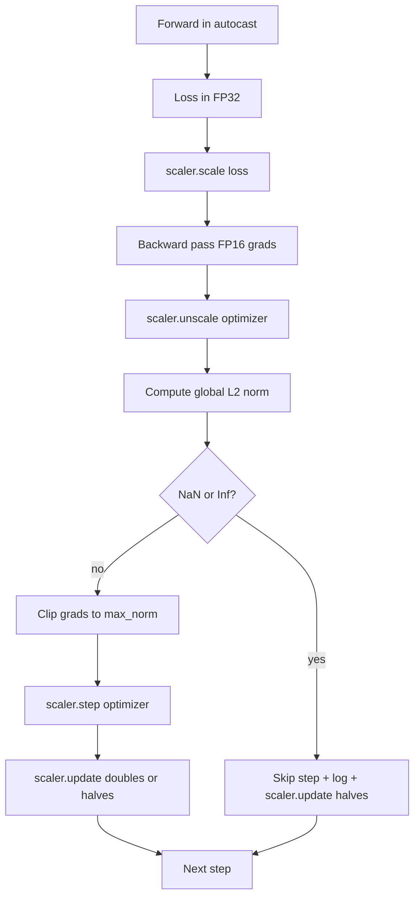

# Gradient Clipping and Mixed Precision

> The optimizer and schedule from the previous lesson assume gradients are sane. They usually are not. A single bad batch can spike the gradient norm by three orders of magnitude. Mixed-precision training amplifies this by introducing FP16 overflow on the loss side. This lesson builds the two safety belts that production training cannot ship without: gradient clipping to a configured global L2 norm, and a mixed-precision loop with autocast and GradScaler that detects NaN and Inf, skips the step cleanly, and logs the scaling factor for forensics.

**Type:** Build
**Languages:** Python
**Prerequisites:** Phase 19 lessons 30-37
**Time:** ~90 minutes

## Learning Objectives

- Compute the global L2 norm over all parameter gradients and clip in place when it exceeds a configured threshold.
- Wrap a training step in autocast plus a GradScaler so FP16 forward and backward passes survive overflow.
- Detect NaN and Inf in the loss or gradient, skip the optimizer step, and log the skip.
- Report the GradScaler's scaling factor every step so a long sequence of skips is visible immediately.

## The Problem

A training run that ran clean yesterday produces a loss curve that goes vertical at step 8,217. The culprit is a single batch whose gradient norm is 4,200, twenty times the previous peak. Without clipping the optimizer applies a step that resets every learning the model had done in the previous hour. With a global L2 clip at norm 1.0, the same batch contributes a unit-norm update; the loss stays on its trend line; the run survives.

Mixed-precision training pushes throughput by 2-3x by computing the forward pass and most of the backward pass in FP16. The cost is that FP16 has a narrow exponent range. A typical gradient that overflows in FP16 evaluates to Inf, which propagates through subsequent layers as NaN, which sets every weight to NaN at the next optimizer step. PyTorch's GradScaler solves this by multiplying the loss by a large scaling factor before the backward pass and dividing the gradients by the same factor before the optimizer step. If any gradient is Inf or NaN at unscale time, the scaler skips the step and halves the scaling factor; if the previous N steps were clean, the scaler doubles the factor. Over the course of training the factor finds the highest value the FP16 range allows.

The build problem is wiring the two correctly. Clip before unscale and the threshold is on scaled gradients; clip after unscale and the order of operations on the GradScaler matters. The right order is: `scaler.scale(loss).backward()`, then `scaler.unscale_(optimizer)`, then `clip_grad_norm_`, then `scaler.step(optimizer)`, then `scaler.update()`. Any other order produces a silently broken loop.

## The Concept



### Global L2 norm

The global L2 norm is the Euclidean norm of the concatenated gradient vector, not the per-parameter norm. PyTorch implements this as `torch.nn.utils.clip_grad_norm_(parameters, max_norm)`. The function returns the pre-clip norm so the lesson can log both the natural and the clipped value, which is necessary for the "we are clipping at every step" diagnosis.

### autocast and GradScaler

`torch.amp.autocast(device_type)` is the context manager that selectively runs eligible operations (most matmul-class operations) in FP16. `torch.amp.GradScaler(device_type)` is the helper that scales the loss before backward and inverse-scales the gradients before the optimizer step. The two are designed together; using one without the other is a configuration error the test should catch.

The lesson uses CPU autocast because that is what runs in CI; the same pattern transfers verbatim to CUDA by changing `device_type="cpu"` to `device_type="cuda"`. The GradScaler on CPU is a stub (CPU autocast already operates in BF16 by default and does not need loss scaling), but the lesson includes the call sites so the wiring is identical to the GPU loop.

### NaN and Inf detection

The detection happens in two places. First, the loss itself is checked with `torch.isfinite` before backward; an Inf or NaN loss does not produce useful gradients and is skipped without entering the optimizer. Second, after `scaler.unscale_(optimizer)` the lesson scans the unscaled gradients with `has_non_finite_grad(...)` and treats any Inf or NaN as a skip. The two checks together cover both the forward-pass and the backward-pass failure modes.

### Scaling factor diagnostics

The scaling factor is the GradScaler's internal state. Every step the lesson reads `scaler.get_scale()` and logs it next to the learning rate and gradient norm. A healthy run shows the scaling factor climbing in powers of two until it saturates near `2^17` or `2^18`. A misbehaving run shows the factor oscillating between high and low values, which is the signal that the model's gradients are sometimes in range and sometimes not. The diagnostic is invisible without logging.

## Build It

`code/main.py` implements:

- `clip_global_l2_norm` - a wrapper around `torch.nn.utils.clip_grad_norm_` that returns both the pre-clip and post-clip norm.
- `has_non_finite_grad` - a helper that scans gradients for NaN and Inf.
- `AmpTrainState` - wraps a model, an `AdamW` optimizer, a GradScaler, and an autocast device. Exposes a `step(inputs, targets)` that runs the full clipping, scaling, and skip-on-NaN pipeline.
- `StepLog` and `SkipLog` - structured per-step records.
- A demo that trains a small `nn.Linear` model for 20 steps, injects an Inf into the gradient on step 5 to exercise the skip path, and prints the resulting log.

Run it:

```bash
python3 code/main.py
```

The script exits zero and prints a per-step log with each row tagged `STEP` or `SKIP`; at least one row is a `SKIP`.

## Production Patterns

Four patterns elevate the loop to a production training step.

**Skip counter as an alert, not a log line.** A handful of skipped steps per training run is healthy. Hundreds of skips per epoch are a hard alert: the model is in a regime FP16 cannot hold and the loop is silently failing. The lesson tracks a 1,000-step rolling skip rate and would, in production, page on a rate above 5 percent.

**Clip threshold lives in the config.** `max_norm = 1.0` is the modern default for language-model training. Sweep it on a small model first; larger thresholds let the model recover from genuinely difficult batches; smaller thresholds bound the worst case at the cost of a noisier loss curve. The threshold belongs in the same YAML or JSON config as the schedule from lesson 44.

**Norm log goes to a CSV with the schedule.** The CSV columns are `step, lr, grad_l2_pre_clip, grad_l2_post_clip, loss, skipped, skip_reason, scaler_scale`. A reviewer who opens the file sees the schedule, the gradient story, the scaling factor, and the skip outcome (with its reason) in one row. Splitting the columns across files is a recipe for misaligned analyses.

**`scaler.update()` runs every step, even on skip.** On a clean step the scaler reads its no-inf counter, increments it, and possibly doubles the factor. On a skipped step the scaler halves the factor and resets the counter. Forgetting `update()` on the skip path is the bug that produces "the scaling factor never changed."

## Use It

Production patterns:

- **Autocast device matches optimizer device.** `torch.amp.autocast(device_type="cuda")` for GPU training; `torch.amp.autocast(device_type="cpu")` for CPU. Mixing devices produces a silent type error that surfaces as a loss curve that looks fine but a model that is not learning.
- **Loss check before backward.** `torch.isfinite(loss).all()` is one tensor reduction; the cost is negligible and the savings on a NaN loss are an entire training step. Always run it.
- **`set_to_none=True` in `zero_grad`.** Sets gradients to `None` instead of zero, which lets the optimizer skip computation for unaffected parameter groups. The setting is a free throughput improvement and a slight bug-surface reduction.

## Ship It

`outputs/skill-clip-amp.md` would, on a real project, describe which clip threshold and autocast device the training step uses, where the per-step CSV lives in version control, and what the production skip-rate alert threshold is. This lesson ships the engine.

## Exercises

1. Replace the synthetic Inf injection with a real loss spike (multiply one batch's target by 1e8) and verify the skip path triggers.
2. Add a `--bf16` mode that switches autocast to BF16 instead of FP16. BF16 has a wider exponent range than FP16 and rarely needs loss scaling; verify the skip rate drops to zero on the same demo.
3. Add a unit test that the gradient-clip wrapper returns the pre-clip and post-clip norm correctly when no clipping occurs.
4. Add a rolling-window skip-rate computation and a CLI flag that fails the run if the rate exceeds a configured threshold for 100 consecutive steps.
5. Wire the loop to write the canonical CSV (`step, lr, grad_l2_pre_clip, grad_l2_post_clip, loss, skipped, skip_reason, scaler_scale`) and confirm the file survives a Ctrl-C by flushing after every row.

## Key Terms

| Term | What people say | What it actually means |
|------|-----------------|------------------------|
| Global L2 norm | "Clip target" | Euclidean norm of the concatenated gradient vector across all trainable parameters |
| autocast | "Mixed precision" | Selective FP16 (or BF16) execution of eligible operations inside a `with` block |
| GradScaler | "Loss scaler" | Helper that multiplies the loss before backward and inverse-scales gradients before the optimizer step |
| Skip | "Bad step" | An optimizer step refused because the gradient or loss was non-finite; the scaler halves the factor |
| Scaling factor | "Scaler state" | The GradScaler's current multiplier; doubles after clean stretches and halves on every skip |

## Further Reading

- [Micikevicius et al., Mixed Precision Training (arXiv 1710.03740)](https://arxiv.org/abs/1710.03740) - the original loss-scaling proposal
- [Pascanu, Mikolov, Bengio, On the difficulty of training recurrent neural networks (arXiv 1211.5063)](https://arxiv.org/abs/1211.5063) - the gradient-clipping reference paper
- [PyTorch torch.amp.GradScaler](https://docs.pytorch.org/docs/stable/amp.html) - the scaler API this lesson wraps
- [PyTorch torch.nn.utils.clip_grad_norm_](https://docs.pytorch.org/docs/stable/generated/torch.nn.utils.clip_grad_norm_.html) - the clipping primitive this lesson uses
- Phase 19 · 42 - the downloader whose corpus feeds the loop
- Phase 19 · 43 - the dataloader the loop consumes
- Phase 19 · 44 - the schedule this loop composes with
