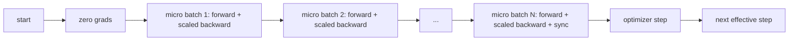
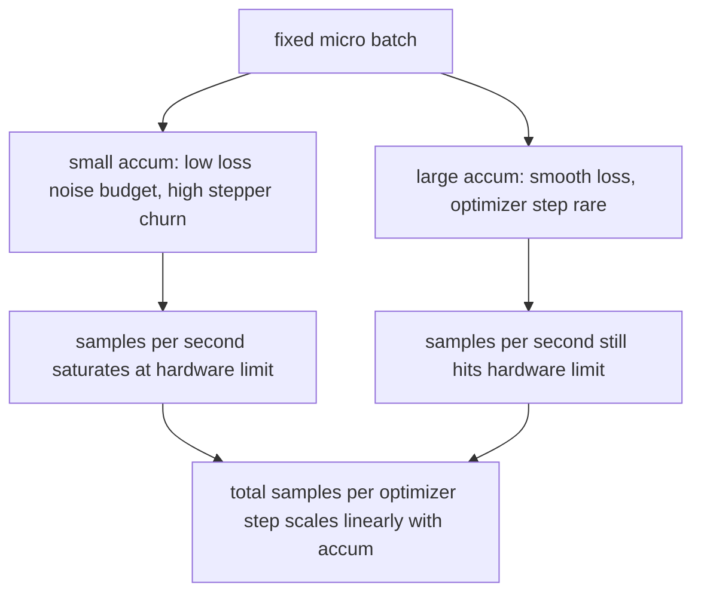

# Gradient Accumulation

> Train at an effective batch you cannot afford, one micro-batch at a time. Scale the loss, hold the optimizer step, and let the gradients pile up.

**Type:** Build
**Languages:** Python
**Prerequisites:** Phase 19 lessons 42 to 45
**Time:** ~90 minutes

## Learning Objectives

- Derive the effective batch identity: `effective_batch = micro_batch * accum_steps`.
- Implement loss-per-micro-batch scaling so the accumulated gradient matches a single full-batch backward.
- Skip optimizer synchronization until the last micro-batch (sync-on-last-step).
- Read a throughput against effective batch curve and explain the diminishing return.

## The Problem

You want to train at an effective batch of 512 because the loss curve is smoother and the optimizer step makes more sense at that scale. The accelerator on the desk holds 32 examples before it runs out of memory. Doubling the batch is not an option. Halving the model is not an option. The trick the field reached for in 2017 and never stopped using is to run 16 backward passes, let the gradients accumulate inside the parameter buffers, and only step the optimizer when the count reaches the target.

The risk is that the loss is no longer the same number it was at the bigger batch. The cross entropy of 16 mini-batches summed naively is 16 times the loss of one full batch. Without scaling, the gradient direction is correct but the magnitude is wrong, and the optimizer step is 16 times too big. The fix is one division. The fix is also easy to forget.

## The Concept



The contract is short:

- Loss for each micro-batch is divided by `accum_steps` before `backward()`. PyTorch sums gradients into `param.grad` by default; the division pushes the running sum back into the right scale.
- The optimizer step fires once per effective batch, after the last micro-batch's backward. Stepping mid-accumulation skews every parameter the rest of the run depends on.
- The optimizer's state (momentum buffers, Adam moments) advances once per effective step, not once per micro-batch. The exponential moving averages would otherwise see the wrong frequency and burn through the schedule.
- On a single device this is bookkeeping. On a multi-rank cluster the same pattern wraps the non-final micro-batches in a `no_sync` context that skips the gradient all-reduce; the last micro-batch reduces the full accumulated gradient in one pass instead of paying the network cost N times.

### The equivalence proof in code

```python
loss = criterion(model(x_full), y_full)
loss.backward()
opt.step()
```

is equivalent to

```python
for x, y in chunks(x_full, y_full, n):
    scaled = criterion(model(x), y) / n
    scaled.backward()
opt.step()
```

up to floating point summation order. The accumulated gradient buffer at the end of the loop is the same tensor that a single full-batch backward would produce. The lesson code asserts this with a max-abs difference under 1e-4 in `equivalence_check`.

### Where the cost goes

Each micro-batch costs one forward and one backward. With accumulation you trade memory for time. The throughput curve in `outputs/accum-curve.json` shows what happens as the effective batch grows at fixed micro-batch:



There is no free lunch. Doubling `accum_steps` doubles the wall time per optimizer step. What changes is the variance of the gradient estimate: at the same wall budget you have made fewer optimizer steps but each one was averaged over more samples. The literature treats large batch and small batch as different optimization problems; the lesson here is mechanical, not statistical.

## Build It

`code/main.py` is the runnable artifact. It does three things.

### Step 1: equivalence check

`equivalence_check()` builds two copies of the same network with the same seed. One sees a 16-sample batch in one forward pass. The other sees four 4-sample chunks with the loss divided by four. The function compares the gradient buffers before the optimizer step and the parameters after. The assertion is `max_abs_diff < 1e-4`.

### Step 2: sync-on-last-step pattern

`train_one_optimizer_step` walks micro-batches. For every micro-batch except the last it enters `no_sync_context(model)`. On a single process the context is a no-op; on DDP this is where the gradient all-reduce is skipped. The bookkeeping is the same regardless. A `sync_counter` records how many times we left the no_sync scope; for N micro-batches the count is one per effective step, not N.

### Step 3: the throughput curve

`sweep_effective_batches` runs the same model with a fixed micro-batch and a list of accumulation steps. For each setting it logs:

- `samples_per_sec`: total samples seen divided by wall time
- `median_step_ms`: 50th percentile per effective step
- `sync_calls`: collective points exercised
- `avg_loss`: average across the sweep's optimizer steps

The output lands in `outputs/accum-curve.json` and is reusable from a notebook.

Run it:

```bash
python3 code/main.py
```

The script prints the equivalence diff, then the sweep table, then the JSON path. Exit code zero.

## Use It

In production training, gradient accumulation lives behind one knob. PyTorch's pattern is `accumulation_steps = effective_batch // (micro_batch * world_size)`. Frameworks that you are not allowed to use here wrap the same loop, but the steps are the same: scale the loss, skip sync on non-final micros, accumulate, step once.

Three patterns in the wild:

- The micro-batch size is chosen to saturate device memory. Anything smaller wastes accelerator cycles. Anything larger crashes.
- The effective batch is chosen from a learning rate schedule. Large effective batches need scaled learning rates and warmup; this is the linear scaling rule talked about since 2017.
- The accumulation count is the bridge between the two and the only knob you are free to tune at runtime without rewriting the data loader.

## Ship It

`outputs/skill-gradient-accumulation.md` captures the recipe so a peer can drop it into a new repo: scale loss by `accum_steps`, skip optimizer sync on non-final micros, step the optimizer once per effective batch, log throughput against effective batch as JSON so the trade is visible.

## Exercises

1. Re-run the sweep with `--num-steps 100` and plot samples per second against effective batch. Where does the curve flatten?
2. Add a wrong scaling variant (no division) and show the parameter diff at step 1 against the reference.
3. Swap SGD for AdamW and confirm the optimizer state advances once per effective step, not once per micro-batch.
4. Introduce a real `DistributedDataParallel` wrapper and route the `no_sync_context` to its method. Confirm sync_calls drops by N-1 per effective batch.
5. Modify the equivalence check to compare two different micro splits (2 by 8 vs 4 by 4) and explain any tolerance you need to relax.

## Key Terms

| Term | What people say | What it actually means |
|------|-----------------|------------------------|
| Micro batch | The batch you forward | The slice that fits in memory in a single forward pass |
| Accum steps | Backward passes per step | Number of backwards summed before one optimizer step |
| Effective batch | The batch | Micro batch times accum steps times data parallel world size |
| Loss scaling | Divide by N | Per-micro-batch division so summed gradients match full batch |
| Sync on last | Skip the rest | Only run the gradient collective on the last backward in the window |

## Further Reading

- PyTorch docs on `DistributedDataParallel.no_sync` for the production version of the sync-on-last-step trick.
- Goyal et al., 2017, on linear scaling for large batch training, the canonical reason to care about effective batch.
- PyTorch issue tracker on gradient accumulation interactions with mixed precision unscaling.
- Phase 19 lessons 42 to 45 cover the model, data loader, optimizer, and trainer scaffolding this lesson assumes.
- Phase 19 lesson 47 covers checkpoint and resume so a long accumulation run survives a wallclock cap.
