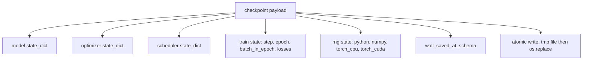
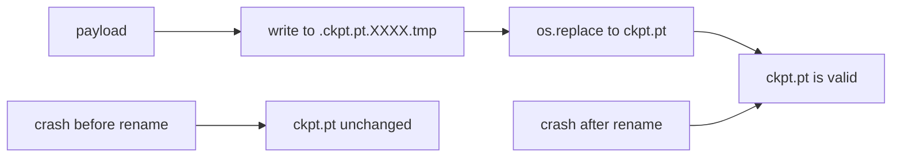
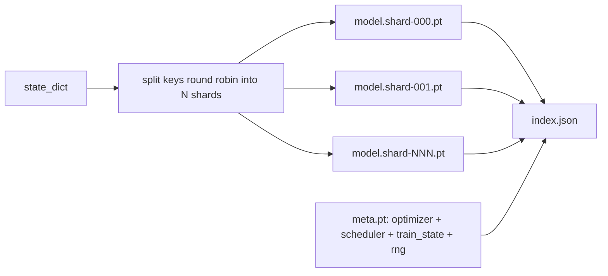

# Checkpoint Save and Resume

> Train interrupts kill runs; checkpoints let them continue. Save model, optimizer, scheduler, loss history, step counter, and RNG state, atomically, so a kill at any moment leaves a valid file on disk.

**Type:** Build
**Languages:** Python
**Prerequisites:** Phase 19 lessons 42 to 45
**Time:** ~90 minutes

## Learning Objectives

- Capture the full training state into a single payload that can be reloaded into a fresh process.
- Implement atomic save with write-to-temp then rename so a crash never leaves a half-written file.
- Restore the RNG state for Python, NumPy, and PyTorch so the post-resume loss matches the uninterrupted baseline.
- Build a sharded checkpoint layout for models that no longer fit in a single file, with hash-verified shards and a JSON index.

## The Problem

You set a training job for 18 hours. The wallclock cap is 4 hours. The cluster reboots at hour 11 because someone above your pay grade approved a kernel upgrade. Without checkpoints you start over. Without resume you also lose the optimizer state that took the first 11 hours to learn, so even if the model weights survived, the AdamW moments are gone and the next step lurches in a direction the training trajectory had already moved past.

The right artifact is a single file that holds everything needed to continue: model parameters, optimizer state, scheduler state, the loss history for plots, the current step and epoch and batch-in-epoch counters, and the RNG state for every source of randomness. Without the RNG state the resumed loss curve is a different curve. Same model, same data, different shuffle, different dropout mask, different number on the dashboard.

Atomic save is the other half of the contract. Writing into the final filename means a crash mid-write leaves a corrupt file; the resume reads garbage. Writing into a temporary file in the same directory and then renaming means a crash mid-write leaves the previous good file untouched. The rename is atomic on POSIX file systems.

## The Concept



### The five state buckets

| Bucket | Why it matters |
|--------|----------------|
| Model | Weights and buffers; what the model is. |
| Optimizer | Momentum and adaptive moments; without these the next step is a different optimization problem. |
| Scheduler | Where the learning rate is on its curve; cosine schedules in particular care. |
| Train counters | Step, epoch, batch-in-epoch, plus the loss history that draws the dashboard. |
| RNG state | Determinism for dropout, data shuffling, and any sampling inside the model. |

### Atomic save



Two rules. First, the temporary file lives in the same directory as the target so the rename stays within the same file system; cross-device renames are not atomic. Second, the temporary name is unique per attempt so two writers do not stomp.

### Sharded checkpoints

When the model gets large the single-file payload becomes too big to load fast, too big to inspect, and too painful when a network share hiccups mid-read. The fix is to split the parameter state into shards and write a small index that ties them together.



The index records the shard count, the sha256 of each shard, and the sha256 of the meta file. The loader fails loudly when any hash mismatches. The shards can land on different physical disks; the meta is small and reads first.

### Resume continues mid epoch

A resume that snaps to the start of the next epoch wastes anywhere from minutes to a day. The fix is `(epoch, batch_in_epoch)` plus the RNG state. After load, the training loop fast-forwards the random number generator past the batches already consumed in the current epoch and continues from `batch_in_epoch`. The lesson code does this exactly; the assertion is that the loss trajectory after resume matches the uninterrupted baseline within 1e-4.

## Build It

`code/main.py` provides four primitives and a demo driver.

### Step 1: capture and restore RNG state

`capture_rng_state` returns a dict with Python's `random.getstate`, NumPy's `np.random.get_state`, and PyTorch CPU and CUDA RNG bytes. `restore_rng_state` reverses it. The CPU tensor is a uint8 byte buffer that PyTorch's RNG knows how to consume.

### Step 2: atomic save

`atomic_save` writes the payload to a temp file in the target directory, then `os.replace` swaps it into the final name. `atomic_write_json` does the same for the sharded index.

### Step 3: full checkpoint round trip

`save_checkpoint` packages the model, optimizer, scheduler, train state, and RNG into one dict. `load_checkpoint` reverses it and returns a `TrainState`. The schema field is the upgrade hook: future format changes bump the version string and the loader dispatches.

### Step 4: sharded variant

`save_sharded_checkpoint` round-robins the parameter keys across N shards, writes each shard with its own atomic save, writes a meta file with optimizer and scheduler and train state, and writes the JSON index with shard sha256s. `load_sharded_checkpoint` verifies every shard before merging.

### Step 5: resume demo

`run_resume_demo` trains a small model for `total_steps`, saves a checkpoint at `interrupt_at`, then continues. A second process restores the checkpoint and runs the remaining steps. The function returns the max absolute difference between the two loss trajectories after the interruption point. With RNG restored, the difference is zero or floating-point noise.

Run it:

```bash
python3 code/main.py
```

The single-file and sharded demos both assert max-diff under 1e-4. The summary lands in `outputs/resume-demo.json`.

## Use It

Production training stacks ship checkpointing as part of the trainer. The shape is the same: model + optimizer + scheduler + counters + RNG, written atomically, named by step so the latest is easy to find. Sharded layouts power large model loading with parallel reads; the index.json is what makes that work.

Three patterns to enforce:

- **Schema is a string in the payload.** Migrations branch on it. Without it you cannot evolve the format without breaking old runs.
- **Sha256 every shard.** A silently truncated download is the worst kind of bug; the loader fails fast or it fails late.
- **Keep checkpoint cadence honest.** Save every N steps and every wallclock-minute, whichever is shorter. Otherwise the long step that crashes wastes a full window of work.

## Ship It

`outputs/skill-checkpoint-save-resume.md` is the recipe for any new training script: payload shape, atomic write, RNG capture, sharded index. Drop the skill into a repo, wire `save_checkpoint` at the periodic save site, wire `load_checkpoint` at startup, and the run survives kills.

## Exercises

1. Replace round-robin sharding with sharding by parameter group (layers ending in `.weight` vs `.bias`). When is each layout preferable?
2. Extend the save loop to keep the last K checkpoints and prune older ones. What is the right K when the disk is small?
3. Add a `--ckpt-every-seconds` flag that triggers a save on a wallclock interval, not just step count.
4. Add a checksum verification path that runs at startup, scans every checkpoint in the directory, and reports which ones are corrupt.
5. Implement a `migrate_v1_to_v2` function that adds a new field to the payload and bumps the schema string. Make load tolerate both versions.

## Key Terms

| Term | What people say | What it actually means |
|------|-----------------|------------------------|
| Atomic save | "Write and pray" | Write to a temp file in the same directory, then os.replace into the target name |
| State dict | "The weights" | Model parameters and buffers, keyed by parameter name |
| Sharded checkpoint | "Big model file" | Multiple files, one per shard, plus a meta file and a JSON index with sha256s |
| RNG state | "Random seed" | Captured state for python random, numpy, torch CPU, torch CUDA; not just the seed |
| Mid-epoch resume | "Restart" | Fast-forward the RNG and continue from the next batch in the same epoch |

## Further Reading

- POSIX `rename` semantics for the atomicity claim that `os.replace` relies on.
- PyTorch documentation on `torch.save` and `torch.load`, including `map_location` for cross-device restores.
- Phase 19 lesson 46 covers the gradient accumulation that this lesson's checkpoint payload survives across.
- Phase 19 lesson 48 covers the distributed wrappers whose state dict format this scheme accommodates.
- The Linux kernel `fsync` documentation for the durability guarantee behind atomic rename.
