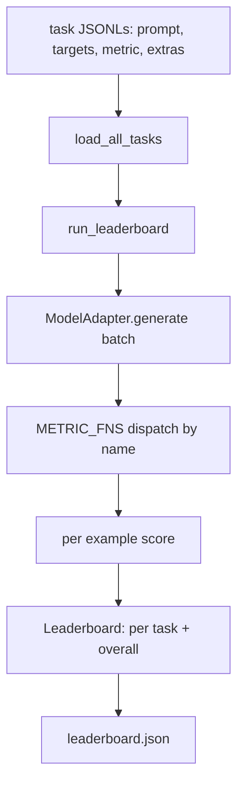
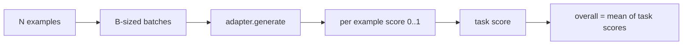

# Language Model Evaluation Harness

> A model that does well on a task you cannot define is a model that does well by accident. The harness is the task definition, the metric, the runner, and the leaderboard, in one short, swappable shape.

**Type:** Build
**Languages:** Python
**Prerequisites:** Phase 19 lessons 42 to 45
**Time:** ~90 minutes

## Learning Objectives

- Define a task as a JSONL file with `prompt`, `targets`, `metric`, and optional `extras` per example.
- Implement five metrics: exact match, rouge-l F1, executable check, multiple choice, and substring contains.
- Build a runner that batches examples per task and dispatches to a swappable model adapter.
- Emit a leaderboard JSON with per-task scores, latency, and an overall average that is reproducible.

## The Problem

A new language model lands every week. The marketing claim is that it does well. The honest question is: well at what? The honest answer is the leaderboard you wrote yourself, because the vendor's leaderboard is the one they tuned to.

Without a harness in your repo you compare two models by vibes. With a harness you compare them by score on a fixed task set with a fixed metric, on a JSON output you can diff. The harness is the contract between yesterday's run and today's run. Without it, regressions ship.

The trap is over-fitting the harness to a single model. The fix is the same trap in reverse: the harness is small enough to read in fifteen minutes, the tasks are small enough to ship in the repo, the metrics are written from scratch so a colleague can audit them, and the adapter is the only place model-specific code lives. Swap the adapter, the leaderboard moves; swap the tasks, the leaderboard moves. Nothing else should move.

## The Concept



### Task spec

Every example is one JSONL line:

```json
{"id": "arith-00", "prompt": "compute: 2 + 2", "targets": ["4"], "metric": "exact_match"}
```

For metrics that need scoring helpers, `extras` carries the side payload:

```json
{
  "id": "code-00",
  "prompt": "python: write a function f that doubles its input",
  "targets": ["ok"],
  "metric": "code_exec",
  "extras": {"io_pairs": [[1, 2], [3, 6]]}
}
```

A task is a `.jsonl` file under `outputs/tasks/`. The file name is the task name. All examples in a file share a metric.

### The five fixture tasks

| Task | Metric | What it tests |
|------|--------|---------------|
| arithmetic | exact_match | Token-level correctness on a deterministic answer |
| summary | rouge_l | Longest common subsequence F1 against a one-line reference summary |
| code-exec | code_exec | Executable test: the predicted function must satisfy a list of input-output pairs |
| multiple-choice | multiple_choice | First letter of the prediction must match an allowed letter |
| generation | substring_contains | Free-form text must contain at least one target substring |

### The metric contract

Every metric is a function from `(prediction, targets, extras) -> float in [0.0, 1.0]`. The harness averages the per-example scores to get a task score, then averages task scores to get the overall. The metric functions are tiny:

- `exact_match`: lowercase, collapse whitespace, equality.
- `substring_contains`: same normalization, substring test.
- `multiple_choice`: first character uppercased.
- `rouge_l`: LCS length divided by lengths of prediction and reference, F1 of precision and recall.
- `code_exec`: execute the prediction in a restricted namespace, call `f(x)` on every input-output pair, count matches.

The code_exec metric runs the prediction in a stripped builtins namespace. The lesson's test asserts that `import os` blows up because `os` is not in the namespace; you cannot reach the filesystem from a code prediction.

### The model adapter

```python
class ModelAdapter(Protocol):
    def generate(self, prompts: Sequence[str]) -> List[str]: ...
    @property
    def name(self) -> str: ...
```

The adapter is the seam. The lesson ships `ToyAdapter`, a deterministic pattern matcher that returns the right answer for every prompt in the five fixture tasks. A real adapter calls the model and returns its output. The harness does not care which.

### The runner

`run_task` batches `batch_size` prompts at a time and dispatches to the metric function. `run_leaderboard` walks every task and averages. `write_leaderboard` emits JSON with a schema string so future format changes do not silently break dashboards.



## Build It

`code/main.py` is the runnable artifact.

### Step 1: seed fixture tasks

`seed_fixture_tasks(target_dir)` writes the five `.jsonl` files. The first run of `main.py` seeds them when the directory is empty.

### Step 2: load tasks

`load_all_tasks(task_dir)` reads every `.jsonl` and returns a dict from task name to a list of `Example` records. Comment lines starting with `#` and blank lines are skipped so contributors can annotate the files.

### Step 3: implement metrics

Each metric is a small function with a unit test. The lesson's test suite includes 13 cases covering normalization, partial overlap, code execution, and unsafe code rejection.

### Step 4: write the runner

`run_task` iterates batches and produces a `TaskResult` with score, correct count, total count, and latency. `run_leaderboard` walks all tasks and produces a `Leaderboard` with the overall average.

### Step 5: emit JSON

`write_leaderboard` serializes the board. The `--include-per-example` flag dumps the per-example records so you can diff predictions against the previous run when scores move.

Run it:

```bash
python3 code/main.py
```

The script seeds the fixtures on first run, scores them with the toy adapter (which gets every fixture right), and writes `outputs/leaderboard.json`. Overall score is 1.0 with the toy adapter; the stub adapter test in `test_main.py` shows the same harness produces 0.0 when the adapter cannot answer.

## Use It

To plug a real model in, write an adapter. The shape:

```python
class HttpAdapter:
    name = "vendor.v1"

    def __init__(self, endpoint, api_key):
        self.endpoint = endpoint
        self.api_key = api_key

    def generate(self, prompts):
        out = []
        for prompt in prompts:
            response = http_post(self.endpoint, prompt, self.api_key)
            out.append(response["text"])
        return out
```

Swap `ToyAdapter` for `HttpAdapter` at the top of `main()`. The harness, the tasks, the metrics, and the leaderboard stay the same.

Three patterns to enforce when shipping the harness in a real project:

- **Pin the task files.** The leaderboard.json carries hash-pinned task content or it carries the JSONLs alongside; otherwise the score moves when the task file does, and you cannot tell which.
- **Diff predictions, not just scores.** The `--include-per-example` flag lets you see what the model said the day the score dropped.
- **Cap the batch size.** Real adapters have rate limits. A small batch size keeps the harness compatible across vendors.

## Ship It

`outputs/skill-lm-eval-harness.md` carries the recipe: JSONL task spec, five metrics, swappable adapter, batched runner, leaderboard JSON with schema string. The task files in `outputs/tasks/` are the fixtures; copy them into a real project as starters.

## Exercises

1. Add a sixth task with a custom metric you write from scratch (BLEU-like overlap, BLEURT-like reference scoring, anything with a clear contract).
2. Extend `code_exec` to capture stdout and accept a list of expected stdouts as targets.
3. Add a leaderboard diff command: given two `leaderboard.json` files, print which tasks moved and by how much.
4. Cap latency per example. Wrap the adapter call in a timeout; surface a separate `timeouts` column in the leaderboard.
5. Pin task content with a sha256 in the leaderboard so a future reader can verify they scored the same tasks.

## Key Terms

| Term | What people say | What it actually means |
|------|-----------------|------------------------|
| Task spec | "The eval format" | JSONL file with prompt, targets, metric, optional extras per example |
| Metric | "How you score" | Function from (prediction, targets, extras) to a float in [0, 1] |
| Adapter | "The model client" | Object with a generate(prompts) -> list[str] method; the only model-specific code |
| Leaderboard | "The scoreboard" | JSON with per-task scores, total counts, latency, and an overall average |
| Code exec metric | "Run it and check" | Execute the prediction in a restricted namespace, compare against input-output pairs |

## Further Reading

- The original lm-evaluation-harness for the production reference, much larger but the same shape.
- HuggingFace's lighteval for an alternative implementation of the same contract.
- Phase 19 lesson 46 covers the gradient accumulation patterns used in the training stack the harness scores.
- Phase 19 lesson 47 covers the checkpoint format you score against; pin the checkpoint hash in the leaderboard.
- Phase 19 lesson 48 covers the distributed training stack that produced the model under test.
