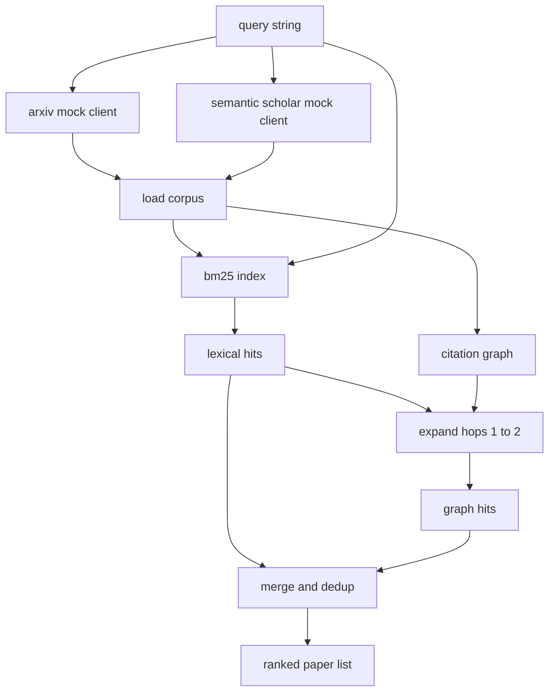

# Literature Retrieval

> A hypothesis is cheap. Knowing whether someone already proved it is the expensive part. Build the retrieval layer that answers that question before the runner spins up a sandbox.

**Type:** Build
**Languages:** Python
**Prerequisites:** Phase 19 Track A lessons 20-29
**Time:** ~90 minutes

## Learning Objectives
- Model a small paper record with the fields the loop will read downstream.
- Build a BM25 index over abstracts with stdlib data structures only.
- Walk a citation graph to surface papers the lexical search missed.
- Deduplicate hits across the lexical and graph passes by stable paper id.
- Wrap two mock external APIs behind a single client so the upstream call site stays the same when real endpoints land.

## Why two retrieval passes

A keyword search over abstracts returns papers that share vocabulary with the query. That covers most of the surface. It misses two cases. The first is when the foundational paper uses different vocabulary; for example a query for "sparse attention" misses a paper titled "block selection in transformer routing." The second is when the relevant paper is a follow up that cites a known anchor; it is more efficient to find the anchor and walk forward than to brute force the abstract pool.

The lesson builds both passes. BM25 over abstracts catches the lexical hits. A citation graph traversal expands a seed set forward and backward by one or two hops. The union is deduplicated by paper id and ranked by a small combined score.

## The Paper shape

```text
Paper
  id          : str           (stable identifier, "p001" for the mock corpus)
  title       : str
  abstract    : str
  year        : int
  authors     : list[str]
  references  : list[str]     (paper ids this paper cites)
  citations   : list[str]     (paper ids that cite this paper)
  source      : str           (which mock api supplied it, "arxiv" or "s2")
```

The references and citations fields form the directed citation graph. The two mock APIs return overlapping but not identical fields, so the corpus loader unions them on `id`.

## Architecture



The retrieval client owns both passes and the merge. The caller hands it a query and gets back a ranked list where each entry carries per paper score fields (`bm25_score`, `graph_distance`, `recency_score`, `final_score`) that explain the ranking.

## BM25 from scratch

The implementation is the standard Okapi BM25 with default parameters `k1=1.5`, `b=0.75`. The index is two dictionaries: `term -> doc_frequency` and `term -> list of (doc_id, term_count)`. The document length is the token count of the abstract. The average document length is computed once at index build time. Scoring a query is a sum over query terms of `idf * tf_norm` where `tf_norm` is the standard BM25 length normalised term frequency.

The tokeniser is `lower` then split on non alphanumeric. It is not stemmed. A production system would swap in a small stemmer. The interface stays the same.

```text
idf(t)      = log((N - df + 0.5) / (df + 0.5) + 1.0)
tf_norm(t)  = (f * (k1 + 1)) / (f + k1 * (1 - b + b * dl / avgdl))
score(d, q) = sum over t in q of idf(t) * tf_norm(t)
```

## Citation graph traversal

The graph is built once from the corpus. Forward edges go from a paper to its references. Backward edges go from a paper to its citations. The traversal is a breadth first search seeded by the top BM25 hits, capped at two hops.

Two hops is a deliberate ceiling. One hop is too shallow; the agent often wants the immediate ancestor or descendant. Three hops blows up the result size on a connected graph and tends to drift off topic. The lesson exposes the hop limit as a config knob so a downstream loop can tighten it.

## Dedup and ranking

The two passes return overlapping sets. The merge keys on paper id. For each paper the final score is a weighted blend.

```text
final_score = w_bm25 * bm25_score_norm
            + w_graph * graph_score
            + w_recency * recency_score
```

`bm25_score_norm` is the BM25 score divided by the maximum BM25 score in the merged set (so the field lives in zero to one). `graph_score` is one for direct lexical hits, then `0.6` for one hop, `0.3` for two hops, zero otherwise. `recency_score` is a linear ramp from zero at the corpus minimum year to one at the maximum.

Default weights are `0.5`, `0.3`, `0.2`. The weights are config; a stale topic might tune recency down while a fast moving topic raises it.

## Mock corpus

The corpus is one hundred papers, generated by `build_corpus()`. Each paper has a hand written title and abstract on one of five topics: attention sparsity, retrieval augmentation, low rank adapters, dataset distillation, and evaluation harnesses. References and citations are wired so each topic forms a connected sub graph with a few cross topic edges.

The two mock API clients (`ArxivMockClient`, `SemanticScholarMockClient`) read from the same corpus but expose different fields. Arxiv returns title, abstract, year, authors. Semantic Scholar adds references and citations. The retrieval client unions on id; cross client field disagreement handling is deferred to a follow up lesson.

## What lessons 52 and 53 read

The runner in lesson fifty-two reads `paper.id`, `paper.title`, and the top three sentences of the abstract as context for the experiment. The evaluator in lesson fifty-three reads `paper.year` and `paper.references` to attribute a baseline to a specific paper.

The retrieval client returns a `RetrievalResult` with both the ranked list and the per query metrics: hit count, average score, top score, total wall time. The runner logs these so a downstream observability pass can plot quality over time.

## How to read the code

`code/main.py` defines `Paper`, `ArxivMockClient`, `SemanticScholarMockClient`, `BM25Index`, `CitationGraph`, `RetrievalClient`, and a deterministic demo. The mock clients and the corpus are in the same file so the lesson stays portable. The BM25 implementation is one class, sixty lines. The graph traversal is one method.

`code/tests/test_retrieval.py` covers the lexical path, the graph path, the merge, the dedup, and the empty query.

## Where this slots in

Lesson fifty produces a hypothesis. Lesson fifty-one searches the literature to see whether that hypothesis is already settled. Lesson fifty-two runs the experiment if it is not. Lesson fifty-three reads both the retrieval result and the experiment metrics to write the verdict. The retrieval client is the cheapest of the four stages and runs first in the orchestrator.
