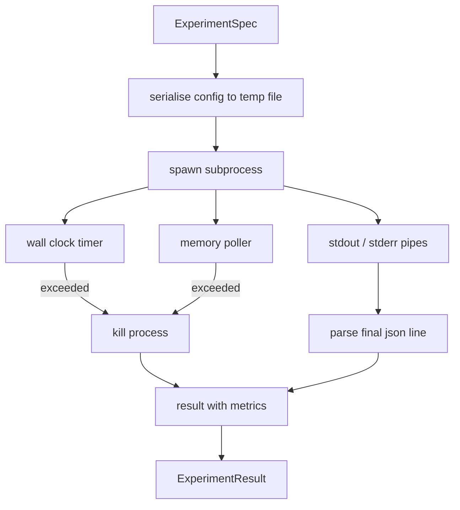

# Experiment Runner

> The loop is only as honest as its measurements. Build the runner that takes a spec, executes it in a sandboxed subprocess, and emits a json metrics blob the evaluator can trust.

**Type:** Build
**Languages:** Python
**Prerequisites:** Phase 19 Track A lessons 20-29
**Time:** ~90 minutes

## Learning Objectives
- Encode an experiment as a typed spec the runner can serialise to a subprocess.
- Launch a subprocess with a hard wall clock timeout and a soft memory cap, and surface both as terminal conditions.
- Capture stdout, stderr, and the structured metrics blob into a single result record.
- Build an ablation table that sweeps one configuration knob at a time over a fixed base spec.
- Keep every result deterministic given a seed so the evaluator sees the same numbers across runs.

## Why a subprocess

A research loop runs untrusted code. The hypothesis came from a sampler, the experiment script came from the same path; treating either as safe in-process is asking for a crash that takes the orchestrator down. Subprocesses are the simplest isolation the language ships: a separate process, an independent address space, a signal handle on the parent side.

The runner here does not implement full sandboxing. There is no cgroup, no seccomp filter, no namespace remapping. What it does have is a wall clock timeout, a polling loop for memory growth, and a kill path that terminates the process on either limit. That is the runtime contract every more elaborate sandbox extends. The lesson keeps the contract small enough to read in one sitting.

## The ExperimentSpec shape

```text
ExperimentSpec
  spec_id        : str            (stable id, "exp_001")
  hypothesis_id  : int            (link back to the queue from lesson 50)
  script_path    : str            (path to the python script to run)
  config         : dict           (passed to the script as one json arg)
  seed           : int            (deterministic seed for the experiment)
  wall_timeout_s : float          (hard timeout, killed on exceed)
  memory_cap_mb  : int            (soft cap, polled; killed on exceed)
  metric_keys    : list[str]      (which fields the evaluator will read)
```

The script lives on disk; the runner writes the config to a temp file path that the script reads. The script is expected to print a single json line on stdout whose keys are a superset of `metric_keys`. Anything else on stdout is captured but ignored by the metrics parser.

## Architecture



The runner is one class with one main method. The poller is a small thread that wakes once every poll interval and reads the subprocess `psutil` equivalent from the proc filesystem when available, falling back to no op when the platform does not expose it.

## Why a soft memory cap

Hard memory caps need `resource.setrlimit` and only work on POSIX. The lesson ships a portable approach: poll the resident set size from the platform and kill the subprocess if it exceeds the cap. The cap is soft because the poller has a non zero interval; a process can spike above the cap between polls and then drop back. The runner records the maximum observed RSS so the evaluator can see how close the run came to the limit.

On systems without process inspection support, the poller logs a one time warning and disables itself. The wall clock timeout still applies. The lesson tests cover both paths.

## Capturing stdout and stderr

The runner reads both pipes drained on completion. Stdout is scanned line by line; the last line that parses as json with all required `metric_keys` is taken as the metrics blob. Earlier json lines are kept in the result as `intermediate_metrics`; the evaluator can use these for learning curves.

Stderr is captured verbatim into the result. The runner never raises on a non zero exit code; instead it records the code in the result. Any non zero exit is labelled `"crash"` even when the script printed metrics, so the evaluator treats partial runs as failures by default.

## Ablation table

```python
def ablate(base: ExperimentSpec, knob: str, values: list[Any]) -> list[ExperimentSpec]:
    ...
```

Given a base spec and a knob name, the helper returns one spec per value with `config[knob]` overridden. Each spec gets a derived `spec_id` (`f"{base.spec_id}_{knob}_{value}"`). The runner ships an `AblationRunner` that runs them in order and returns an `AblationTable` keyed by knob value.

Why one knob at a time. Full factorial sweeps blow up exponentially and produce results the evaluator cannot interpret. One knob at a time produces a clean axis the evaluator can plot. The lesson supports multi knob sweeps only as repeated single knob ablations, composed by the caller.

## Determinism

Every spec carries a seed. The runner forwards the seed to the script via the config dict (`config["__seed"] = spec.seed`). The mock experiment scripts in `code/experiments/` honour the seed and produce identical metrics across runs. The evaluator in lesson fifty-three depends on this; without determinism a "regression" might be a different random initialisation.

## The mock experiment script

The lesson ships one experiment script: `code/experiments/sparsity_experiment.py`. It is a real script that reads its config file, simulates a small training run with a numpy random pass, and prints a json metrics blob. The script honours a `sleep_s` knob for testing timeouts and an `allocate_mb` knob for testing the memory poller.

The simulation is not training anything real. It is a numerical computation that mimics the shape of a training loop: a loss curve, a final perplexity, a wall time. The point of the lesson is the runner, not the simulation. A real experiment script would import a model.

## Result shape

```text
ExperimentResult
  spec_id              : str
  hypothesis_id        : int
  exit_code            : int
  terminal             : "ok" | "timeout" | "oom" | "crash"
  wall_time_s          : float
  peak_rss_mb          : float | None
  metrics              : dict
  intermediate_metrics : list[dict]
  stdout_tail          : str
  stderr_tail          : str
```

The evaluator reads `metrics` and `terminal` first. If terminal is anything other than `"ok"` the experiment counts as a failed run and the evaluator's verdict is automatic. Otherwise the metrics are passed through the significance test.

## How to read the code

`code/main.py` defines `ExperimentSpec`, `ExperimentResult`, `ExperimentRunner`, `AblationRunner`, and a deterministic demo. The subprocess management is one class. The memory poller is a small thread. The ablation helper is a single function.

`code/experiments/sparsity_experiment.py` is the mock experiment used in tests. It reads its config file path from argv and writes a single json metrics line on completion.

`code/tests/test_runner.py` covers the success path, the timeout path, the crash path, the ablation table, and the determinism check across two runs.

## Where this slots in

Lesson fifty generates the hypothesis. Lesson fifty-one filters out anything the literature already settled. Lesson fifty-two runs the experiment for what is left. Lesson fifty-three reads the result, runs the significance test, and writes the verdict the orchestrator stores against the hypothesis id.
