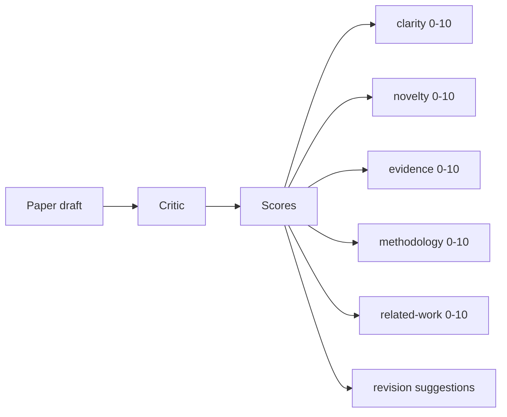
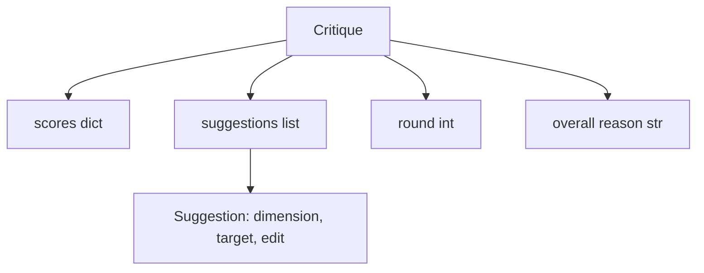
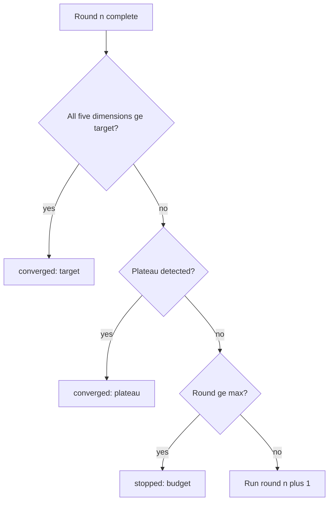
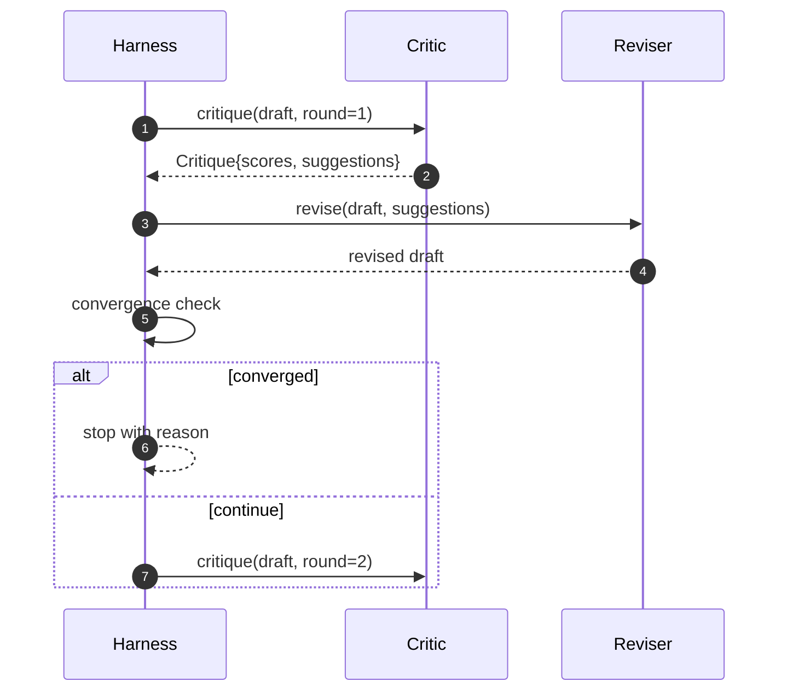

# Critic Loop

> A critic that returns "looks good" the first time is broken. A critic that always returns "needs work" is broken. The interesting critic is the one that converges, and you have to engineer convergence.

**Type:** Build
**Languages:** Python
**Prerequisites:** Phase 19 lessons 50-53
**Time:** ~90 minutes

## Learning Objectives

- Score a paper draft across five fixed dimensions: clarity, novelty, evidence, methodology, related-work.
- Apply each round's critique as a structured revision diff rather than a freeform rewrite.
- Detect convergence by comparing scores across rounds; stop on plateau, target met, or budget exhausted.
- Cap rounds with a max-iteration budget so a non-converging critic does not run forever.
- Emit a per-round trace so the dashboard or the next stage can render the score trajectory.

## Why five fixed dimensions

A freeform critic is a model that returns a paragraph of suggestions. The next round's revision treats the paragraph as ambient context. Whether the rewrite addresses the criticism is unverifiable because the criticism never had structure.

Five dimensions give the harness a contract.



The score is a vector. The harness watches each dimension across rounds. A revision that raises clarity but tanks evidence is a regression on evidence, and the convergence check sees it. A model-only critic cannot offer that guarantee.

## The Critique shape



Every suggestion carries the dimension it improves, the section it targets, and an `edit` instruction the reviser can apply. The reviser is also a callable. The lesson ships a deterministic reviser that interprets the edit instruction as an append-to-section operation. A model-driven reviser would interpret the same field as a prompt. The contract does not change.

## Convergence rules, in order

The critic loop terminates when any one of three conditions fires.



The target is the strictest case: every one of the five dimensions (clarity, novelty, evidence, methodology, related_work) must hit `>= target_score` (default `8.0`) before the loop returns success. A high mean with one weak dimension is not enough. Plateau detection compares the current round's mean to the previous round's mean. If the improvement is below `plateau_epsilon` (default `0.1`) for two consecutive rounds, the loop exits with `plateau`. The budget is a hard cap on rounds (default `5`) and exits with `budget`.

The order matters. Target wins over plateau wins over budget. If round three hits the target on the same iteration that would also trigger a plateau, the result is `target`, not `plateau`.

## Why plateau detection runs over two rounds

A one-round plateau is noise. A real critic returns a slightly different score each iteration even on a fixed draft, because deterministic scoring still depends on which suggestions were applied and in what order. Requiring two consecutive plateau rounds filters that noise out. If the harness reports a plateau, the draft has genuinely stopped improving.

## The deterministic critic in this lesson

The lesson does not call a model. The shipped critic is a callable that scores a draft based on three signals: average section body length (clarity), figure count and citation count (evidence), and an `originality_tag` field on the paper metadata (novelty). The reviser knows how to push each score upward.

```text
clarity      grows when the average section body length increases
novelty      grows when originality_tag is set to "high"
evidence     grows when a section's figure_refs is non-empty
methodology  grows when a section titled "Method" exists with body
related-work grows when a section titled "Related Work" exists with body
```

The reviser interprets each suggestion as a targeted append. After round one, the harness can observe the score going up. The tests use this property to assert the loop reduces the gap.

## The full loop contract



The harness owns the round counter, the trace, and the convergence check. The critic owns the score. The reviser owns the diff. None of the three touches the others' state.

## The Trace output

Every round emits one trace event with the round number, the score vector, the suggestion count, and the convergence verdict. The full trace is returned alongside the final draft. A downstream dashboard can render the score-per-round chart. The next lesson, the iteration scheduler, reads the trace to decide whether the branch is worth keeping.

## Budgets that protect against bad critics

A critic that produces suggestions that never improve the score will lock the loop into the max-iteration ceiling. The trace makes that visible: five rounds, scores flat, verdict `budget`. The user reads that as a critic bug, not a draft bug. The alternative, surfacing only the final draft, hides the diagnosis. Trace-first design surfaces it.

## How to read the code

`code/main.py` defines `Critique`, `Suggestion`, `Critic` protocol, `Reviser` protocol, `CriticLoop`, and a `make_deterministic_critic_pair` factory that returns the deterministic critic and a matching reviser. A minimal `Paper` shape is included so the lesson stands alone.

`code/tests/test_critic_loop.py` covers: monotone improvement after round one, target convergence on a tuned draft, plateau detection after two flat rounds, budget exhaustion when no suggestion improves, suggestion application by the reviser, and trace shape.

## Going further

Two extensions a real implementation will want. First, dimension weights: a paper for a workshop weights novelty higher than methodology; a journal weights the inverse. The convergence check becomes a weighted mean. Second, paired critics: one critic scores, a second critic adjudicates the suggestions before the reviser sees them. Both add value, both compose on the same `Critique` shape.

The bet is the score vector. Once the critique is structured, every other improvement, convergence rule, dashboard, paired critic, drops in without changing the loop.
