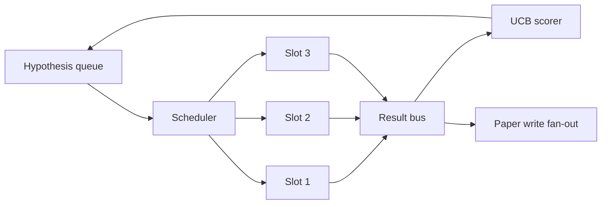
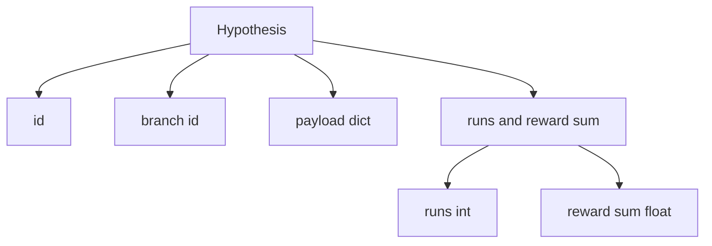
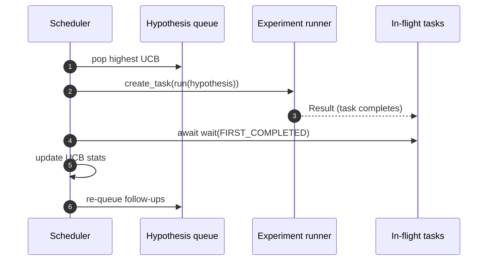

# Iteration Scheduler

> A research loop without a scheduler is a queue with delusions. The scheduler is where the loop decides what to stop exploring, and that decision is the whole game.

**Type:** Build
**Languages:** Python
**Prerequisites:** Phase 19 lessons 50-53
**Time:** ~90 minutes

## Learning Objectives

- Model a research workflow as a hypothesis queue feeding parallel experiment slots whose results fan back in.
- Run multiple experiments concurrently with asyncio so the scheduler can keep all slots busy.
- Score each hypothesis branch with UCB so the scheduler can prune low-yield branches without abandoning exploration.
- Fan out finished results to a paper-write stage and a re-queue stage so a high-yield branch spawns follow-up hypotheses.
- Surface a per-iteration trace with branch scores, slot occupancy, and pruning decisions.

## Why a scheduler, not a worklist

A flat worklist runs jobs in submission order. That is fine when each job is independent. Research is not independent: a finding from experiment three changes the priority of experiments four and five. A scheduler that reads the result fan-in and reorders the queue gets more useful work done per unit of compute.

The interesting design choice is the scoring rule. A greedy scorer always picks the current leader and never explores. A uniform scorer never exploits. UCB (upper confidence bound) is the middle path: exploit the leader while reserving capacity for branches that have been tried less.

## The system shape



The queue holds hypotheses. The scheduler picks the highest-UCB hypothesis when a slot frees. Each slot runs an experiment asynchronously. Finished experiments fan their result onto the bus. The bus updates UCB statistics on the originating branch and fans out to the paper-write stage when a branch's yield crosses a threshold.

## The Hypothesis shape



`branch` is the key for UCB statistics. Multiple hypotheses may share a branch (the branch is the research direction; the hypothesis is one trial within it). `runs` is the count of completed experiments for that branch, `reward_sum` is the cumulative reward. UCB reads both.

## UCB scoring

The UCB formula used in this lesson is the classic UCB1.

```text
ucb(branch) = mean_reward(branch) + c * sqrt( ln(total_runs) / runs(branch) )
```

`total_runs` is the count of all experiments completed across all branches. `c` is the exploration weight; the lesson defaults to `sqrt(2)`. A branch with zero runs gets `+inf` so untried branches are always scheduled first. A branch with high mean reward keeps a high score until other branches catch up; a branch that runs many times without much reward gets eclipsed by less-run alternatives.

The pruning gate is separate from the picker. Pruning removes a branch from future scheduling when its mean reward falls below an absolute floor (default `0.2`) after at least `prune_after_runs` trials (default `3`). This keeps the queue bounded.

## Parallel slots with asyncio

The scheduler drives experiments with `asyncio.create_task`. Each task runs the experiment runner (an `async def` callable) that returns a `Result`. The main loop waits on the set of in-flight tasks with `asyncio.wait(..., return_when=asyncio.FIRST_COMPLETED)` and fires the scoring update on each completion.



Three slots run concurrently. The main loop never blocks on a single experiment. The scheduler keeps starting new tasks as soon as a slot frees, until both the queue is empty and no tasks are in flight.

## Fan-out: paper triggers

When a branch's mean reward crosses `paper_threshold` (default `0.7`) and that branch has not yet produced a paper, the scheduler fans a `paper.trigger` event onto an output list. Downstream the paper writer from lesson fifty-four would pick this up. In this lesson the trigger is captured as a list so tests can assert it.

## Fan-out: follow-up hypotheses

When a high-yield result lands, the scheduler can call the user-supplied `expander` to produce one or more follow-up hypotheses on the same branch. The expander is a pure function from `Result` to `list[Hypothesis]`. The lesson ships a deterministic expander that produces two follow-ups for any result whose reward exceeds the paper threshold.

## Budgets

Two budgets protect the scheduler from runaway loops.

```text
max_experiments    : total count of experiments run across all branches
max_seconds        : wall-clock cap (asyncio time)
```

When either fires, the scheduler stops scheduling new tasks, awaits the in-flight ones, and returns the final trace. The trace includes a `stop_reason`.

## The Trace and final report

Each scheduling decision (pick, dispatch, result, prune, fan-out) emits one event. The final report summarises per-branch stats, total runs, total wall-clock, and the paper triggers fired. The next lesson, the end-to-end demo, reads this report to drive the paper writer.

## How to read the code

`code/main.py` defines `Hypothesis`, `Result`, `BranchStats`, `IterationScheduler`, and a `make_deterministic_runner` factory that returns an asyncio experiment runner with predictable rewards. The runner sleeps for a fixed `delay_ms` (default `5ms`) so concurrency is observable.

`code/tests/test_scheduler.py` covers: UCB picks untried branches first, parallel slot occupancy, paper triggers when threshold is crossed, branch pruning after low-yield trials, fan-out follow-up hypotheses, and budget exit (both experiment count and wall clock).

## Going further

Three extensions a real implementation will want. First, persistent UCB stats across sessions: the current statistics live in memory; a real scheduler would checkpoint them so a restart preserves the exploration budget already spent. Second, multi-objective scoring: instead of a scalar reward, each result emits a vector and UCB becomes a Pareto-style picker. Third, contextual bandits: the picker conditions on hypothesis features (length, complexity) so similar hypotheses share exploration.

The scheduler is the place where research becomes more than a worklist. Once UCB is wired and the slots run in parallel, every other improvement composes on top.
