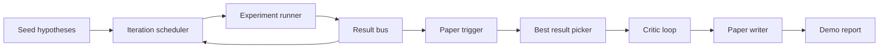
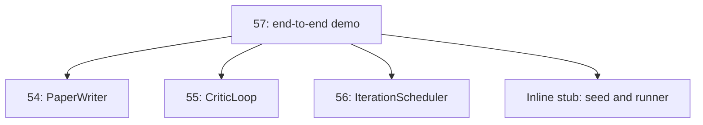
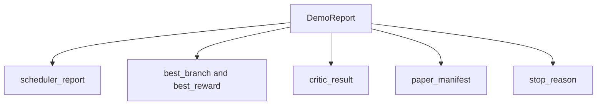

# End-to-End Research Demo

> A demo is the place where every contract you wrote earlier has to compose. If any one of them leaks, the demo is the lesson that catches it.

**Type:** Build
**Languages:** Python
**Prerequisites:** Phase 19 lessons 50-53
**Time:** ~90 minutes

## Learning Objectives

- Wire the auto-research loop end to end: hypothesis seed, experiment runner, scheduler, critic loop, paper writer.
- Compose the primitives from the four earlier Track D lessons through plain Python imports, not a framework.
- Run the loop to a self-terminating end and emit a single demo report that lists every stage's output.
- Keep the demo deterministic so the test suite can assert the final shape.
- Surface a clear failure mode when any stage's contract breaks, so the next stage does not run with a broken input.

## What composes here



Five stages. The seed is a list of three hypotheses. The scheduler runs six experiments across them with three parallel slots. The bus reports one or more paper triggers. The picker selects the single best result. The critic loop iterates on a draft built from that result. The paper writer emits the final LaTeX, BibTeX, and manifest.

## Why import, not copy

Each earlier lesson ships a `main.py` with public dataclasses and functions. The demo imports them by adjusting `sys.path` to the parent directory of each lesson. This is not framework wiring; it is the same import the test files in the earlier lessons already use.



The inline stub stands in for lessons fifty through fifty-three: a small generator of seed hypotheses and a synchronous reward function. The user can swap the inline stub for the real primitives from those lessons by adjusting two imports.

## Determinism guarantees

The demo is deterministic by construction. The experiment runner is seeded numpy. The critic loop's reviser walks fixed dimensions in fixed order. The paper writer's prose generator is the mocked one from lesson fifty-four. The scheduler's UCB picker breaks ties on iteration order, not random choice.

Given the same seed, the demo emits the same report. The test asserts this property by running the demo twice and comparing the manifest.

## The demo report shape



Each field comes verbatim from the upstream stage. The demo does not transform any output; it composes them. That is the test the demo is.

## Failure mode handling

Each stage either succeeds or raises a typed error.

```text
Scheduler ........ returns SchedulerReport with stop_reason
                   in {queue_empty, max_experiments, deadline}
Best-result pick . raises NoTriggerError if no paper trigger fired
Critic loop ...... returns LoopResult with status converged or stopped
Paper writer ..... raises PaperValidationError on contract break
```

A failure in any stage short-circuits the demo with a typed exception. The tests pin this contract: `test_no_triggers_raises_typed_error` and `test_best_picker_raises_when_no_triggers` assert the picker raises `NoTriggerError` / `BestResultError` when no branch fired a trigger, and the writer is never invoked.

## The best-result picker

The scheduler emits paper triggers per branch. The picker selects the branch with the highest mean reward across all triggers. Ties break alphabetically by branch id so the demo is deterministic. The picker is a small pure function; the test pins it on a fixed scheduler report.

## Wiring the critic loop

The critic loop in lesson fifty-five operates on a `MiniPaper`. The demo builds a `MiniPaper` from the picked branch by populating the abstract with the branch id, seeding two sections (Introduction and Results), and setting `originality_tag` from the branch's mean reward (high if `>= 0.8`, medium if `>= 0.6`, low otherwise).

The reviser then iterates the draft to convergence. The output goes into the paper writer.

## Wiring the paper writer

The paper writer in lesson fifty-four operates on the full `Paper` shape with figures and bibliography. The demo upgrades the converged `MiniPaper` via `mini_to_full_paper`, which attaches one figure for the selected branch and a small synthetic bibliography built from the union of cite keys the critic suggested. Every cite the demo adds is also added to the bibliography list, so validation passes.

## How to read the code

`code/main.py` defines `BestResultError`, `NoTriggerError`, `DemoReport`, `pick_best_branch`, `build_mini_paper`, `mini_to_full_paper`, and `run_demo`. The imports at the top adjust `sys.path` once and pull `PaperWriter`, `CriticLoop`, and `IterationScheduler` from their lessons.

`code/tests/test_e2e.py` covers: demo runs end to end and emits a report with all five fields populated, determinism across two runs, NoTriggerError when no branch crosses the threshold, PaperValidationError when the writer's contract breaks, paper manifest contains the picked branch's figure, and the scheduler stop reason is one of the expected values.

## Going further

Three extensions worth wiring once the demo is green. First, persistent state: each stage's result writes to a small JSON store so a restart can resume without re-running the cheap stages. Second, a dashboard: the trace events from the scheduler and critic loop render as a single timeline. Third, real model calls: swap the mocked prose generator and the deterministic critic for model-driven ones; the wiring does not change.

The demo's job is to prove that composition is the architecture. Five lessons, four imports, one report. The next time you add a stage, the wiring grows by exactly one line.
