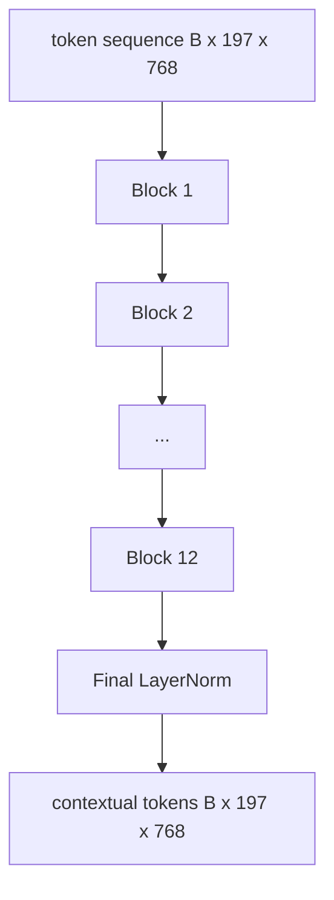

# Vision Transformer Encoder

> Patches alone do not see. A 12-layer pre-LN transformer with 12 attention heads turns the sequence of patch tokens into a sequence of contextual tokens, with the CLS token pooling whole-image features in its final hidden state. This lesson is the engine room of every modern vision-language model.

**Type:** Build
**Languages:** Python
**Prerequisites:** Phase 19 lessons 30-37 (Track B foundations)
**Time:** ~90 minutes

## Learning Objectives

- Implement a pre-LN transformer block with multi-head self-attention and a feed-forward sub-layer.
- Stack 12 blocks with 12 heads to form a ViT-Base encoder.
- Wire the patch front end from lesson 58 into the encoder and run a forward pass.
- Verify that the CLS token aggregates information from every patch.

## The Problem

The patch embedding produces a sequence of 197 tokens, each one a vector with no awareness of any other patch. A picture of a cat needs every patch to know which patches contain whiskers, which contain background, and which contain the eye. The transformer is the mechanism that builds that awareness, one attention layer at a time. Without it, the patch front end is a clever tokenizer with no understanding.

The standard recipe is twelve blocks deep, twelve heads wide, with pre-LayerNorm placement, GELU activation, and a feed-forward expansion of 4x. That recipe is the spine of CLIP ViT-L, SigLIP, DINOv2, the Qwen-VL family, InternVL, and every other open-weight vision encoder of 2025-2026. The recipe is stable enough that you can read any of those papers and assume this block shape unless they explicitly say otherwise.

## The Concept




### Pre-LN vs post-LN

Original Transformer placed LayerNorm after the residual. Pre-LN (LayerNorm before each sub-layer) is the version every modern vision-language model uses, because it trains stably without learning-rate warm-up tricks. The difference is one line in the forward pass, and the gradient flow at depth 12+ is night and day.

### Multi-head self-attention

Each head projects the token vector to its own `(query, key, value)` triple with dimension `head_dim = hidden / num_heads`. With `hidden = 768` and `heads = 12`, each head has `dim = 64`. The 12 heads attend in parallel, then their outputs concat back to dimension 768 and pass through an output projection. The point of multi-head is that one head can learn "attend to the cat eye" while another learns "attend to the background gradient" without interference.

### Why the 4x feed-forward expansion

The FFN goes `hidden -> 4 * hidden -> hidden` with GELU in the middle. The factor 4 is empirical and has held across language and vision transformers since 2017. Smaller (2x) underfits; larger (8x) overfits at fixed data budget. The MLP is where the model stores most of its learned facts, and the wider middle is where they sit.

| Component | Parameters at ViT-Base scale |
|-----------|------------------------------|
| qkv projection per block | `3 * 768 * 768 = 1.77M` |
| output projection per block | `768 * 768 = 590K` |
| FFN per block (4x expansion) | `2 * 768 * 4 * 768 = 4.72M` |
| LayerNorm per block | `4 * 768 = 3K` |
| Total per block | about 7.1M |
| 12 blocks | about 85M |
| Plus front end | about 86M total |

ViT-Base is a 86M-parameter encoder. That is small by 2026 standards (SigLIP-So400M is 400M, the Qwen-VL ViT is 675M), but the architecture is identical up to width and depth.

### Causal mask or not?

Vision Transformers are encoder-only and bidirectional: token `i` may attend to token `j` for any pair. No mask. The decoder-side cross-attention in lesson 61 will use a causal mask, but inside the vision encoder, attention is fully connected.

### What the CLS token learns

The CLS token starts as a learned parameter, has no patch content of its own, and accumulates information through attention across every block. By the final layer, the CLS row is a vector summary of the whole image; downstream heads project this single vector into class logits, contrastive embeddings, or cross-attention keys for a text decoder.

## Build It

`code/main.py` implements:

- `MultiHeadSelfAttention`, with `qkv` and output projections, the scaled-dot-product attention math, and shape assertions.
- `FeedForward`, the 4x-expansion GELU MLP.
- `Block`, a pre-LN block composing attention and feed-forward sub-layers with residuals.
- `ViT`, a stack of 12 blocks with a final LayerNorm.
- `VisionEncoder`, which wires `VisionFrontEnd` from lesson 58 to the `ViT` stack and exposes a `forward()` returning the contextual sequence and the pooled CLS vector.
- A demo that runs a synthesized 224x224 fixture image through the full encoder and prints input shape, output shape, parameter count, and the CLS norm at every other layer.

Run it:

```bash
python3 code/main.py
```

Output: the fixture is encoded to a `(1, 197, 768)` tensor. The CLS norm drifts upward as the layers compose, then stabilizes at the final LayerNorm. Total parameters report at about 86M.

## Use It

The encoder defined here is, up to width and depth, the same block stack that ships inside every open-weight VLM in 2025-2026. Differences live in:

- **Width and depth.** ViT-Large is `hidden=1024, depth=24, heads=16`; SigLIP So400M is `hidden=1152, depth=27, heads=16`. Same block.
- **Pooling head.** CLS pooling (this lesson) vs average pooling (SigLIP) vs attention pooling (later VLMs).
- **Position handling.** Fixed sinusoidal (lesson 58) vs learned 1D vs ALiBi vs 2D RoPE. The block math is unchanged.
- **Register tokens.** DINOv2 prepends 4 extra learned tokens. One line of code.

This block stack is the substrate. The next lessons (60-63) stand on top of it.

## Tests

`code/test_main.py` covers:

- a single block preserves shape and is invariant to input batch size
- attention scores sum to one along the key axis (softmax sanity)
- residual paths are wired (zero input still produces non-zero output via the CLS token)
- a 4-layer stacked forward pass produces the right shape
- gradients flow to the patch projection from the CLS output

Run them:

```bash
python3 -m unittest code/test_main.py
```

## Exercises

1. Add register tokens (4 learned vectors prepended after CLS) and rerun. Compare attention map smoothness via the entropy of the softmax distribution on the last layer.

2. Swap pre-LN for post-LN and train for one epoch on a synthetic shape classifier. Observe which one trains stably without LR warm-up.

3. Implement causal masking as an `attn_mask` argument so the same block can be reused as a decoder block. The mask shape is `(seq, seq)`, lower-triangular.

4. Profile a forward pass at batch sizes 1, 8, 64 with `torch.profiler`. The MLP layer dominates wall time, not attention.

5. Replace one attention head's q-k-v projections with a low-rank LoRA adapter, freeze the rest, and verify the gradient only flows where you expect.

## Key Terms

| Term | What it means |
|------|---------------|
| Pre-LN | LayerNorm applied before each sub-layer instead of after |
| Self-attention | Each token attends to every other token in the same sequence |
| Multi-head | The hidden dim is split across `H` independent attention heads |
| FFN expansion | The feed-forward layer widens to `4 * hidden` before contracting |
| CLS pooling | Use the first token's final hidden state as the image summary |

## Further Reading

- An Image is Worth 16x16 Words (ViT, 2021) for the encoder recipe.
- DINOv2 (2023) for register tokens and the self-supervised pretraining objective.
- SigLIP (2023) for the average-pooling variant and the sigmoid contrastive loss used in lesson 62.
