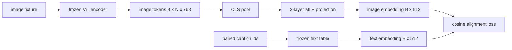

# Projection Layer for Modality Alignment

> A vision encoder produces image tokens. A text decoder consumes text tokens. The two live in different vector spaces. A small two-layer MLP projects image tokens into the text embedding space, and a cosine alignment loss against a paired caption pulls the two spaces into agreement. That projection is the smallest piece of a vision-language model and the one that matters most for transfer.

**Type:** Build
**Languages:** Python
**Prerequisites:** Phase 19 lessons 30-37 (Track B foundations)
**Time:** ~90 minutes

## Learning Objectives

- Build a two-layer MLP projection that maps image features into the text embedding space.
- Construct a mock text embedding table (no pretrained tokenizer, no real corpus).
- Compute a cosine alignment loss between projected image tokens and a paired caption embedding.
- Train the projection alone with a frozen vision encoder and a frozen text table.

## The Problem

You have a vision encoder (lessons 58-59) producing tokens of dimension `vision_hidden = 768`. You have a text decoder you want to bolt on top with embedding dimension `text_hidden = 512` (any other number is just as plausible). The decoder expects text-shaped tokens. The image tokens are not text-shaped: they live in a basis the encoder learned during vision-only pretraining, with no relationship to the decoder's word vectors.

Two-layer MLP projection (linear, GELU, linear) bridges the gap. It is small enough (about `768 * 1024 + 1024 * 512 = 1.3M` parameters) to train in minutes on a single GPU, and it is the only piece that has to learn during the alignment phase. The vision encoder stays frozen. The text embedding table stays frozen. Only the projection moves. This is the recipe LLaVA shipped in 2023, that BLIP-2 reframed as a Q-Former, and that every open-weight VLM since has adopted in some form.

## The Concept



### Pooling before projection

The vision encoder emits 197 tokens. The text side has a single caption-level embedding. To align them you need one image-level vector per sample. CLS pooling is the simplest: take the first token from the encoder and project it. Mean pooling over all 197 tokens is another option and is what SigLIP uses. Either pools 197 vectors down to one.

### Why two layers and not one

A single linear projection can rotate and rescale but cannot fix the basis if the two spaces have curvature mismatches. GELU between two linear layers gives the projection one non-linear bend, which is empirically enough to align CLIP-style features to language model embeddings. Deeper projections (LLaVA-NeXT used GLU; Qwen-VL used a stack of attention layers) are extensions; two-layer MLP is the canonical baseline and is what BLIP-2's Q-Former projection head ships with under the hood.

| Layer | Shape | Parameters |
|-------|-------|------------|
| fc1 | `(vision_hidden, projection_hidden)` | `768 * 1024 + 1024` |
| activation | GELU | 0 |
| fc2 | `(projection_hidden, text_hidden)` | `1024 * 512 + 512` |

About 1.3M parameters for a `768 -> 1024 -> 512` head.

### Cosine alignment loss

Align does not mean `image_emb == text_emb`. Align means `image_emb` points in the same direction as `text_emb` in the joint space. The cosine loss is `1 - cos_sim(image, text)`, ranging from 0 (perfectly aligned) to 2 (opposite). Training drives this toward zero per pair. Lesson 62 generalizes to a contrastive batch (InfoNCE) where every image must be closer to its own caption than to any other caption in the batch; this lesson uses the per-pair version so the dynamics are visible.

### Frozen encoder is the trick

The vision encoder has 86M parameters. The text table has another few million. Training all of them from a mock corpus is a non-starter. Freezing both means the projection's 1.3M parameters are the only thing changing, and a few hundred steps on synthetic pairs is enough to drive the loss down. This is exactly the operational shape of every adapter-based VLM: the heavy parts stay frozen, the light bridge trains.

## Build It

`code/main.py` implements:

- `MLPProjector(in_dim, hidden_dim, out_dim)`, two-layer linear MLP with GELU activation.
- `MockTextEmbedding(vocab_size, dim)`, a frozen embedding table with deterministic init from a seed.
- `make_pair(seed, vocab_size)`, which synthesizes one paired (image, caption) sample. Captions are short id sequences; the caption embedding is mean-pooled over token embeddings.
- `cosine_alignment_loss(image_emb, text_emb)`, the per-pair `1 - cos_sim` objective.
- A training loop that runs the projection for 200 steps over 32 synthetic pairs (cycled), with the vision encoder and text table frozen, and prints the loss every 25 steps.

Run it:

```bash
python3 code/main.py
```

Output: training reports drop from initial loss around 1.07 down to about 0.80 within 200 steps, demonstrating that the projection alone can pull image tokens toward the text space. The final cosine similarity per pair is also printed.

## Use It

The same pattern shows up in every open-weight VLM:

- **LLaVA 1.5.** Two-layer GELU MLP projection from CLIP-ViT-L hidden to LLaMA embedding dim. Frozen vision encoder, frozen LLM, train only the projection (then unfreeze the LLM in stage two).
- **BLIP-2.** Q-Former takes 32 learned query tokens through cross-attention against image tokens, then projects to the LLM embedding dim. The projection head at the very end of Q-Former is the analog of this lesson's MLP.
- **MiniGPT-4.** Single linear projection from BLIP-2 Q-Former output to Vicuna embedding dim.
- **Qwen-VL.** Cross-attention adapter with several layers, but the final piece is again a projection to the LM embedding dim.

The shape varies but the role is identical: pool image tokens, project to text embedding dim, train alone.

## Tests

`code/test_main.py` covers:

- projector output shape matches the configured `out_dim`
- frozen text embedding table has zero `requires_grad` parameters
- cosine loss is zero on identical vectors and is 2 on anti-parallel vectors
- projector gradient flows after one backward pass
- the training loop reduces loss between step 0 and step 200

Run them:

```bash
python3 -m unittest code/test_main.py
```

## Exercises

1. Replace CLS pooling with mean pooling over the 196 patch tokens and compare final loss after 200 steps. Mean pooling usually trains faster on synthetic data; CLS is more sample-efficient on natural images.

2. Add a learned scalar temperature to the cosine loss (`cos / tau`) and observe what happens when `tau` is too small (gradient noise) or too large (loss plateaus high).

3. Swap the two-layer MLP for a single linear layer and quantify the loss gap. The non-linearity matters more on natural image features and less on synthetic ones.

4. Add a small L2 penalty on the projector weights and watch how it interacts with cosine alignment (cosine is scale-invariant, so the penalty mostly shrinks unused directions).

5. Persist projector weights, then reload and run inference without the vision encoder backward pass to verify that only the projector is needed at deploy time.

## Key Terms

| Term | What it means |
|------|---------------|
| Modality alignment | The act of making image and text embeddings comparable in one shared space |
| Projection head | The small module that maps one space to another, usually a 2-layer MLP |
| Cosine similarity | Dot product divided by the product of L2 norms |
| Frozen encoder | The vision (or text) model has all parameters with `requires_grad=False` |
| Mock corpus | Synthetic pairs used so training has no dataset download dependency |

## Further Reading

- LLaVA paper for the two-stage train (project, then unfreeze LM).
- BLIP-2 paper for Q-Former as a learnable projection alternative.
- Qwen-VL technical report for cross-attention adapters as deeper projection heads.
