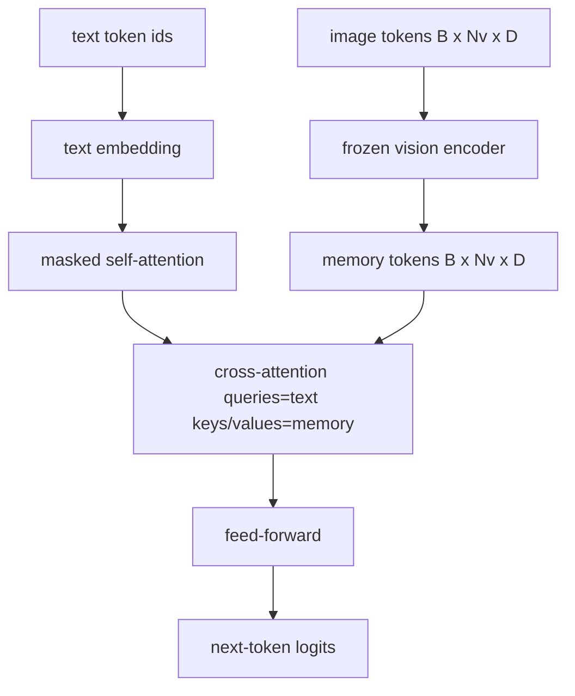
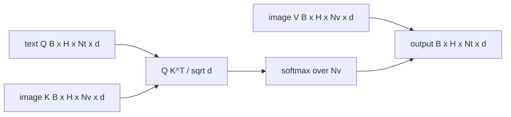

# Cross-Attention Fusion

> The projection layer aligns one image vector with one caption vector. A real vision-language decoder needs every text token to attend to every patch token, so the model can ground each word in a region. Cross-attention is how that grounding happens. The text queries; the vision keys and values answer. This lesson builds the cross-attention block, the causal text self-attention, and the mask shapes that keep both legal.

**Type:** Build
**Languages:** Python
**Prerequisites:** Phase 19 lessons 30-37 (Track B foundations)
**Time:** ~90 minutes

## Learning Objectives

- Implement multi-head cross-attention where the query stream is text and the key/value stream is vision.
- Compose a decoder block: causal self-attention + cross-attention + feed-forward.
- Get the mask shapes right: causal mask for self-attention, no mask for cross-attention.
- Run a forward pass with batched text tokens and a fixed pool of image tokens.

## The Problem

Concatenating image tokens and text tokens into one sequence is one fusion option (early fusion, the path Chameleon and Emu3 take). Cross-attention is the other (late fusion, the path Flamingo introduced and that every Flamingo-shaped decoder since has copied). In late fusion, the text decoder runs on text-only tokens and reaches over into the image stream through cross-attention at every layer.

Late fusion has two advantages. First, the text stream stays clean and the model preserves text-only capabilities. Second, the image stream is computed once per image and reused for every decode step, so generation is cheap even for long captions. The cost is one extra attention sub-layer per block.

## The Concept





### Mask shapes

The two attentions inside a decoder block need different masks:

| Attention | Query length | Key length | Mask | Why |
|-----------|--------------|------------|------|-----|
| Self-attention | `Nt` (text) | `Nt` (text) | Causal: lower-triangular `(Nt, Nt)` | Text tokens may not look ahead during autoregression |
| Cross-attention | `Nt` (text) | `Nv` (vision) | No mask | The whole image is visible to every text position |

The lesson includes one shape-validation function so the mistake of mixing them up surfaces as a `ValueError` instead of a silently broken loss curve.

### Why no mask on cross-attention

The image is fully observed before any text is generated. Token `t` of the caption may attend to any patch of the image; there is no temporal order on image patches. Some Flamingo variants add a per-sample masking pattern when interleaving multiple images and text segments, but for a single image plus a caption, cross-attention sees everything.

### Key/value caching

The image keys and values are computed once at the start of the decode and held in a cache. Each new text token uses the cache without recomputation. This is what makes captioning fast at inference: the heavy ViT runs once; the cross-attention reuses its keys and values for every step. The lesson exposes the cache and tests the cache-hit path.

### Block composition

A decoder block runs: pre-LN -> self-attention -> residual -> pre-LN -> cross-attention -> residual -> pre-LN -> feed-forward -> residual. Three sub-layers, each with its own LayerNorm. The Flamingo paper added a learned gate on cross-attention so the model could opt out of the image path at training-time stability cost; the canonical baseline (used here) has no gate.

```python
class DecoderBlock:
  def forward(self, text_tokens, image_tokens, text_mask, cross_mask):
      text_tokens = text_tokens + self.self_attn(self.ln1(text_tokens),
                                                 mask=text_mask)
      text_tokens = text_tokens + self.cross_attn(self.ln2(text_tokens),
                                                  image_tokens,
                                                  mask=cross_mask)
      text_tokens = text_tokens + self.ffn(self.ln3(text_tokens))
      return text_tokens
```

## Build It

`code/main.py` implements:

- `CrossAttention(hidden, heads)`, multi-head cross-attention with separate `q` and `kv` projections.
- `CausalSelfAttention(hidden, heads)`, the masked self-attention from a standard decoder.
- `DecoderBlock`, composing the three sub-layers with pre-LN residuals.
- `VisionLanguageDecoder`, four-layer decoder fed by a mock vision encoder output and a small text embedding table.
- `causal_mask(length)` returning a `(length, length)` lower-triangular boolean tensor.
- A demo that feeds a batch of two text sequences of length 10 with image memory of length 197 and prints output shape, the self-attention mask shape, and the cross-attention output norm per position.

Run it:

```bash
python3 code/main.py
```

Output: decoder produces a `(2, 10, text_vocab)` logits tensor. Mask shape is `(10, 10)`. The KV-cache reuse check confirms identical logits between the cached and uncached paths.

## Use It

Cross-attention shows up in two production families:

- **Flamingo and IDEFICS.** Insert a cross-attention sub-layer every K language model blocks, with a frozen LM. The vision-language adapter is the cross-attention block plus its gate.
- **BLIP-2.** The Q-Former uses cross-attention from a fixed set of 32 query tokens into the image features, then projects the queries into the LM embedding space.

The shape of the block in this lesson maps directly onto both. The mask discipline (causal on self, none on cross) is the same.

## Tests

`code/test_main.py` covers:

- causal mask is lower-triangular and matches expected boolean shape
- cross-attention output shape is `(B, Nt, hidden)` regardless of key length
- KV-cache path matches uncached path to float tolerance
- shape mismatch between text and image streams raises a clear `ValueError`
- a full decoder forward pass produces the right batch and sequence shape

Run them:

```bash
python3 -m unittest code/test_main.py
```

## Exercises

1. Add a learned tanh gate to the cross-attention residual (the Flamingo trick) and verify training converges from a near-zero initial gate. The gate starts at 0; the model recovers text-only behavior before mixing the image stream in.

2. Implement interleaved attention where the same decoder consumes multiple images plus multiple text segments. Build the per-sample cross-attention mask that prevents text segment 2 from attending to image 1.

3. Profile the cross-attention vs the self-attention layer at `Nt=64, Nv=576` (a 24x24 grid at higher resolution). The cross-attention cost is `Nt * Nv` and dominates at high image resolution.

4. Add a query-side dropout on the cross-attention map and measure caption diversity on the demo (caption sample variance increases with dropout in the cross map).

5. Swap the cross-attention layer for a Q-Former-style attention block where a fixed 32-token query pool attends to image features once per layer.

## Key Terms

| Term | What it means |
|------|---------------|
| Late fusion | Text and vision stay in separate streams; cross-attention bridges them at every block |
| Cross-attention | Q comes from one stream, K and V from another |
| Causal mask | Lower-triangular boolean mask that prevents looking ahead during autoregression |
| KV cache | Image keys and values stored once and reused for every decode step |
| Memory tokens | The frozen image tokens that the decoder reaches into |

## Further Reading

- Flamingo (2022) for the canonical late-fusion design with gated cross-attention.
- BLIP-2 (2023) for the Q-Former, which is a cross-attention block dressed as a learned query pool.
- IDEFICS (2023) for an open-weight reproduction of the Flamingo recipe.
