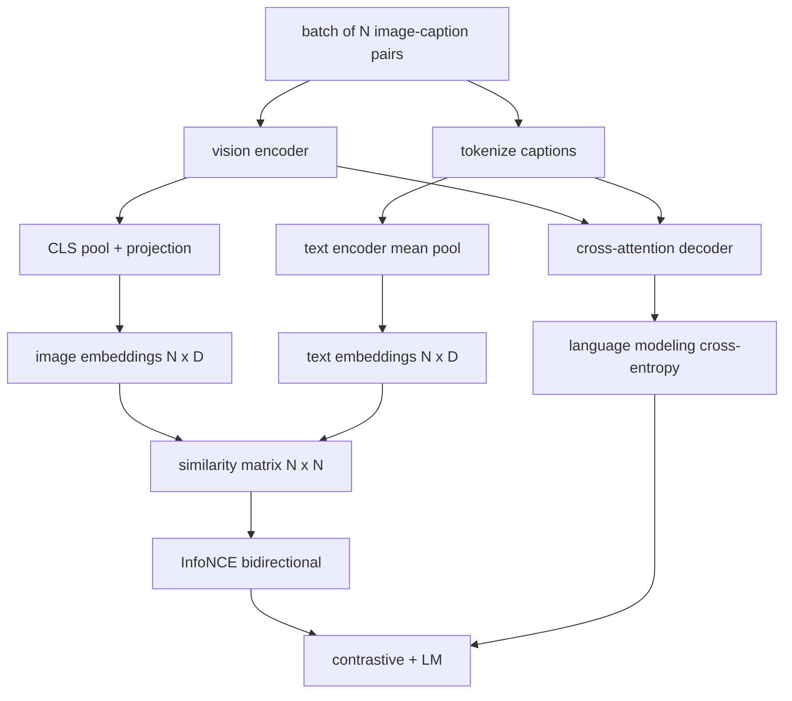

# Vision-Language Pretraining

> The encoder, projection, and decoder are wired. Now train them together. Two objectives drive learning: a contrastive image-text loss (InfoNCE) that pulls matching pairs together in the joint embedding space, and a language modeling loss that asks the decoder to caption each image. Combined, they teach the network both to find the right image for a caption and to write a caption for the image.

**Type:** Build
**Languages:** Python
**Prerequisites:** Phase 19 lessons 30-37 (Track B foundations)
**Time:** ~90 minutes

## Learning Objectives

- Implement InfoNCE contrastive loss across a batch of image-caption pairs.
- Compose contrastive loss with autoregressive language modeling loss.
- Synthesize a 200-pair mock image-caption corpus with no real dataset download.
- Run a 50-step demo training loop and observe both losses decreasing.

## The Problem

A vision-language model needs two skills. It must rank: given a caption, find the right image among many. It must generate: given an image, write a caption. Pretraining the model on one skill alone gives you half a system. CLIP nailed ranking but cannot caption. GPT-4V can caption but uses a separate retrieval head for ranking. Multi-objective pretraining gets both in one pass.

InfoNCE handles the ranking half. For a batch of N pairs, the model treats the N matching pairs as positives and the `N^2 - N` mismatched pairs as negatives, then runs a cross-entropy loss on the resulting `(N, N)` similarity matrix. The LM loss handles the generation half: standard next-token prediction conditioned on the image. Both losses are differentiable and can share the encoder, projector, and decoder weights.

## The Concept



### InfoNCE in one paragraph

Stack the N image embeddings as rows and the N text embeddings as rows. L2-normalize both. Compute the `N x N` matrix `S = I T^T / tau` where `tau` is a learned temperature. The diagonal entries are the matching pairs; off-diagonal entries are negatives. Apply cross-entropy with the target `argmax` running down the diagonal: row `i` should have its highest entry in column `i`. Do the same symmetrically along columns. The total is the average of the two. This is the CLIP loss in eight lines.

### Temperature matters

The temperature `tau` controls how peaked the softmax is. Too small (e.g. `tau = 0.01`) and the gradient comes only from the very hardest negative, training is noisy. Too large and the softmax flattens and gradient vanishes. CLIP learns `tau` as a parameter; the demo here does the same.

### Language modeling loss

The decoder consumes image memory tokens via cross-attention and predicts the next text token at every position. Loss is standard cross-entropy with the next-position target. Padding positions are masked out of the loss.

### Combining the losses

`total = contrastive + lm_weight * lm` where `lm_weight` is a scalar (often 1.0). The two losses share gradients into the encoder and projection; only the decoder receives LM-loss gradient. This is the multi-task recipe that CoCa, BLIP, and SigLIP-style models all use, with various weightings.

| Component | Loss surface | Affects |
|-----------|--------------|---------|
| InfoNCE | Pair ranking in the joint space | Encoder + projection + text head |
| LM | Token prediction conditioned on image | Encoder + projection + decoder |
| Combined | Multi-task | Whole stack |

### Why 50 steps is enough for a demo

The mock corpus is a synthetic 200-pair set with random images and random caption ids. After 50 SGD steps with batch size 16, both losses drop visibly even if the absolute values stay above what a real-data model would achieve. The point of the demo is to confirm the gradient plumbing works end to end and that adding the LM loss does not destabilize the contrastive objective.

## Build It

`code/main.py` implements:

- `MultimodalModel`, combining a small ViT encoder, the MLP projector, a tiny text-side encoder (mean-pool over embedded ids), and the cross-attention decoder from lesson 61.
- `info_nce_loss(image_emb, text_emb, temperature)`, the bidirectional CLIP-style contrastive loss.
- `lm_loss(logits, target_ids, padding_id)`, masked next-token cross-entropy.
- `make_mock_corpus(seed, n_pairs)`, returning 200 deterministic (image, caption_ids) pairs.
- A training loop running 50 steps with batch size 16, Adam optimizer, and a learned log-temperature parameter. Both losses are printed every 5 steps.

Run it:

```bash
python3 code/main.py
```

Output: contrastive loss drops from about `ln(16) = 2.77` toward 2.4; LM loss drops from a random-uniform baseline of `ln(512) ≈ 6.24` toward about 4.7. Both decreases prove the gradient is wired correctly. Real models train for millions of steps; the dynamics are the same.

## Use It

This is the same loss recipe shipped in:

- **CLIP (2021).** Image-text contrastive only, with a separate frozen-encoder caption probe.
- **CoCa (2022).** Image-text contrastive plus image-captioning LM loss in one model. The exact pattern this lesson builds.
- **BLIP (2022) and BLIP-2.** Contrastive plus LM plus image-text matching head. Three losses combined.
- **SigLIP (2023).** Switches InfoNCE for a sigmoid pair loss; same contrastive role, different functional form.
- **LLaVA family.** Two-stage training where stage one is alignment (cosine on a frozen LM) and stage two adds LM loss with an unfrozen LM. Lesson 60 maps to stage one; this lesson maps to stage two.

## Tests

`code/test_main.py` covers:

- InfoNCE loss is symmetric across image/text rows
- InfoNCE loss returns 0 when the similarity matrix is a perfect diagonal of large positive numbers
- LM loss correctly masks padding positions
- model forward pass produces both losses without errors
- 5-step training loop reduces the combined loss

Run them:

```bash
python3 -m unittest code/test_main.py
```

## Exercises

1. Replace InfoNCE with SigLIP-style sigmoid pair loss and compare convergence on the mock corpus.

2. Add a hard-negative mining step: every other batch, select the hardest off-diagonal pair from the previous batch and append it. Train and inspect whether contrastive loss drops faster.

3. Add an image-text matching binary head on top of the joint embedding (true/false: do these match?) for a third loss, replicating BLIP's three-head setup.

4. Replace the mock corpus with caption-id sequences drawn from a Markov chain whose transition matrix is conditioned on image hash. The captioning loss should drop further because there is actual learnable signal.

5. Train the same model with `lm_weight = 0` and again with `lm_weight = 1`. Compare contrastive loss; the LM loss should not regress the ranking objective.

## Key Terms

| Term | What it means |
|------|---------------|
| InfoNCE | Noise contrastive estimation: cross-entropy on a similarity matrix |
| Temperature | Scalar that controls how peaked the contrastive softmax is |
| Hard negative | An off-diagonal pair the model finds confusing, useful for sampling |
| LM loss | Standard next-token cross-entropy on the captioning side |
| Joint embedding space | The shared space where image and text vectors live after projection |

## Further Reading

- CLIP paper for the original contrastive recipe.
- CoCa paper for contrastive plus captioning in one model.
- SigLIP paper for the sigmoid pair-loss variant and why it scales better.
