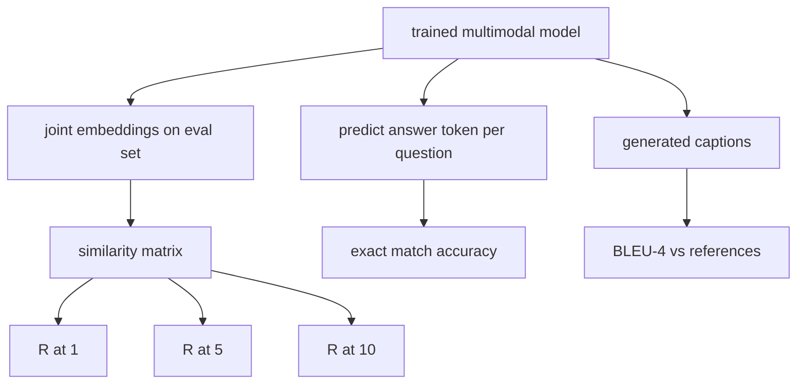

# Multimodal Evaluation

> Training is half the loop. The other half is measurement. This lesson builds three evaluation surfaces from primitives: image-caption retrieval reported as R@1, R@5, R@10; visual question answering reported as exact match accuracy; and image captioning reported as BLEU-4. Each metric is a function over the model's outputs and a synthetic eval suite that runs in seconds.

**Type:** Build
**Languages:** Python
**Prerequisites:** Phase 19 lessons 58-62 (Track E foundations: encoder, transformer, projection, cross-attention fusion, pretraining)
**Time:** ~90 minutes

## Learning Objectives

- Compute Recall@K from a similarity matrix between image and caption embeddings.
- Compute exact-match VQA accuracy from a model that maps (image, question) pairs to a fixed answer vocabulary.
- Compute BLEU-4 from generated and reference token sequences without any external library.
- Run all three evals against a synthetic suite built on top of the trained model from lesson 62.

## The Problem

The temptation is to declare a multimodal model finished when the training loss plateaus. Training loss measures fit on the training distribution; it does not measure whether the model can rank pairs in a held-out batch, answer a question, or write a caption a human would accept. Three eval surfaces are standard:

- **Retrieval (R@1, R@5, R@10).** Build the joint embedding for a query caption; rank every image in the eval pool by cosine; report whether the matching image lands in the top 1, top 5, top 10. Symmetric (image-to-text) form runs the same way.
- **Visual question answering (exact match).** Given (image, question), the model outputs an answer token. Exact match is one-bit per sample: did the predicted answer equal the reference answer? Average over the eval set.
- **Captioning (BLEU-4).** Generate a caption. Compute the geometric mean of 1-gram through 4-gram precisions against reference captions, with a brevity penalty. Multi-reference is the standard form (one image, several reference captions).

Each metric is a thin function. The lesson builds them all in code so the math is concrete and the surface stays under your control. Real benchmark suites (MS-COCO, VQA v2, GQA, OK-VQA) plug into the same function shapes.

## The Concept



### Recall@K from a similarity matrix

Build the `(N, N)` cosine similarity matrix between image and caption embeddings. For each row, sort the columns by descending similarity. Recall@K is the fraction of rows where the diagonal column index lies within the top K positions. Symmetric Recall@K (caption-to-image) is computed on the transposed matrix. Both numbers are reported. For an N=100 eval, R@1 = 0.6 means 60 of the 100 captions retrieved their correct image as the top match.

### VQA exact match

For each (image, question, answer), encode the image, embed the question, fuse via the decoder, and read out the next token. The predicted token id is compared to the reference id; correct if equal. Average over the eval set. Real VQA datasets ship with multiple human-annotated answers per question and use a soft-accuracy formula (1.0 if at least 3 of 10 annotators agree, scaled below); the lesson uses single-answer exact match for clarity.

### BLEU-4

```text
BLEU-4 = BP * exp(mean(log p1, log p2, log p3, log p4))
```

Where `p_n` is the modified n-gram precision (clipped count of generated n-grams that appear in any reference, divided by total generated n-grams), and `BP` is the brevity penalty:

```text
BP = 1                if generated length > reference length
   = exp(1 - r/g)     otherwise, where r is reference length and g is generated
```

Smoothing is needed for small samples where some `p_n` is zero. The implementation uses Chen and Cherry "method 1" (add 1 to numerator and denominator for any zero count), which is the safest default for low-count regimes.

### Synthetic eval suite

A 50-sample eval suite is built in memory from the same mock corpus pattern used in lesson 62, with a held-out seed. Three lists make up the suite:

- `pairs`: 50 (image, caption_ids) pairs for retrieval.
- `vqa`: 50 (image, question_ids, answer_id) triples.
- `caps`: 50 (image, [reference_caption_ids, ...]) entries with up to 3 references per image.

The suite is deterministic from the seed and held out from the training corpus, so the metrics are computed on data the model never saw. Persisting the suite to JSON is left as an exercise (see below).

| Metric | Range | Random baseline (N=50) |
|--------|-------|------------------------|
| R@1 | 0 to 1 | 0.02 (1 / N) |
| R@5 | 0 to 1 | 0.10 |
| R@10 | 0 to 1 | 0.20 |
| VQA EM | 0 to 1 | 1 / vocab |
| BLEU-4 | 0 to 1 | small but nonzero |

For a 50-step training run on synthetic data, the metrics are not expected to be high; they are expected to be above the random baseline, which is what the demo checks.

## Build It

`code/main.py` implements:

- `recall_at_k(sim_matrix, k)`, returning a float in `[0, 1]` for both directions.
- `vqa_exact_match(predictions, references)`, returning the mean over `int` equality.
- `bleu4(generated, references, smoothing=True)`, with multi-reference support.
- `build_eval_suite(seed, n_samples, vocab_size, max_len)`, returning three deterministic eval lists.
- `evaluate(model, suite)`, which runs all three metrics and returns a `dict` of numbers.
- A demo that loads a freshly-initialized multimodal model from lesson 62, evaluates it, then trains it for 50 steps and evaluates again, printing the before/after metrics.

Run it:

```bash
python3 code/main.py
```

Output: the before/after metric table shows retrieval improving from near-random toward the model's learned signal, VQA improving above random, and BLEU-4 improving (the synthetic structure is enough for a 4-gram precision lift).

## Use It

Each metric maps directly onto a production benchmark:

- **Retrieval.** MS-COCO 5K val, Flickr30K, ImageNet zero-shot are all R@K problems on the same similarity matrix. Replace the synthetic eval with the real files and the function signature is unchanged.
- **VQA.** VQA v2, GQA, OK-VQA use the same exact-match shape (with soft-acc instead of single-answer EM for VQA v2).
- **BLEU-4.** MS-COCO captioning, NoCaps, Flickr30K captioning all use BLEU-4 plus CIDEr and METEOR. Adding CIDEr is one more function.

For real benchmarks, swap `build_eval_suite` for a real loader and keep the function bodies. The math is benchmark-agnostic.

## Tests

`code/test_main.py` covers:

- recall@k returns 1.0 on a perfect identity similarity matrix and 0.0 on a flipped one for k < N
- recall@k respects `k <= N` upper bound
- bleu4 returns 1.0 when generated equals one of the references exactly
- bleu4 returns 0.0 on disjoint vocabulary
- vqa exact match equals the fraction of equal pairs
- build_eval_suite returns the expected number of pairs, vqa items, and caption entries

Run them:

```bash
python3 -m unittest code/test_main.py
```

## Exercises

1. Add CIDEr to the captioning metrics. CIDEr uses TF-IDF weighting on n-grams, which rewards informative tokens.

2. Implement soft-accuracy VQA: multiple human answers per question, accuracy is `min(human_count / 3, 1)` if any matches. Replicates VQA v2.

3. Add a NaN-safe variant of `bleu4` that handles empty generated sequences without crashing.

4. Compute mean reciprocal rank (MRR) alongside R@K. MRR is sensitive to where the correct item lands beyond the top K; R@K is sensitive to whether it lands in the top K.

5. Run the eval on the model at five checkpoints during training (step 0, 10, 20, 30, 40, 50) and plot the learning curve. Confirm the metric trajectories track the loss trajectory.

## Key Terms

| Term | What it means |
|------|---------------|
| R@K | Fraction of queries where the correct match lands in the top K results |
| Exact match | The simplest VQA scoring: predicted answer equals reference |
| BLEU-4 | Geometric mean of 1- to 4-gram precisions, with brevity penalty |
| Multi-reference | A captioning metric accepts several reference captions per image |
| Held-out | The eval set is sampled from a seed disjoint from the training corpus |

## Further Reading

- VQA v2 paper for the soft-accuracy formula and dataset statistics.
- CIDEr paper for TF-IDF-weighted n-gram captioning.
- BLEU original (Papineni et al., 2002) for the smoothing variants.
- MS-COCO captioning eval scripts for the canonical reference implementation.
