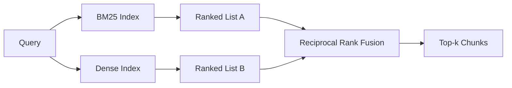

# Hybrid Retrieval with BM25 and Dense Embeddings

> Lexical and semantic retrieval fail on opposite query distributions. Hybrid retrieval with reciprocal rank fusion does not interpolate, it votes - and the vote wins on every query class.

**Type:** Build
**Languages:** Python
**Prerequisites:** Phase 11 lessons 04 (embeddings), 06 (RAG); Phase 19 Track B foundations (lessons 20-29); Phase 19 lesson 64 (chunking strategies)
**Time:** ~90 minutes

## Learning Objectives
- Implement BM25 from scratch from the Robertson and Sparck Jones formulation, with field weighting, document length normalization, and tunable k1 and b.
- Build a dense retriever on top of a deterministic mock embedding so the loop runs offline.
- Implement reciprocal rank fusion exactly as Cormack, Clarke, and Buettcher published it in 2009, and explain why it dominates score-weighted interpolation.
- Tune the RRF k constant and the per-modality weights and read the trade-offs on a small fixture corpus.

## The Problem

Lexical search wins when the query carries a literal identifier the corpus contains verbatim. A query for `AbortMultipartOnFail` returns the right Go function via BM25 in microseconds. The same query, embedded, sits at the boundary of three similarity clusters and a dense retriever ranks the wrong file first.

Dense search wins when the query is paraphrased away from the corpus's literal tokens. A user asking "how do we handle cancelled uploads" never typed the word abort or multipart. BM25 returns the documentation chunk on "uploading large files" because that page contains the word uploads. Dense retrieval finds the abort function whose summary mentions cancellation.

The choice between the two is not a static one. The query distribution is the variable. A production RAG system handles both classes from the same endpoint, so retrieval has to handle both at once. That is hybrid retrieval. The merge step is the part that has to be right.

## The Concept



### BM25 in one paragraph

BM25 scores a query-document pair by summing, over query terms, an inverse document frequency factor multiplied by a saturating term-frequency factor that includes a length-normalization correction. Two knobs. `k1` controls term-frequency saturation; the default 1.5 is the published recommendation and you should not move it without a benchmark. `b` controls how much document length matters; the default 0.75 says longer documents are penalized, but not linearly.

The IDF formula uses the smoothed Robertson and Sparck Jones definition, which is `log((N - df + 0.5) / (df + 0.5) + 1)`. The plus-one inside the log keeps the IDF positive when a term appears in more than half the corpus. This matters in small corpora where stopwords are technically rare.

Field weighting lets you tell BM25 that a match on the symbol name counts more than a match in the body. Implementation is a multiplier on the term counts during indexing, not at scoring time. That keeps the math identical and avoids a separate score per field.

### Dense retrieval in one paragraph

Embed each chunk into a fixed-dimension vector with an embedding model. At query time, embed the query, cosine-rank every chunk by similarity, and return the top-k. The model is the variable that decides quality. The retrieval algorithm itself is two lines: dot product and sort.

This lesson uses a deterministic hash-based embedding so you can read the fusion math without a network call. The hash sums token-keyed offsets into a 96-dimensional vector and normalizes. The cosine ranks are deterministic across runs, which is what the test suite requires.

### Reciprocal rank fusion, the published formula

Two ranked lists. For each candidate that appears in either list, sum its reciprocal-rank contributions. The 2009 paper used `1 / (k + rank)` with k equal to 60 as the default. Sort by total score. That is the whole algorithm.

The published constant k = 60 is not arbitrary. With k = 60 the rank-1 contribution is 1 / 61 and the rank-10 contribution is 1 / 70. The contribution decays slowly so deep candidates still vote. Smaller k makes the top results dominate. Larger k flattens the contribution curve.

Two tunable knobs in our implementation. The `k` constant. A pair of per-modality weights so you can boost BM25 or dense when you have prior evidence one is better on your corpus. Multiplying the rank contribution by the weight is the simplest principled implementation; it preserves the rank-decay shape and stays scale-free.

### Why fusion beats score-weighted interpolation

BM25 scores are unbounded and corpus-dependent. Cosine similarities are bounded in -1 to 1. A linear combination `alpha * bm25 + (1 - alpha) * cosine` requires per-corpus alpha tuning and breaks every time you reindex. The rank-based fusion does not. Two ranks are comparable across modalities. The published RRF baseline beats score-interpolation in every public TREC track since 2010.

This is the same argument you hear about RankFusion vs RRF in Vespa and Weaviate documentation. They came to the same conclusion: stay rank-based unless you have very strong evidence to interpolate scores.

## Build It

`code/main.py` implements:

- `tokenize(text)` - a fast regex tokenizer.
- `BM25Index` - field-weighted, with `add` and `search` and tunable k1, b.
- `mock_embed`, `DenseIndex` - the same deterministic embedding as lesson 64 so chunks are comparable.
- `rrf(rankings, k, weights)` - the published fusion with multi-modality weights.
- `HybridRetriever` - combines BM25 and dense.
- A demo `main()` that loads a small fixture corpus, runs three queries that target each retriever's strength and weakness, and prints the rankings each modality produced plus the fused list.

Run it:

```bash
python3 code/main.py
```

Read the demo output side by side. The literal identifier query lands at BM25 rank 1, dense rank 4, RRF rank 1. The paraphrased query lands at BM25 rank 6, dense rank 1, RRF rank 1. The ambiguous query lands at BM25 rank 3, dense rank 3, RRF rank 1. The fusion is not a tie-breaker; it is the system that wins on every query class.

## Tuning the knobs

| Knob | Default | Move it up when | Move it down when |
|------|---------|----------------|------------------|
| BM25 k1 | 1.5 | Terms repeat in documents and you want frequency to matter more | Documents are short and term repetition is noise |
| BM25 b | 0.75 | Long documents really do say less per word | Document length is uncorrelated with topic |
| RRF k | 60 | Deep candidates should keep voting | The top-1 should dominate |
| BM25 weight | 1.0 | Your corpus contains literal identifiers and queries match them | Your queries are user-paraphrased |
| Dense weight | 1.0 | Queries are paraphrased | Queries are literal |

Tune by re-running lesson 68's eval harness on your held-out query set, not by intuition.

## Failure modes the demo will hide

**Out-of-vocabulary tokens.** BM25's IDF is computed from the corpus, so terms only in the query contribute zero. Dense embeddings hallucinate a vector for the same term. On out-of-corpus identifiers the dense modality returns plausible-looking but wrong neighbors. The fusion absorbs this because BM25 returns nothing and the rank contribution drops out, but only if you de-duplicate by document, not by chunk.

**Stop-token domination.** BM25 against the word "the" produces a uniform ranking over the corpus. Filter stop tokens in the indexer or accept that high-IDF terms dominate naturally.

**Identical content across modalities.** If your corpus is small enough that the top-1 of BM25 is also the top-1 of dense, RRF gives you the same top-1 with the same neighbors. That is correct behavior, not a failure, but it makes the fusion look invisible. Add an adversarial query pair in your eval to verify the fusion is actually working.

## Use It

Production patterns:

- Index BM25 in process; the bottleneck is the term-frequency dictionary, not the vectors.
- Index dense vectors in a separate store (in this lesson we use a flat list; in production you would use HNSW).
- Run both queries in parallel; the fusion is a constant-time merge over the union.
- Persist the modality of each retrieved hit so a downstream reranker can see which modality voted for it.

## Ship It

Lesson 66 takes the fused top-k from this lesson and reranks with a cross-encoder. Lesson 68 evaluates the entire pipeline with precision, recall, MRR, and nDCG. The hybrid retriever in this lesson is the first stage of the end-to-end system in lesson 69.

## Exercises

1. Replace `mock_embed` with a real model from your provider. Re-run the demo and report how the dense-only ranking changes on the paraphrased query.
2. Add a third modality: chunk summaries indexed separately and fused as a third ranked list. Measure the gain.
3. Sweep RRF k across 10, 30, 60, 100, 200. Plot the recall@k curve from lesson 68. Report the value of k where the curve peaks on your corpus.
4. Implement BM25F properly (per-field length normalization rather than the multiplier trick) and compare on a corpus where symbol matches matter most.

## Key Terms

| Term | What people say | What it actually means |
|------|-----------------|------------------------|
| BM25 | "Lexical search" | Probabilistic ranking with idf x saturating tf x length normalization |
| RRF | "Rank fusion" | Sum of 1 / (k + rank) across ranked lists; k = 60 default |
| k1 | "TF saturation" | Controls how fast a repeated term stops adding more score |
| b | "Length penalty" | 0 means ignore document length, 1 means full normalization |
| Field weighting | "Symbol boost" | Repeat tokens during indexing to boost matches in that field |
| Rank-based vs score-based fusion | "Why RRF beats linear" | Ranks are comparable across modalities; scores are not |

## Further Reading

- Cormack, Clarke, Buettcher, "Reciprocal Rank Fusion outperforms Condorcet and individual rank learning methods", SIGIR 2009
- Robertson, Walker, Beaulieu, Gatford, Payne, "Okapi at TREC-3" (the original BM25 paper)
- [Vespa: Hybrid Retrieval with BM25 and Embeddings](https://docs.vespa.ai/en/tutorials/hybrid-search.html)
- [Weaviate: Hybrid Search](https://weaviate.io/developers/weaviate/search/hybrid)
- Phase 11 lesson 06 - RAG fundamentals
- Phase 19 lesson 64 - chunkers whose output is indexed here
- Phase 19 lesson 66 - cross-encoder reranker that consumes the fused top-k
