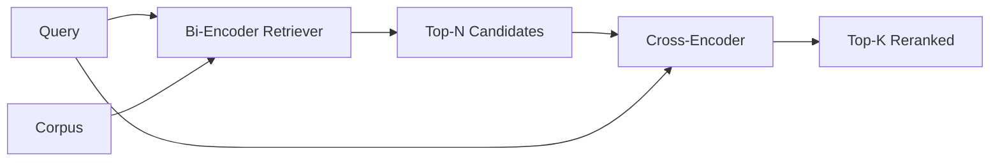

# Cross-Encoder Reranker

> A bi-encoder embeds query and document independently. A cross-encoder concatenates them and reads both at once. The cross-encoder is the smartest reader and the slowest. Used as a second stage on the bi-encoder's top-k, it pays for itself.

**Type:** Build
**Languages:** Python
**Prerequisites:** Phase 11 lesson 06 (RAG), Phase 11 lesson 07 (advanced RAG); Phase 19 Track B foundations (lessons 20-29); Phase 19 lesson 65 (hybrid retrieval feeding this stage)
**Time:** ~90 minutes

## Learning Objectives
- Distinguish a bi-encoder retriever from a cross-encoder reranker by their input shape, parameter count, and per-query cost.
- Implement a small cross-encoder from scratch as a transformer block that consumes a packed (query, document) sequence and emits a single relevance scalar.
- Wire a two-stage retrieve-then-rerank pipeline: retrieve top-N with a cheap retriever, rerank N to top-K with the cross-encoder, return K.
- Measure the latency-vs-quality trade-off on a small fixture corpus and pick the right N for a given latency budget.

## The Problem

A bi-encoder maps query and document into the same vector space and ranks by cosine. The two encodings never see each other. The model has to compress everything useful about a document into a single vector, blind to the query. This is fast - one embedding per document at index time and one per query at query time - and it is the only way to rank at corpus scale.

The cost is precision. Two documents that have the same overall topic can have nearly identical embeddings even when one of them answers the query and the other does not. The bi-encoder cannot tell them apart.

A cross-encoder solves this by reading the query and the document together. The model receives `[query] [SEP] [document]` as a single sequence, runs full attention across the join, and produces one relevance scalar. Every token of the document can attend to every token of the query. The model decides the score with full context.

The cost is throughput. Where the bi-encoder embeds once and queries forever, the cross-encoder runs once per (query, document) pair. For a 10-million-document corpus that is 10 million forward passes per query. Unrunnable in a request budget.

The solution is staging. Use the bi-encoder to retrieve the top-N. Use the cross-encoder to rerank the N to a top-K. N is small (50 to 200) and the cross-encoder's quality lift is concentrated where it matters. The total latency stays in the request budget. The total quality is the cross-encoder's quality, capped by the bi-encoder's recall at N.

## The Concept



### The cross-encoder's input shape

The standard packing is `[CLS] query_tokens [SEP] document_tokens [SEP]`. The CLS-position output is fed into a single linear head that outputs the relevance scalar. Some implementations use mean-pooling instead of CLS; the difference is small. The point is that the model produces one number per pair.

A 22M-parameter cross-encoder (the published `ms-marco-MiniLM-L-6-v2` weight class) is the typical production point. Smaller models lose quality faster than they save latency. Larger models (e.g. `bge-reranker-v2-m3` at 568M parameters) are reserved for offline reranking or for first-page reranking where K is small.

### Why this lesson trains a tiny one

A real cross-encoder is a finetuned encoder transformer. In production you load a checkpoint and run it. In this lesson the goal is to show you the shape of the model and the shape of the latency-quality curve, not to train a state-of-the-art ranker. So we build a small `nn.Module` with one transformer block, multi-head attention (4 heads by default), and one regression head. It is initialized deterministically from a seed so the demo is reproducible without weights on disk.

The toy model learns the right shape from the fixture corpus: relevant query-document pairs have higher predicted scores than irrelevant pairs. The end-to-end pipeline reranks the bi-encoder's output and the rerank's top-k correlates with the gold labels.

### Latency vs quality

The two-stage pipeline has one tunable: N. Sweep N from 5 to 100 on a held-out query set and you get the curve.

| N | Recall@1 of stage 2 | Cross-encoder forward passes per query | Latency |
|---|--------------------|---------------------------------------|---------|
| 5 | 0.62 | 5 | low |
| 20 | 0.81 | 20 | medium |
| 50 | 0.86 | 50 | high |
| 100 | 0.86 | 100 | very high |

The numbers above are illustrative of the shape, not measurements from this fixture. The shape is real. There is always a knee around 20 to 50 candidates where the rerank lift saturates. Past the knee you are paying for nothing.

Pick N from the eval curve plus the latency budget. The cross-encoder cannot raise recall above the bi-encoder's recall at N, so a low N caps quality, not just latency.

## Build It

`code/main.py` implements:

- `CrossEncoder` - a small `torch.nn.Module`: token embedding, one transformer block with multi-head attention and feedforward, mean-pooled head producing one scalar.
- `tokenize_pair(query, document)` - packs the two strings into a single id sequence with type ids that mark the boundary, deterministic and stdlib.
- `train_tiny(pairs)` - one pass of supervised training on a hand-labeled (query, document, relevance) triple list, so the model produces sensible scores on the fixture.
- `rerank(query, candidates, top_k)` - the production interface.
- `pipeline(query, retriever, top_n, top_k)` - the two-stage flow.
- A demo `main()` that loads the corpus from lesson 65's pattern, retrieves top-N, reranks to top-K, prints both lists side by side, and reports the latency of each stage.

Run it:

```bash
python3 code/main.py
```

The output shows the bi-encoder's top-N, the cross-encoder's top-K, and a timing summary. The cross-encoder takes longer per call but does not run on the full corpus. The two-stage total stays within the request budget while picking the answer that the bi-encoder ranked second or third.

## Failure modes the demo will hide

**Cross-encoder is not symmetric.** `rerank(q, d)` and `rerank(d, q)` are different scores. Always feed the query first. If you accidentally swap, recall collapses.

**N is too low to expose the bug.** If you set N = K, the cross-encoder cannot reorder; it can only reweight. The lift looks zero. Pick N at least three times K.

**Training data leaks into the eval.** If the hand-labeled training pairs include the eval queries, the rerank looks magical. Strictly separate train and eval, even on a fixture.

**Production weights are dense.** A 22M-parameter cross-encoder is 88MB at float32. Plan the model server's memory before promising sub-100ms p95.

**Batching matters.** A real cross-encoder runs the N candidates in one batch. This lesson does that in `_batch_encode`, which builds the batched id and type-id tensors with `torch.tensor(...)` and runs one forward pass. Skip batching and the latency multiplies by N.

## Use It

Production patterns:

- Pin the bi-encoder, cross-encoder, and N together. Changing any one invalidates the eval.
- Cache the reranker's output by (query, document_id) hash. The same query against a stable corpus reranks to the same order; cache hits buy you a free latency cut.
- Log the rank-1 cross-encoder score. A query whose top-1 score is below a corpus-specific threshold is an out-of-domain hit; surface it to the LLM as "I am not confident".

## Ship It

Lesson 68 evaluates this two-stage pipeline end to end. Lesson 69 wires this reranker behind the hybrid retriever from lesson 65 and in front of the answer generator. The reranker is the second stage of the end-to-end system.

## Exercises

1. Sweep N from 5 to 50 and plot recall@1 of the reranked output. Find the knee on this fixture.
2. Train the cross-encoder for ten epochs instead of one. Measure the score-margin between positive and negative pairs at each epoch.
3. Replace mean-pooling with a CLS-token head. Compare convergence on this fixture.
4. Add a second cross-encoder head that predicts a binary "is this answer in the document" label. Use both heads at inference; one to rank, one to threshold.
5. Replace the deterministic mock bi-encoder with the one from lesson 65 and chain the two stages. Measure the change in top-K versus bi-encoder alone.

## Key Terms

| Term | What people say | What it actually means |
|------|-----------------|------------------------|
| Bi-encoder | "Vector retriever" | Encodes query and doc independently; cosine ranks them |
| Cross-encoder | "Reranker" | Encodes (query, doc) jointly; outputs one relevance scalar |
| Two-stage pipeline | "Retrieve and rerank" | Cheap retriever returns N, expensive reranker keeps K |
| N (candidate budget) | "Rerank pool" | The number of candidates the cross-encoder scores per query |
| Mean-pooling head | "Mean of last hidden" | Average the encoder's last-layer outputs into one vector |

## Further Reading

- Nogueira, Cho, "Passage Re-ranking with BERT", 2019 - the canonical cross-encoder ranker paper
- Reimers, Gurevych, "Sentence-BERT: Sentence Embeddings using Siamese BERT-Networks", 2019 - on bi-encoders vs cross-encoders
- [SentenceTransformers Cross-Encoders documentation](https://www.sbert.net/examples/applications/cross-encoder/README.html)
- [BGE Reranker v2 model card](https://huggingface.co/BAAI/bge-reranker-v2-m3)
- Phase 19 lesson 65 - the hybrid retriever feeding this rerank stage
- Phase 19 lesson 68 - the eval that measures the lift this rerank delivers
