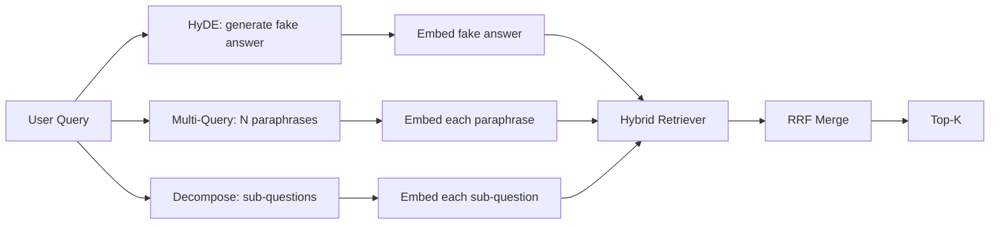

# Query Rewriting: HyDE, Multi-Query, and Decomposition

> The query the user types is not the query your retriever wants. Rewriting bridges the gap before retrieval, so the index sees something closer to what the answer looks like.

**Type:** Build
**Languages:** Python
**Prerequisites:** Phase 11 lessons 04 (embeddings), 06 (RAG); Phase 19 Track B foundations (lessons 20-29); Phase 19 lessons 64 and 65
**Time:** ~90 minutes

## Learning Objectives
- Implement Hypothetical Document Embeddings (HyDE): generate a fake answer, embed it, retrieve against that vector instead of the query vector.
- Implement multi-query expansion: rewrite one query into N paraphrases, retrieve with each, merge the union by reciprocal rank fusion.
- Implement query decomposition: split a complex question into sub-questions, retrieve per sub-question, merge.
- Compare the three rewriters head to head on a fixture and explain when each strategy wins.
- Wire a mock LLM that produces deterministic, on-fixture outputs so the rewriter loop runs offline.

## The Problem

A user types "what does our team do when uploads fail and the budget is gone?". The corpus contains a doc that says "AbortMultipartOnFail aborts an in-flight S3 multipart upload and decrements the per-bucket retry budget when the upload fails". The query and the document do not share a noun phrase. BM25 misses. The bi-encoder ranks the document third or fourth because the query vector lands in a region of the embedding space that prefers the doc about cancelled jobs, not the doc about aborted uploads. The two-stage rerank from lesson 66 can salvage the answer if it sits in the top-N, but if it does not even reach top-N, the reranker never sees it.

The fix is to rewrite the query before it touches the retriever. The 2023 paper "Precise Zero-Shot Dense Retrieval without Relevance Labels" (Gao et al.) introduced HyDE: ask an LLM to write the document that would answer the query, embed that hypothetical document, and use its embedding as the retrieval vector. The hypothetical document sits in the right region of the embedding space because it is written in the corpus's voice. The query vector did not.

Two cousin techniques pair with HyDE. Multi-query expansion (the term Microsoft's GraphRAG used) generates N paraphrases of the query and retrieves with each, then merges. Decomposition (popularized as "subquery decomposition" in the 2024 Stanford DSPy work) splits "what does our team do when uploads fail and the budget is gone" into two questions: "what happens when an upload fails" and "what happens when the retry budget is gone". Two retrievals, one merged result, both pieces of the answer reachable.

This lesson implements all three and runs them against the same fixture corpus.

## The Concept



### HyDE in detail

HyDE replaces the user's query vector with an LLM-written hypothetical document vector. The prompt is short:

```
You are a domain expert. Write a one-paragraph passage that answers the question
below. Use the same vocabulary and phrasing the documentation in this domain would
use. Do not refuse. Do not say you do not know.

Question: {user_query}

Passage:
```

The LLM's answer is wrong as a factual answer because the LLM does not know your corpus. That is fine. The retriever does not care about factual correctness, only about token distribution. The hypothetical passage contains the words "abort", "multipart", "bucket", "budget", because that is what a documentation passage on this topic would say. Embed that passage. The vector lands near the real passage.

In production you cap the hypothetical document to two or three sentences. Longer hypotheticals collect more noise. Shorter ones lose the lexical signal HyDE needs.

### Multi-query expansion in detail

Generate N paraphrases of the user's query. The simplest prompt:

```
Rewrite the following question in {N} different ways. Each rewrite must preserve
the original intent. Number them 1 to {N}. Do not add explanations.
```

Retrieve top-k for each paraphrase. Merge the N ranked lists with RRF (the same algorithm from lesson 65). Cheap, parallel, deterministic.

Multi-query wins when the user's phrasing is one of many equally valid ways to ask the question, and any of the rewrites would have asked it better. Loses when all rewrites are equally bad because the original was bad in the same way.

### Decomposition in detail

A single retrieval cannot satisfy a multi-faceted question. Decomposition asks the LLM to split the question into sub-questions and the system retrieves per sub-question. The prompt:

```
The following question may require information from multiple distinct topics.
Decompose it into a list of sub-questions. Each sub-question must be answerable
independently. If the question is already atomic, return it unchanged.

Question: {user_query}
```

Retrieve per sub-question. Merge. Decomposition is the right tool for questions that contain conjunctions, multi-clause comparisons, or two unrelated topics. Wrong tool for atomic questions; the decomposer's job there is to return the single question and not invent fake sub-questions.

### Why all three exist

The three are complementary. HyDE bridges the query-corpus token gap. Multi-query covers paraphrase variance. Decomposition covers multi-topic queries. A production system runs all three and picks the strategy per query (lesson 69's end-to-end system shows the selector).

## The Mock LLM

The lesson runs offline. The mock LLM is a small lookup table keyed on the user's query, plus a fallback for queries it has not seen. The lookup table contains:

- For each fixture query: a written hypothetical passage, three paraphrases, and a decomposition.
- For an unknown query: a deterministic transformation: take the query's content words, expand them through a synonym map, and return the result.

The shape of the mock is what matters, not the data. In production you swap the mock for a real model call. The retriever does not change.

## Build It

`code/main.py` implements:

- `MockLLM` - the deterministic stand-in described above.
- `HyDERewriter` - calls the LLM to write the hypothetical document, returns the rewriter output as `RewriteResult` with the hypothetical text and the query the retriever should use.
- `MultiQueryRewriter` - calls the LLM for N paraphrases, returns a list of queries.
- `DecomposeRewriter` - calls the LLM to decompose, returns sub-questions.
- `retrieve_with_rewriter` - takes a rewriter and a retriever, runs the rewrites, fuses the results.
- A demo that runs the three rewriters on a fixture and prints which strategy returned the gold answer document first.

The retriever shape is reused from lesson 65 (hybrid BM25 + dense). The fusion is the same RRF. The only new shape is the rewriter interface, which is small.

Run it:

```bash
python3 code/main.py
```

The output is a per-strategy ranking and a final summary. HyDE wins on the phrasing-mismatched query. Multi-query wins on the paraphrase-variance query. Decomposition wins on the multi-topic query. The fallback (no rewriter) loses on at least one of the three.

## Failure modes the demo will hide

**HyDE hallucinates corpus-specific identifiers wrong.** The model invents a function name. The hypothetical's BM25 score on the right doc collapses because the invented name is now a high-weight token that does not appear in the index. Cap the hypothetical's length and weight BM25 lower in the fusion.

**Multi-query rewrites all converge.** A weak model produces three near-identical paraphrases. The N retrievals return the same top-k. The RRF merge is no better than a single retrieval. Add an explicit diversity instruction to the rewrite prompt and detect duplicates by Jaccard.

**Decomposition over-splits.** The decomposer turns an atomic question into a list. The retrievals all return the same document but with reduced rank. The merge is worse than the original. Detect this with a "are these sub-questions distinct enough" pass before fan-out.

**Latency multiplies.** HyDE costs one LLM call. Multi-query costs one LLM call to generate N rewrites, then N retrievals. Decomposition costs one LLM call to decompose, then M retrievals. The retrievals run in parallel; the LLM call is the floor.

## Use It

Production patterns:

- Per-query strategy selection by query length: atomic short queries get multi-query, complex multi-clause queries get decomposition, jargon-heavy queries get HyDE.
- Cache the rewriter output by query hash. Many queries repeat.
- Run all three in parallel and fuse the three result sets into one with RRF. The cost is three LLM calls and one fusion; the quality is the union of all three strategies' coverage.

## Ship It

Lesson 69 wires this rewriter stage before the retriever from lesson 65 and the reranker from lesson 66. Lesson 68 evaluates the lift the rewriter adds to retrieval recall.

## Exercises

1. Implement RAG-Fusion (a 2024 variant of multi-query) where the rewriter's paraphrases are intentionally diverse, then the rerank step (lesson 66) picks the final list.
2. Add a fourth strategy: step-back prompting (ask the LLM for the more general question, retrieve on that, then narrow). Compare on the fixture.
3. Train the decomposer to recognize atomic queries by adding a "is the question atomic" head. Measure the over-split rate before and after.
4. Replace the mock LLM with a real model call. Measure the latency-per-strategy on your stack.
5. Add a confidence score per rewrite. Drop rewrites below the threshold. Measure the impact on recall.

## Key Terms

| Term | What people say | What it actually means |
|------|-----------------|------------------------|
| HyDE | "Fake-document retrieval" | LLM writes the answer; embed and retrieve on that instead of the query |
| Multi-query | "Paraphrase expansion" | N rewrites of the query; retrieve N times, merge by RRF |
| Decomposition | "Subquery split" | Multi-topic queries split into sub-questions, retrieved separately |
| Atomic query | "Single-topic" | Cannot be decomposed without inventing fake sub-questions |
| Step-back | "Abstract the query" | Ask the more general question, retrieve, then narrow |

## Further Reading

- Gao, Ma, Lin, Callan, "Precise Zero-Shot Dense Retrieval without Relevance Labels" (HyDE), 2023
- Microsoft Research, "Multi-Query Expansion for Retrieval"
- Stanford DSPy, "Subquery Decomposition for Multi-Hop QA"
- [LlamaIndex query transformations documentation](https://docs.llamaindex.ai/en/stable/optimizing/advanced_retrieval/query_transformations/)
- Phase 11 lesson 07 - advanced RAG patterns
- Phase 19 lesson 65 - the retriever this rewriter feeds
- Phase 19 lesson 68 - the eval that measures the rewriter lift
