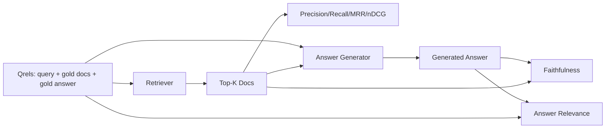

# RAG Evaluation: Precision, Recall, MRR, nDCG, Faithfulness, Answer Relevance

> If you cannot grade your retrieval and your answer at the same time, you cannot ship the system. The two are not the same metric and the same prompt fails on different axes.

**Type:** Build
**Languages:** Python
**Prerequisites:** Phase 11 lessons 06 (RAG), 10 (evaluation); Phase 19 Track B foundations (lessons 20-29); Phase 19 lessons 64, 65, 66, 67
**Time:** ~90 minutes

## Learning Objectives
- Compute four retrieval metrics from gold qrels: precision@k, recall@k, MRR (mean reciprocal rank), and nDCG@k.
- Compute two answer-grade metrics: faithfulness (every claim grounded in retrieved context) and answer relevance (the answer addresses the question).
- Build a fixture qrels file (queries, gold doc ids, gold answer text) that the eval reads end to end.
- Read the metric values to diagnose where a pipeline is failing: retrieval, ranking, generation, or grounding.

## The Problem

A RAG system has at least four moving parts: chunker, retriever, reranker, generator. Any of them can be the cause of a wrong answer. Without per-stage metrics you are flying blind.

A user reports a wrong answer. Is it because the chunker cut the answer span? Is it because the retriever did not include the chunk in top-k? Is it because the reranker pushed the right chunk past position one? Is it because the generator ignored the chunk and made something up? You cannot tell from the answer alone. You need:

- Retrieval metrics to grade what came out of the retriever.
- Ranking metrics to grade where the right chunk sat in the order.
- Faithfulness to grade whether the generator stayed inside the retrieved context.
- Answer relevance to grade whether the answer addresses the question at all.

This lesson builds all six on top of a fixture qrels file. The eval is offline and deterministic; in production you swap the mock LLM-as-judge for a real one.

## The Concept



### Precision@k

Of the top-k documents the retriever returned, what fraction are in the gold set? If gold has three documents and the top-3 returns two of them and one wrong one, precision@3 is 2 / 3. Use precision when the cost of an irrelevant retrieved chunk is high (the generator wastes tokens on it, or the chunk poisons the answer).

### Recall@k

Of the gold documents, what fraction are in the top-k? If gold has three documents and the top-5 contains all three, recall@5 is 1.0. Use recall when the cost of a missed answer is high (you would rather see one extra wrong chunk than miss the answer chunk entirely).

In production RAG the metric people usually quote is recall@k. Generation can drop irrelevant chunks easily; it cannot invent an answer from a chunk it never saw.

### MRR (Mean Reciprocal Rank)

For each query, find the position of the first relevant document in the ranked list. The reciprocal rank is 1 / position. Mean across the query set. MRR is a single-number summary of how well the retriever puts the best answer at the top.

MRR weights position-1 heavily. A query where the gold doc is at rank 1 contributes 1.0. Rank 2 contributes 0.5. Rank 10 contributes 0.1. The metric is dominated by the top of the list.

### nDCG@k

Normalized Discounted Cumulative Gain. The full formula assigns a gain to each retrieved document (often 1 for relevant, 0 for not), discounts by the log of the position, sums, and divides by the ideal DCG (the DCG you would have if you ranked perfectly). Range 0 to 1.

nDCG accommodates graded relevance: the gold can say "doc A is 3, doc B is 2, doc C is 1". MRR and recall@k flatten everything to binary. Use nDCG when the corpus has multiple partially-relevant documents per query.

### Faithfulness

For each claim in the generated answer, check whether the claim is supported by the retrieved context. The standard implementation uses an LLM-as-judge prompt that takes (claim, context) and returns yes or no. The metric is the fraction of claims that pass.

Faithfulness catches the generator failure mode where the model invents content. Even if the retriever returned the right chunks, a generator that hallucinates is broken. Faithfulness is also called groundedness, support, attribution.

This lesson implements faithfulness with a deterministic mock judge that checks whether each claim's tokens overlap the retrieved context by a threshold. In production you swap to a real model call. The shape of the metric is the same.

### Answer relevance

Does the answer actually address the question? Faithfulness asks "is the answer grounded in the context?". Answer relevance asks "is the answer grounded in the question?". A faithful but off-topic answer scores high on faithfulness and low on relevance. A short, on-topic answer that ignores the context scores high on relevance and low on faithfulness.

The standard implementation also uses LLM-as-judge: take (question, answer) and ask whether the answer addresses the question. This lesson implements a token-overlap-plus-judge stand-in.

## The fixture qrels

```python
{
  "qid": "q1",
  "query": "what is the abort threshold for multipart uploads",
  "gold_doc_ids": ["d1", "d3"],
  "gold_answer_substring": "three failed parts",
  "graded_relevance": {"d1": 3, "d3": 2},
}
```

Each query carries:
- the query string,
- a set of gold doc ids (for precision / recall / MRR),
- a graded relevance dict (for nDCG),
- the gold answer substring (kept as reference metadata on each qrel; faithfulness in this lesson is computed by judging extracted claims against the retrieved context, not against this substring).

In production you label these. This lesson ships a hand-built fixture so the eval runs out of the box.

## Build It

`code/main.py` implements:

- `precision_at_k(retrieved, gold, k)` - the literal definition.
- `recall_at_k(retrieved, gold, k)` - the literal definition.
- `mean_reciprocal_rank(retrieved_list_of_lists, gold_list)` - the mean over queries.
- `ndcg_at_k(retrieved, graded_relevance, k)` - DCG / IDCG with binary or graded gains.
- `extract_claims(answer)` - splits an answer into sentence-shaped claims.
- `faithfulness(claims, context_texts, judge)` - fraction of claims judged supported.
- `answer_relevance(question, answer, judge)` - judge on whether the answer addresses the question.
- `MockJudge` - deterministic token-overlap judge so the eval runs offline.
- `evaluate_pipeline(pipeline_fn, qrels, ks)` - the orchestrator that runs every metric.
- A demo that runs three pipeline variants (chunker baseline, hybrid retrieval, hybrid + rerank) against the qrels and prints a metrics table.

Run it:

```bash
python3 code/main.py
```

The output shows precision@k, recall@k, MRR, nDCG@k, faithfulness, and answer relevance for each variant in a single metrics table. The hybrid retrieval row beats the chunker baseline on recall; the rerank row beats hybrid on MRR.

## Reading the metrics to diagnose failures

| Symptom | Likely cause | What to fix |
|---------|-------------|-------------|
| Low recall@k, low precision@k | Chunker cut the answer or retriever cannot find it | Chunker boundaries (lesson 64) or retriever modality (lesson 65) |
| Decent recall@k, low MRR | Right chunk is in top-k but not at position 1 | Reranker (lesson 66) |
| High MRR, low faithfulness | Generator invents content despite right context | Generation prompt; force-cite-or-refuse |
| High faithfulness, low relevance | Answer is grounded but off-topic | Query rewriter (lesson 67) or generation prompt |
| All four high, users still complain | Eval set is unrepresentative | Expand qrels with real user queries |

## Failure modes the demo will hide

**LLM-as-judge bias.** A model judges its own outputs as more faithful than they are. Use a different model family for the judge than the generator, or hand-grade a sample.

**Qrels rot.** The gold answers drift as the corpus changes. A doc that was gold for q1 in January 2024 is no longer the right answer in October 2024 because the team renamed the function. Schedule a quarterly qrels review.

**Faithfulness micro-checks miss macro-claims.** Per-sentence faithfulness can pass while the overall answer's structure misleads. Add a sample-level qualitative review on top of the automated metric.

**Recall@k masks per-query failures.** A 90% average recall can hide that one query class always misses. Slice the qrels by query class (literal, paraphrased, multi-topic) and report per-slice.

## Use It

Production patterns:

- Run the eval on every retriever or generator change. Treat a recall@k regression like a test failure.
- Persist the metric trace per query. When a user complains, look up the qrels entry that matches and see whether it would have been caught.
- Tier the qrels: a smoke set of 20 queries that runs in CI; a regression set of 200 that runs nightly; a deep set of 2000 that runs weekly.

## Ship It

Lesson 69 wires the entire pipeline (chunker, retriever, reranker, generator) and runs this eval against the end-to-end system.

## Exercises

1. Add a fifth retrieval metric: hit-rate@k. Compare it against recall@k. Explain when they differ.
2. Implement a graded faithfulness: 0 (unsupported), 1 (partially supported), 2 (fully supported). Update the metric accordingly.
3. Replace the mock judge with a real model call. Measure the disagreement between the mock and the real judge on the fixture.
4. Add a query-class slice ("literal", "paraphrased", "multi-topic"). Report per-slice metrics.
5. Add an "answer length" metric and correlate it with faithfulness. Plot the curve.

## Key Terms

| Term | What people say | What it actually means |
|------|-----------------|------------------------|
| Precision@k | "Hit rate over retrieved" | Fraction of top-k that are gold |
| Recall@k | "Hit rate over gold" | Fraction of gold in top-k |
| MRR | "First-hit position" | Mean of 1 / rank of first relevant document |
| nDCG@k | "Graded ranking quality" | DCG over the top-k divided by ideal DCG |
| Faithfulness | "Groundedness" | Fraction of answer claims supported by retrieved context |
| Answer relevance | "Did it address the question?" | Whether the answer matches the question's intent |
| Qrels | "Gold labels" | The labeled set of queries and their gold documents and answers |

## Further Reading

- Buckley, Voorhees, "Evaluating Evaluation Measure Stability", SIGIR 2000 - the canonical paper on ranking metrics
- Jarvelin, Kekalainen, "Cumulated Gain-based Evaluation of IR Techniques" - the nDCG paper
- [Ragas: Automated Evaluation of RAG Pipelines](https://docs.ragas.io)
- [Anthropic, Evaluating RAG](https://www.anthropic.com/news/evaluating-rag)
- Phase 11 lesson 10 - evaluation framework foundations
- Phase 19 lessons 64-67 - components evaluated here
- Phase 19 lesson 69 - the end-to-end pipeline this eval grades
