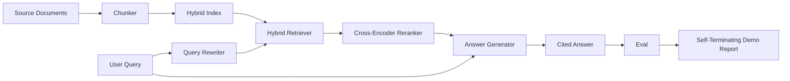

# End-to-End RAG System

> Six lessons of components. One pipeline. One eval loop. One self-terminating demo. This is the system you ship.

**Type:** Build
**Languages:** Python
**Prerequisites:** Phase 11 lessons 06 (RAG), 10 (evaluation); Phase 19 Track B foundations (lessons 20-29); Phase 19 lessons 64, 65, 66, 67, 68
**Time:** ~90 minutes

## Learning Objectives
- Compose the chunker, hybrid retriever, query rewriter, cross-encoder reranker, and answer generator into a single end-to-end pipeline.
- Implement an answer generator that cites its claims by chunk anchor, with refuse-on-low-confidence fallback.
- Run the lesson 68 eval against the assembled pipeline and prove the staged build wins on every metric over the same components in isolation.
- Build a self-terminating CLI demo that ingests a fixture corpus, runs a fixed query set, and exits zero with a summary report.

## The Problem

Six components in isolation prove nothing. The chunker can win on recall@5 against the corpus and lose on the system's recall@5 because the retriever cannot rank what the chunker emits. The reranker can lift MRR on a synthetic candidate pool and fail on real bi-encoder candidates because the bi-encoder's recall at the rerank budget is too low. The query rewriter can promote the gold doc on a single query and break on the next because the LLM mock returns a degenerate hypothetical.

The integration test is the whole pipeline run end to end against the same fixture qrels, with the same metric, with one orchestrator file that wires everything together. That is what this lesson builds. If the metrics on the integrated pipeline beat the metrics on each stage's isolated demo, you have proven the system.

## The Concept



### Wiring choices

The pipeline is a small graph. Each stage is a function with a clear signature.

| Stage | Input | Output |
|-------|-------|--------|
| Chunker | Document text | List of Chunk records |
| Retriever | Query string | Top-N Chunk records |
| Rewriter (optional) | Query string | List of rewrites + hypothetical |
| Reranker | Query, candidates | Top-K Chunk records with cross scores |
| Generator | Query, top-K Chunk records | Answer string with citations |

The composition is straightforward when each signature is stable. The lesson's `Pipeline` class holds the five stages and a `query` method that runs them in order. Every stage is swappable: pass a different chunker, retriever, rewriter, reranker, or generator and the pipeline still runs.

### Answer generator with citations

The generator is the last stage and the easiest to break. The lesson ships a deterministic mock generator that:

1. Takes the top-K reranked chunks.
2. Selects up to two chunks whose text contains the highest content-token overlap with the query.
3. Emits an answer that is a concatenation of one-sentence-from-each-selected-chunk, with each sentence followed by a `[doc_id:chunk_index]` anchor.
4. If no chunk has overlap above a refuse threshold, emits "I do not know" with no citation.

In production you swap the mock for a real LLM call with the prompt template:

```
You are answering a question using only the snippets below.
Cite every claim with the anchor in parentheses.
If the snippets do not answer the question, say "I do not know".

Question: {query}

Snippets:
{enumerated chunks with anchors}

Answer:
```

The refuse-on-low-confidence path is the whole reason the cross-encoder rank-1 score is logged. If it sits below the corpus threshold, the generator refuses. This is the safety valve against hallucinated answers.

### The self-terminating demo

The demo runs everything end to end. It prints a per-stage breakdown of one query, runs the eval over the four fixture qrels, prints a metrics table, and exits with status zero if all the lesson 68 metrics meet the thresholds set in the demo. If any metric is below threshold, the demo exits with a non-zero status and a message naming the failing metric.

This is the shape a CI smoke test takes. The pipeline runs offline, fast, deterministic. The thresholds are deliberately tight on the fixture so a regression in any of the six lessons fails the demo.

## Build It

`code/main.py` implements:

- `Chunk` - the record carried through all stages (extends lesson 64's shape with a chunk_index and source doc_id).
- `Chunker` - selects a strategy from lesson 64 (default recursive split).
- `HybridIndex` - bundles BM25 + dense + RRF from lesson 65.
- `Rewriter` (optional) - picks one of HyDE, multi-query, decomposition from lesson 67 by query length and presence of conjunctions.
- `Reranker` - the trained cross-encoder from lesson 66, with a smaller fixture training set so it converges in seconds.
- `Generator` - the deterministic mock generator with citations and refuse-on-low-confidence.
- `Pipeline` - composes the five stages with a `query(question)` method that returns `Result(answer, top_k, latency_ms_per_stage)`.
- `run_demo()` - ingests the corpus, runs three fixture queries, runs the eval, prints results, sets exit code by threshold.

Run it:

```bash
python3 code/main.py
```

The output is one printed query trace, the full eval table, and a final pass/fail status. Returns exit code 0 on the fixture.

## Failure modes the demo will hide

**Chunker boundary drift.** If you swap the chunker strategy between the eval qrels labeling pass and the demo, the gold doc ids no longer line up. Lock the chunker strategy in the qrels file. The demo includes a header that names the chunker.

**Reranker training set leaks into the eval.** The 14 training triples in lesson 66 include queries that resemble the eval queries. In production, hold out the eval queries strictly. The demo's eval queries are deliberately disjoint from the rerank training set.

**Mock generator hides hallucination risk.** The mock cannot hallucinate because it only emits text from the retrieved chunks. The lesson notes this and points the production swap-in path to a real model.

**No streaming.** The pipeline returns the full answer at the end of every stage. A production system would stream the generator's output. Streaming is out of scope; the answer-grade metrics work on the final string either way.

**Latency is offline.** The mock LLM calls are constant time. Real LLM calls dominate. Plan a latency budget in the request scope; the lesson's per-stage timing only measures CPU work.

## Use It

Production patterns:

- Ship the pipeline file under one orchestrator with explicit stage interfaces. Avoid spreading the wiring across the repo.
- Run the eval before every merge that touches a stage. If the eval drops, the merge does not land.
- Persist the metric trace per CI run so you can attribute regressions to a stage swap.
- Add a smoke set of 20 queries (subset of the regression set) that runs in under 30 seconds; the full regression set runs nightly.

## Ship It

The pipeline file in this lesson is the shape the rest of Phase 19's Track F lessons assume. Subsequent lessons would add ingestion automation, incremental re-index, telemetry, and a serving layer on top. The retrieval, rerank, rewrite, and eval halves are complete here.

## Exercises

1. Add a per-query strategy selector inside the rewriter: heuristics from lesson 67 (length, conjunctions, jargon ratio) pick HyDE, multi-query, or decomposition.
2. Add a real LLM call for the generator behind an env flag. Default to the mock. Measure the latency delta.
3. Extend the demo to take a `--corpus path` flag that loads a real corpus. Re-run the eval and the threshold check.
4. Add a `--strategy` flag to the chunker. Measure each strategy's contribution to end-to-end recall.
5. Add a streaming generator interface and feed it into the eval. Confirm that faithfulness is computed on the final string and not on the streamed prefix.

## Key Terms

| Term | What people say | What it actually means |
|------|-----------------|------------------------|
| Pipeline | "RAG pipeline" | The composed stages from ingestion to cited answer |
| Citation anchor | "Source link" | The (doc_id, chunk_index) reference attached to each claim |
| Refuse-on-low-confidence | "I do not know" | Generator returns no answer when the reranker top-1 score sits below threshold |
| Smoke set | "CI eval" | The minimal qrels subset that runs in every PR check |
| Stage interface | "Function signature" | The stable input and output type of each pipeline stage |

## Further Reading

- [Anthropic, Building search and retrieval](https://www.anthropic.com/news/contextual-retrieval)
- [Pinterest, MCP internal search](https://medium.com/pinterest-engineering) - reference production architecture
- [Ragas: Automated Evaluation of RAG Pipelines](https://docs.ragas.io)
- Phase 11 lesson 06 - RAG fundamentals
- Phase 19 lessons 64-68 - the components composed here
