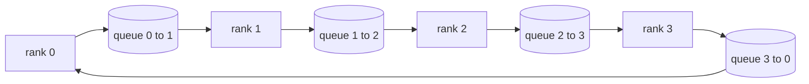

# Collective Ops From Scratch

> The four collective operations that hold distributed training together are allreduce, broadcast, allgather, and reduce_scatter. Every other primitive a training framework offers is a wrapper around these. Build them once over a `multiprocessing.Queue` mesh, verify them against a reference implementation, and the rest of the track becomes plumbing.

**Type:** Build
**Languages:** Python
**Prerequisites:** Phase 19 Track C lessons 42-49
**Time:** ~90 min

## Learning Objectives

- Implement ring allreduce in two passes (reduce-scatter then allgather) and prove the per-rank communication volume is 2(N-1)/N bytes per element.
- Build broadcast, allgather, and reduce_scatter on top of point-to-point sends over `multiprocessing.Queue`.
- Verify every primitive against a `torch.distributed` gloo reference for the same input.
- Defend the choice of ring versus tree on cluster shape, latency floor, and bandwidth ceiling.

## The Problem

A naive allreduce over N ranks sends N times the tensor to a root and broadcasts N times back. Bandwidth scales as O(N) per rank, the root becomes a bottleneck, and the wall-clock floor is the slowest link times N. Ring allreduce flattens that into 2(N-1) chunks of size T/N, so per-rank bytes drop to 2T(N-1)/N independent of cluster size. Tree allreduce wins on small N and high-latency links because depth is log2(N) hops instead of 2(N-1). Pick the wrong topology for the cluster shape and the slowest GPU dictates step time.

Every distributed training framework you will read this track depends on these four primitives. PyTorch DDP synchronises gradients with one allreduce per parameter bucket. ZeRO shards optimiser state by reduce_scatter and broadcasts updated parameters by allgather. FSDP turns the full forward into allgather plus reduce_scatter. Pipeline parallel needs broadcast for activations across stage groups. If you cannot implement the four collectives, you cannot reason about why training stalls, why the gradient mismatch shows up at rank 3, or why the pipeline bubble doubles when you swap topologies.

## The Concept



### Ring allreduce in two passes

Split the tensor into N equal chunks indexed 0..N-1. Each rank owns chunk index equal to its rank. Pass 1, reduce-scatter, runs N-1 steps. At step s, rank r sends chunk (r - s) mod N to rank (r + 1) mod N and receives chunk (r - s - 1) mod N from rank (r - 1) mod N, accumulating the received chunk into its local copy. After N-1 steps, rank r owns the full sum for chunk r. Pass 2, allgather, runs another N-1 steps and rotates the finished chunks around the ring until every rank holds the full sum for every chunk.

| Primitive | Per-rank bytes | Steps | When to use |
|-----------|---------------|-------|-------------|
| Ring allreduce | 2T(N-1)/N | 2(N-1) | Large T, fat-pipe homogeneous cluster |
| Tree allreduce | T log2(N) | 2 log2(N) | Small T or high-latency links |
| Broadcast | T | log2(N) tree | Parameter init, scalar config |
| Allgather | T(N-1)/N | N-1 | Sharded forward, ZeRO unshard |
| Reduce_scatter | T(N-1)/N | N-1 | ZeRO gradient sharding |

### Queue mesh as a stand-in for NCCL

NCCL runs over PCIe and NVLink with hardware-offloaded reductions. On CPU you do not have that. A `multiprocessing.Queue` per ring edge gives you ordered point-to-point delivery with a single producer and single consumer. The reduction happens in user space, so you pay Python overhead, but the wire pattern is identical to NCCL ring allreduce. Reason about correctness on the queue version and the cluster behaviour follows.

### Verify against gloo

Every primitive lands with a unit test that compares its output against `torch.distributed` initialised with the gloo backend on the same tensor across the same world size. If your ring allreduce diverges from gloo by more than float32 epsilon, the test fails. Verification against a reference implementation is non-negotiable; without it the primitive looks correct until step 10000 of a real training run.

## Build It

`code/main.py` implements:

- `Mesh` class that wires N `multiprocessing.Queue` instances into a ring and exposes `send(dst, tensor)` and `recv(src)` per rank.
- `ring_allreduce(mesh, rank, world_size, tensor)` running the two-pass algorithm.
- `broadcast(mesh, rank, world_size, tensor, src)` over a logarithmic tree.
- `allgather(mesh, rank, world_size, tensor)` using N-1 rotations.
- `reduce_scatter(mesh, rank, world_size, tensor)` as the first half of allreduce.
- `_gloo_reference(op, world_size, tensor)` that runs the same input through `torch.distributed` with gloo for byte-equal comparison.

Run it:

```bash
python3 code/main.py
```

Output: per-primitive verification table comparing queue-mesh and gloo outputs, followed by a per-rank byte counter that proves the 2T(N-1)/N scaling.

## Production patterns in the wild

Three patterns harden the primitives enough to ship.

**Bucket gradients before allreduce.** A 1B-parameter model has tens of thousands of gradient tensors. One allreduce per tensor pays the latency floor N times. DDP buckets gradients into ~25 MB chunks and issues one allreduce per bucket; the small tensors ride on the back of the big ones. Without bucketing the latency overhead dominates the step.

**Overlap communication with computation.** Backward computes gradients layer by layer in reverse order. The moment the last layer's gradient is ready, kick off its allreduce while the next layer keeps computing. PyTorch DDP wires this with bucket-ready hooks. The overlap halves visible communication time when the network has slack.

**Pick ring or tree by message size, not religion.** NCCL ships a topology detector that picks ring for messages above ~1 MB and tree below. The crossover is bandwidth-versus-latency: above 1 MB, the bandwidth term 2T(N-1)/N dominates and ring wins; below 1 MB, the log2(N) hop count wins. Hard-coding one topology costs throughput on the wrong message size.

## Use It

Production patterns:

- **PyTorch DDP.** Calls `dist.all_reduce` on bucketed gradients after backward. The bucket size is tunable; default 25 MB is reasonable for 100Gbit Ethernet.
- **DeepSpeed ZeRO.** Issues reduce_scatter to shard gradients and allgather to reconstruct full parameters before forward. The lesson's primitives are exactly the calls ZeRO makes.
- **FSDP.** Forward begins with allgather to unshard the layer, computes, then reduces with reduce_scatter and discards the unshard. Same primitives, different schedule.

## Ship It

Use the queue-mesh primitives in lessons 77-81. Lesson 77 wires allreduce into DDP. Lesson 78 wires reduce_scatter into ZeRO. Lesson 79 wires broadcast into pipeline activations. Lesson 81 composes all four into the end-to-end demo.

## Exercises

1. Add a tree allreduce variant and switch between ring and tree by message size. Measure the crossover.
2. Add a `recv_timeout_ms` so a stalled rank surfaces a deadline error instead of hanging forever.
3. Replace `multiprocessing.Queue` with TCP sockets for the four primitives. Same tests, real wire.
4. Add a bandwidth instrumentation hook so the per-rank byte counter logs to JSONL.
5. Compare wall-clock time of ring versus tree on 4 ranks for tensors of size 1KB, 1MB, 16MB. Defend the crossover empirically.

## Key Terms

| Term | What people say | What it actually means |
|------|----------------|------------------------|
| Allreduce | "Sum across ranks" | After the call every rank holds the same reduced tensor |
| Ring | "The fast topology" | N-1 chunks of size T/N flow around the cycle twice |
| Tree | "The log topology" | Reduction follows a binary tree; depth is log2(N) hops |
| Allgather | "Concatenate shards" | Every rank ends with every other rank's shard |
| Reduce_scatter | "Split the sum" | Each rank ends with the sum of one chunk only |
| Bucket | "Fuse small tensors" | Coalesce N small allreduces into one large one |

## Further Reading

- [PyTorch Distributed: NCCL collectives](https://pytorch.org/docs/stable/distributed.html#collective-functions)
- [Horovod ring allreduce paper](https://arxiv.org/abs/1802.05799)
- [NCCL topology and algorithm selection](https://docs.nvidia.com/deeplearning/nccl/user-guide/docs/index.html)
- [Patarasuk and Yuan, Bandwidth optimal allreduce algorithms](https://www.cs.fsu.edu/~xyuan/paper/09jpdc.pdf)
- Phase 10 Lesson 05 - distributed training overview
- Phase 19 Lesson 77 - DDP wired on top of these primitives
