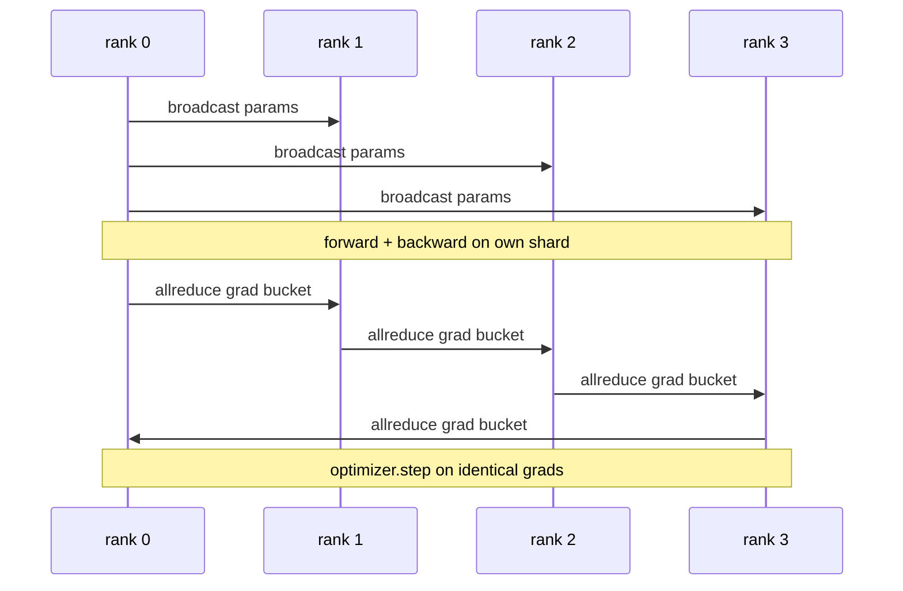

# Data Parallel DDP From Scratch

> DistributedDataParallel is a hook on top of allreduce. Wrap a model, broadcast the initial parameters from rank 0 so every rank starts identical, install a backward hook on every parameter that issues an allreduce of the gradient, and the rest is gradient descent. The whole pattern is 200 lines.

**Type:** Build
**Languages:** Python
**Prerequisites:** Phase 19 Track C lessons 42-49
**Time:** ~90 min

## Learning Objectives

- Wire a `DistributedDataParallel`-shaped wrapper that broadcasts initial parameters and allreduces gradients after backward.
- Spawn N CPU ranks with `torch.multiprocessing.spawn` over the gloo backend with file-based rendezvous.
- Prove gradient-sync correctness by training the same model on the same data sequentially and showing per-step parameter equivalence.
- Defend the use of buckets (gradient fusion) and overlap (comm during backward) as the two changes that turn a working DDP into a production DDP.

## The Problem

A 1-billion-parameter model with 12 GB of activations does not fit on one consumer GPU. Even when it fits, training takes weeks. Data parallel splits the batch across N ranks, each rank computes the forward and backward on its shard, and at every step every rank's gradients are summed so all N copies stay identical. The summed gradient is what the optimiser steps on.

Without gradient sync, the N replicas diverge by step 2. The model is not "one model trained on more data" anymore, it is N separate models that happen to share initial weights. With gradient sync done badly (one allreduce per parameter, no overlap, no bucketing) the network is the bottleneck and the GPUs idle waiting for the wire. The craft of DDP is making the gradient sync nearly free relative to compute. The canonical PyTorch DDP achieves that by bucketing gradients, overlapping allreduce with the next layer's backward, and using NCCL on NVLink. We can do all three on CPU with gloo and learn the same lessons.

## The Concept



### The three operations DDP needs

| Stage | Collective | Why |
|-------|-----------|-----|
| Init | broadcast from rank 0 | Every rank starts with the same parameters |
| After backward | allreduce of each grad | The mean gradient is what the optimiser steps on |
| Sometimes | broadcast of buffers | Batchnorm running stats stay synchronised |

### Why mean and not sum

Allreduce-SUM divided by world_size gives the mean gradient. The mean is invariant to world_size: a learning rate tuned at one rank works at four ranks because the per-step gradient magnitude does not change. Allreduce-SUM without the division forces you to retune the learning rate every time you change cluster size. DDP wraps the SUM and divides; do the same in the lesson.

### Why bucket gradients

A transformer has thousands of parameter tensors. One allreduce per tensor pays the gloo latency floor thousands of times. DDP groups gradients into ~25 MB buckets and issues one allreduce per bucket. The same total bytes move across the wire but the latency is amortised over the bucket. For the lesson's tiny model we group everything into one bucket; the structure is what carries across.

### Why pin the seed

Every rank must call `torch.manual_seed(seed + rank)` for shuffling but `torch.manual_seed(seed)` for parameter init. A single shared seed means every rank sees the same batch order (defeating data parallel); a rank-specific seed for params means initial parameters disagree by float epsilon and gradient sync no longer makes the replicas identical. Get the seed pattern right or the test for parameter equivalence fails on step 1.

## Build It

`code/main.py` implements:

- `MiniMLP`: a 3-layer MLP small enough to converge in seconds, large enough to expose the wiring.
- `DistributedDataParallel(model, world_size)`: broadcasts params at construct time, returns a wrapper whose `sync_grads` divides accumulated allreduce-summed grads by world_size.
- `worker(rank, world_size, ...)`: full training loop with `torch.distributed` init over gloo, forward, backward, sync, step.
- `_reference_single_process_loop(...)`: trains the same model on the same data sequentially on one rank, used by the test for byte-equal parameter equivalence after each step.

Run it:

```bash
python3 code/main.py
```

Output: a per-step training table comparing single-process loss and parameter checksum to the DDP run on 4 ranks. The two paths produce identical loss curves to float epsilon, proving the gradient sync is correct.

## Production patterns in the wild

Three patterns harden DDP enough to ship.

**Find unused parameters.** Some forward paths skip parameters conditionally (early exit, mixture-of-experts router). The skipped parameters have no gradient, but DDP's bucket-ready hook still waits for them and the allreduce deadlocks. `find_unused_parameters=True` tells DDP to look at which params got gradients before reducing. The cost is a graph walk per step, so leave it off unless your forward branches.

**Static graph optimisation.** When the forward is stable across steps, `static_graph=True` lets DDP precompute the bucket schedule. The optimisation matters at scale: precomputing saves a few ms per step which compounds across 10000 steps.

**Gradient accumulation needs care.** Accumulating gradients over K microbatches without syncing each microbatch is a 10x throughput win. DDP exposes `no_sync()` as a context manager that pauses the post-backward allreduce. Forget the manager and you allreduce K times for nothing; the throughput drops to the floor.

## Use It

Production patterns:

- **PyTorch DDP.** The canonical implementation. `torch.nn.parallel.DistributedDataParallel(model)` wires bucketing, overlap, and the no_sync context.
- **HuggingFace Accelerate.** Adds a launcher that handles `torchrun` env vars and the model wrap. Same DDP under the hood.
- **Megatron-LM data parallel.** Combines DDP with tensor parallel for large models; the data-parallel piece is the same allreduce-after-backward pattern.

## Ship It

Lesson 78 (ZeRO sharding) replaces the per-parameter allreduce with reduce_scatter so each rank only stores its shard of the optimiser state. Lesson 81 composes DDP with ZeRO into the end-to-end demo.

## Exercises

1. Add gradient buckets of configurable size and measure the speedup vs one-allreduce-per-parameter on a deeper model.
2. Implement `no_sync()` as a context manager and verify gradient accumulation matches a single-process baseline over K microbatches.
3. Add a `find_unused_parameters` mode where the forward sometimes skips one of the MLP layers; without the flag the run should deadlock.
4. Replace gloo with `torch.distributed.barrier()`-only synchronisation to feel the difference between allreduce-based and barrier-based sync.
5. Measure the gradient-sync overhead as a fraction of step time for batch sizes 1, 16, 256 and explain the scaling.

## Key Terms

| Term | What people say | What it actually means |
|------|----------------|------------------------|
| DDP | "Data parallel" | Wrapper that broadcasts params and allreduces grads each step |
| Bucket | "Fuse grads" | Group N small allreduces into one large one |
| Overlap | "Hide comm" | Issue allreduce while later layers still computing backward |
| no_sync | "Accumulate" | Skip the post-backward allreduce for gradient accumulation |
| find_unused | "Branchy forward" | Detect parameters with no grad before reducing |

## Further Reading

- [PyTorch DistributedDataParallel docs](https://pytorch.org/docs/stable/generated/torch.nn.parallel.DistributedDataParallel.html)
- [PyTorch DDP internals tutorial](https://pytorch.org/tutorials/intermediate/ddp_tutorial.html)
- [Li et al, PyTorch Distributed: Experiences on Accelerating Data Parallel Training](https://arxiv.org/abs/2006.15704)
- Phase 19 Lesson 76 - the collectives DDP is built on
- Phase 19 Lesson 78 - ZeRO sharding replaces the per-param allreduce with reduce_scatter
