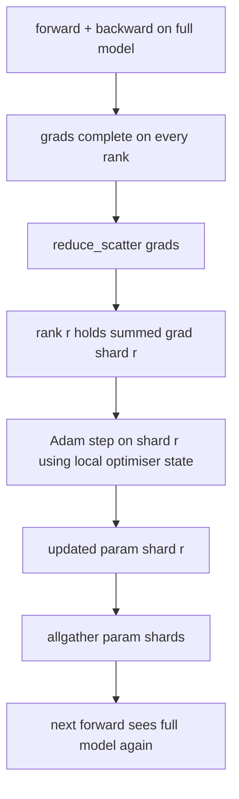

# ZeRO Optimizer State Sharding

> Adam stores two moment estimates per parameter, both in float32. A 7B-parameter model carries 56 GB of optimiser state. ZeRO stage 1 shards that across N ranks; each rank owns 1/N of the optimiser. After the local step the updated parameter shards broadcast back, every rank reconstructs the full model, and the next step begins. The win is a linear memory drop on the largest single allocation in the training stack.

**Type:** Build
**Languages:** Python
**Prerequisites:** Phase 19 Track C lessons 42-49
**Time:** ~90 min

## Learning Objectives

- Shard optimiser state (first moment, second moment, fp32 master copy) across N ranks so each rank owns 1/N.
- Use reduce_scatter to deliver each rank only its shard's gradient sum, then allgather to broadcast the updated parameter shards back.
- Compute the memory savings table for stage 1, stage 2, stage 3 against vanilla DDP.
- Defend the choice of stage 1 vs stage 2 vs stage 3 on model size and bandwidth budget.

## The Problem

Vanilla DDP replicates everything: parameters, gradients, and optimiser state are present in full on every rank. For a 7B-parameter model in fp16 that means 14 GB of parameters, 14 GB of gradients, and 28 GB of optimiser state per rank. The optimiser state is the largest term and the easiest to shard because it is only touched during the step, not during forward or backward.

ZeRO stage 1 shards the optimiser state. Each rank holds 1/N of the Adam moments. After backward, instead of allreducing the full gradient and stepping locally, ZeRO reduce_scatters so each rank receives only its shard's summed gradient. The rank applies the optimiser step to its shard of the master parameters. The updated parameter shards then allgather back so every rank has the full model for the next forward. The optimiser memory drops by N. The wire traffic per step is the same as DDP: one reduce_scatter plus one allgather equals one allreduce by bandwidth. Memory wins, throughput holds.

## The Concept



### Stages of ZeRO

| Stage | What is sharded | Memory per rank | Comm per step |
|-------|----------------|------------------|---------------|
| DDP | nothing | params + grads + optim | 1x allreduce |
| ZeRO-1 | optimiser state | params + grads + optim/N | 1x reduce_scatter + 1x allgather |
| ZeRO-2 | optim + grads | params + grads/N + optim/N | 1x reduce_scatter + 1x allgather |
| ZeRO-3 | optim + grads + params | params/N + grads/N + optim/N | 1x allgather per layer + 1x reduce_scatter per layer |

Stage 1 is the cheapest win because optimiser state dominates the budget. Stage 2 needs gradient-shard accumulation logic but the bandwidth is the same. Stage 3 (FSDP) pays per-layer comm for every forward and backward, gaining the parameter-shard memory drop. The lesson implements stage 1 in full.

### The memory math, real numbers

For a model with P parameters trained with Adam in mixed precision:

| Term | Vanilla | ZeRO-1 | Why |
|------|---------|--------|-----|
| fp16 params | 2P bytes | 2P bytes | needed for forward |
| fp16 grads | 2P bytes | 2P bytes | needed for backward |
| fp32 master copy | 4P bytes | 4P/N bytes | only the optim uses it |
| fp32 first moment | 4P bytes | 4P/N bytes | only the optim uses it |
| fp32 second moment | 4P bytes | 4P/N bytes | only the optim uses it |
| Total | 16P bytes | 4P + 12P/N bytes |   |

At N=8: vanilla 16P, ZeRO-1 5.5P, a 65% drop. At N=64: vanilla 16P, ZeRO-1 4.19P, a 74% drop.

### Why reduce_scatter beats allreduce-then-shard

Allreduce gives every rank the full summed gradient. If you only need shard r, the (N-1)/N of the gradient that was reduced is wasted on rank r. Reduce_scatter delivers exactly the shard each rank owns; the per-rank bytes are the same as allreduce (since allreduce is reduce_scatter + allgather) but the second half is replaced by the parameter-shard allgather later. Net wire is identical to DDP, memory is divided.

## Build It

`code/main.py` implements:

- `flatten_params(module)` and `unflatten_into(module, flat)` that pack a model's parameters into one contiguous tensor and unpack back. The flat layout is what makes sharding by rank a simple slice.
- `ZeroOptimizer(model, world_size, rank, lr)` that owns the rank's shard of the master copy and Adam moments.
- `step()` that runs reduce_scatter on the flat gradient, applies Adam to the rank's shard, and allgathers the updated parameters back.
- A demo that trains a 3-layer MLP for 20 steps and prints the per-step memory budget alongside a vanilla DDP baseline.

Run it:

```bash
python3 code/main.py
```

Output: per-step loss and the memory table that shows ZeRO-1 holds 1/N of the optimiser state on each rank versus DDP's full copy.

## Production patterns in the wild

Three patterns harden ZeRO enough to ship.

**Sharded checkpointing matters.** ZeRO-1's optimiser state is split across ranks; the checkpoint has to record which rank owns what. Lesson 80 builds the sharded checkpoint manifest that resumes a ZeRO run on the same world size. Without it the saved state is unreadable at restart.

**Mixed precision is the point.** ZeRO is a mixed-precision technique; the fp32 master copy is what is sharded. Running ZeRO without mixed precision pays the memory tax on the fp32 master without the corresponding fp16 forward win. Production runs always pair ZeRO with autocast or bf16 weights.

**Stage 1 is a near-free win.** The comm is identical to DDP by bandwidth. The memory savings are linear in N. The only cost is the bookkeeping for the optimiser shard. Production stacks default to stage 1 unless the parameter shard memory is also a problem; then stage 2 or 3 trades comm for memory.

## Use It

Production patterns:

- **DeepSpeed ZeRO.** The reference implementation. `deepspeed_config.json` selects stage 1/2/3 and partition sizes.
- **PyTorch FSDP.** The PyTorch-native equivalent. `ShardingStrategy.SHARD_GRAD_OP` is ZeRO-2; `FULL_SHARD` is ZeRO-3.
- **HuggingFace Accelerate.** Wraps both DeepSpeed and FSDP under a uniform config.

## Ship It

Lesson 79 (pipeline parallel) is the orthogonal sharding axis: instead of sharding optimiser state across the same model, pipeline shards layers across ranks. Lesson 81 composes DDP + ZeRO on the end-to-end demo.

## Exercises

1. Extend to ZeRO-2 by sharding gradients: each rank only stores the gradient for its shard, achieved by zeroing out the non-shard portion after backward.
2. Add a memory profiler that prints actual fp32 byte usage on rank 0 versus the formula prediction.
3. Measure the per-step wall-clock time of vanilla DDP versus ZeRO-1 and decompose into forward, backward, comm.
4. Implement gradient clipping under ZeRO-1: the L2 norm must be computed across all shards via allreduce of the local norm squared.
5. Implement a "naive ZeRO" with allreduce instead of reduce_scatter, measure the wire-time difference. Defend the reduce_scatter choice with numbers.

## Key Terms

| Term | What people say | What it actually means |
|------|----------------|------------------------|
| ZeRO-1 | "Shard the optimiser" | Each rank holds 1/N of fp32 master + Adam moments |
| ZeRO-2 | "Shard grads too" | Each rank also drops the non-shard gradients after reduce_scatter |
| ZeRO-3 | "Shard params" | Each rank holds 1/N of fp16 params; allgather per layer in forward |
| Master copy | "fp32 weights" | The high-precision parameter copy the optimiser updates |
| Reduce_scatter | "Split the sum" | Deliver each rank only its shard's summed gradient |

## Further Reading

- [Rajbhandari et al, ZeRO: Memory Optimizations Toward Training Trillion Parameter Models](https://arxiv.org/abs/1910.02054)
- [DeepSpeed ZeRO documentation](https://www.deepspeed.ai/tutorials/zero/)
- [PyTorch FSDP documentation](https://pytorch.org/docs/stable/fsdp.html)
- Phase 19 Lesson 76 - the reduce_scatter and allgather this lesson stands on
- Phase 19 Lesson 80 - sharded checkpointing the ZeRO state must use
