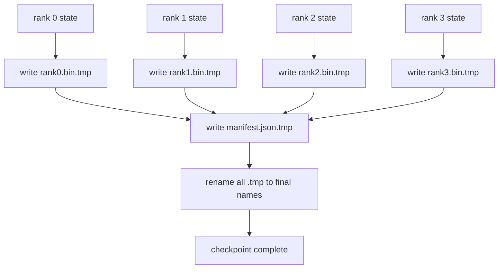

# Sharded Checkpoint and Atomic Resume

> A 70B-parameter training job is paused by a node failure every few hours. The checkpoint format decides whether you lose 30 minutes or 30 hours. A sharded checkpoint writes every rank's shard in parallel and records ownership in a manifest. Resume loads each rank's shard from its own file, reconstructs the state on the same world size, and the optimiser steps as if nothing happened. Atomic write keeps a half-finished checkpoint from poisoning the next resume.

**Type:** Build
**Languages:** Python
**Prerequisites:** Phase 19 Track C lessons 42-49
**Time:** ~90 min

## Learning Objectives

- Save a multi-rank checkpoint as a per-rank shard file plus a manifest that records which rank owns what.
- Use the atomic write pattern (write to a temp path then rename) so a crash mid-write never produces a half-finished checkpoint.
- Resume from the manifest, verifying byte-equal state for both fp16 parameters and the ZeRO optimiser state on every rank.
- Defend the manifest schema against the three failure modes: world-size change, shard count mismatch, and partial write.

## The Problem

A vanilla checkpoint reads all parameters and optimiser state into rank 0, gathers, and writes a single file. For a 70B model that is 1.1 TB of state through one rank's network port. The write blocks every other rank because they idle waiting for the gather. The IO bandwidth is the slowest single GPU's network link, not the aggregate. On a real cluster the gather-then-write step can take longer than the previous training hour, which means the job ships less than one checkpoint per training day.

Sharded checkpoints flip the pattern: every rank writes its own shard to its own file in parallel. The manifest records which rank owned which shard so resume can put each shard back where it came from. The aggregate write bandwidth scales with the cluster. A 1 TB checkpoint that took 4 hours through one rank takes 4 minutes through 64 ranks. Plus the manifest gives you a contract for incompatible resumes: world-size change is detectable, partial writes are detectable, and the load path can fail loudly rather than silently using stale data.

## The Concept



### Manifest schema

```json
{
  "world_size": 4,
  "step": 1234,
  "wall_clock_seconds": 4521,
  "shards": [
    {"rank": 0, "path": "rank0.bin", "sha256": "...", "param_shard_offset": 0, "param_shard_numel": 65536},
    {"rank": 1, "path": "rank1.bin", "sha256": "...", "param_shard_offset": 65536, "param_shard_numel": 65536}
  ],
  "schema_version": 1
}
```

Three fields are load-bearing. `world_size` makes a resume on a different size loudly fail rather than silently corrupt. `sha256` per shard catches partial or corrupted writes. `param_shard_offset` and `param_shard_numel` per shard let the loader reconstruct the flat parameter tensor at the correct position.

### Atomic write

The standard pattern: write every shard to `<name>.tmp`, write the manifest to `manifest.json.tmp`, fsync each, then rename. POSIX rename within the same filesystem is atomic; either the new file is fully present or the old one is. A crash before the final rename leaves the previous checkpoint as the live one. Without atomic write a crash can leave a partial shard with a present manifest that points at it, and the load corrupts the optimiser state on resume.

### Three failure modes the schema must defend against

| Failure | Symptom | Defence |
|---------|---------|---------|
| World-size change | resume on N=8 with manifest from N=4 | world_size mismatch in manifest, fail loudly |
| Shard count mismatch | resume sees fewer rank*.bin files than shards in manifest | enumerate shards, verify every one exists |
| Partial write | shard file truncated mid-flush | sha256 verification on load |

Each defence rejects the bad load early; the alternative is silent corruption that surfaces 100 steps later when loss goes to NaN.

### Why per-rank files, not one big file

Concurrent write to one file via `O_APPEND` works on POSIX for byte-aligned writes, but in practice the offsets within one shard span MB-sized regions and the locking dominates. Per-rank files have no contention and benefit from striping when the underlying filesystem is parallel (Lustre, GPFS). Production stacks (DeepSpeed, FSDP, NeMo) all use per-rank files for that reason.

## Build It

`code/main.py` implements:

- `ShardManifest` dataclass with the schema above plus `to_json`/`from_json`.
- `save_sharded(state_dict_per_rank, dir, step)` that writes every rank's binary state to its own file using the atomic temp-then-rename pattern, then writes the manifest.
- `load_sharded(dir, expected_world_size)` that reads the manifest, verifies each shard's sha256, and returns per-rank state dicts.
- A round-trip test: build per-rank state, save, load, assert byte-equal.

Run it:

```bash
python3 code/main.py
```

Output: 4 shard files plus manifest written, then reloaded with byte-equal verification.

## Production patterns in the wild

Three patterns harden the checkpoint enough to ship.

**Async write.** Production stacks issue the checkpoint write on a separate thread or process so training continues. The barrier is at next checkpoint: do not start the next save until the previous one is complete. DeepSpeed's `async_io` flag does exactly this. The lesson keeps the write synchronous so the steps are visible.

**Local fast disk first, then async upload.** Write to local NVMe (fast) then async-upload to S3 or GCS. The two-tier pattern keeps the in-cluster checkpoint fast for resume while shipping a durable copy off-cluster for archive. The manifest carries the local path; an upload manifest carries the remote path.

**Rotation matters.** Production runs keep the last K checkpoints (typically 3-5) and rotate the oldest. Without rotation the disk fills mid-run and the next checkpoint fails. With rotation the next save deletes the oldest first, freeing the budget.

## Use It

Production patterns:

- **DeepSpeed checkpointing.** `deepspeed.save_checkpoint(tag=step)` writes per-rank files and a `latest` file pointing at the active tag.
- **PyTorch FSDP checkpointing.** `torch.distributed.checkpoint` saves sharded state with a `Planner` that decides per-rank layout.
- **NeMo.** Wraps DeepSpeed and FSDP with a uniform `save_to_checkpoint` API that adds metadata.

## Ship It

Lesson 81 saves a sharded checkpoint of the end-to-end DDP+ZeRO run and reloads it on the same world size to prove the resume contract holds.

## Exercises

1. Add async write: kick off the save in a thread and let training continue. Block the next save until the previous one completes.
2. Add a `last_5_steps` rotation: keep the 5 most recent checkpoints, delete the oldest before saving a new one.
3. Add a CRC-only fast verification path for the inner-loop reload (rotation rolls a checkpoint into being the new active one without full sha256).
4. Add a cross-world-size load: shard rebalance from N=4 to N=8 by reading the manifest, concatenating, and re-sharding.
5. Add an upload to a fake S3 (a second directory) and write the upload manifest. Defend the two-tier storage policy.

## Key Terms

| Term | What people say | What it actually means |
|------|----------------|------------------------|
| Sharded checkpoint | "Per-rank save" | Each rank writes its own shard file in parallel |
| Manifest | "Index" | JSON file recording shard paths, offsets, and sha256 |
| Atomic write | "tmp then rename" | Write to .tmp then POSIX rename so a crash leaves the previous file live |
| Partial write | "Truncated shard" | A crash during write produces a corrupt shard; sha256 catches it |
| Rotation | "Keep last K" | Delete oldest checkpoint before writing new one to bound disk usage |

## Further Reading

- [DeepSpeed checkpointing](https://www.deepspeed.ai/tutorials/checkpointing/)
- [PyTorch torch.distributed.checkpoint](https://pytorch.org/docs/stable/distributed.checkpoint.html)
- [POSIX rename atomicity](https://pubs.opengroup.org/onlinepubs/9699919799/functions/rename.html)
- Phase 19 Lesson 78 - the ZeRO state this checkpoint is shaped to save
- Phase 19 Lesson 81 - the end-to-end demo round-trips the saved state
