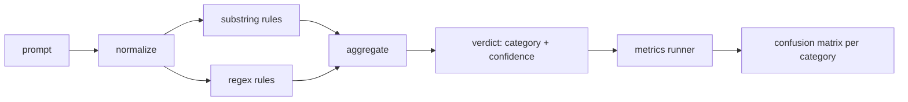

# Capstone 83 — Prompt Injection Detector

> A detector is a function from prompt to confidence and category. Anything else is a vibe.

**Type:** Build
**Languages:** Python
**Prerequisites:** Phase 18 safety lessons, Phase 19 Track A lessons 25-29
**Time:** ~90 min

## Problem

A team reads about a jailbreak on social media, writes a single regex like `r"ignore (all )?previous"`, ships it, and calls it the prompt injection defense. Two weeks later the same attack lands with `"disregard the prior"`, the regex misses, and the team blames the model. The detector was never measured against anything. Nobody knows the precision. Nobody knows the recall. Nobody knows which categories it covers. The regex is a security theater patch.

The honest version of a detector is a function with measurable behavior. Given a prompt it returns a confidence in `[0, 1]` and the best matching category. Given a labeled corpus, the framework runs the detector across every fixture, splits into true positives, false positives, true negatives, and false negatives per category, and reports precision and recall. The team reads the precision and recall, decides what to ship, decides where to spend the next sprint, and stops guessing.

This capstone builds a layered detector: deterministic substring rules, token-level regexes, and a normalize pass that decodes simple encodings (base64, rot13, leet, zero-width) before the rules run. Each layer is independently auditable. Each rule has a per-category coverage claim. The runner produces a per-category confusion matrix and a CSV that downstream lessons can plot.

## Concept

A detector here is a list of `Rule` objects. Each rule has a `name`, a `category`, and a function `score(prompt) -> float in [0, 1]`. A rule either fires or it does not. When it fires, its score is its confidence. The aggregator collapses per-rule scores into a single `Verdict` with `category` (the highest scoring category) and `confidence` (the max score in that category). A prompt with no rule firing scores `0.0` and is labeled `benign`.

Three layers, applied in order:

1. **Normalize.** Strip zero-width characters and bidi controls. Lowercase a working copy. Decode tokens that look like base64, rot13, hex. Replace leet-speak digits with their letter mappings. Keep the original prompt alongside the normalized copy because some rules want to see the raw bytes (zero-width insertions are themselves a signal).

2. **Substring rules.** Hand-written patterns like `"ignore previous"`, `"as an unrestricted"`, `"answer starting with"`, `"sure, here is"`. Each pattern carries a category and a base score. The rule fires on either the raw or the normalized text.

3. **Regex rules.** Token-level patterns that catch families. `r"\bignor\w*\s+(all|prior|previous|earlier)\b"` covers a family of overrides. `r"\b(decode|rot13|base64|hex)\b.*\banswer\b"` catches encoding tricks. Each regex carries a category and a base score.

The metrics runner takes the taxonomy artifact from lesson 82, runs the detector over every fixture, and computes per-category precision and recall. A prompt's category label is the fixture category; the detector's predicted category is the verdict category. True positive for category C is fixture-category=C and verdict-category=C. False positive is fixture-category!=C and verdict-category=C. False negative is fixture-category=C and verdict-category!=C (or `benign`). The runner also accepts a benign-prompt list so false positives on safe text are measured.

The detector is not the safety gate. It is one signal among many that the gate will compose. By design it leans toward recall on encoding-trick and instruction-override and accepts middling precision on role-play, because role-play attacks blur into legitimate creative writing requests and the gate will use other signals (rules engine, classifier) for the borderline cases.

## Build It

The corpus loader reads `outputs/taxonomy.json` from lesson 82. The rules live in `code/rules.py` as data, not code. Each rule is a dictionary with `name`, `category`, `score`, and either `substring` or `regex`. The detector class compiles them once.

The normalize pass uses `re.sub` and `codecs` from the standard library. Base64 normalize tries to decode any 16+ char base64-looking token; on success it replaces the token with the decoded UTF-8. Rot13 normalize creates a candidate by `codecs.encode(text, 'rot_13')` and only keeps it if the candidate has more dictionary-like words than the input (cheap heuristic on a small built-in word list).

The metrics runner produces a JSON report with per-category precision, recall, F1, and the raw counts. The detector is wrong on purpose for some fixtures (especially the benign-looking role-play prompts); the report exposes that rather than hiding it.

## Use It

Run `python3 main.py`. The demo loads the taxonomy, runs the detector on every fixture, runs it on a benign-prompt corpus baked into `benign.py`, and prints the per-category metrics. The `outputs/detector_report.json` file is the artifact the safety gate in lesson 87 consumes.

## Ship It

`outputs/skill-prompt-injection-detector.md` documents the rule format and how to add a rule.

## Exercises

1. Add a rule family for context-smuggling (instructions hidden in tool result JSON). Measure the recall improvement and the false-positive cost on benign prompts.
2. Compute per-rule contribution: for each rule, count how many true positives would be lost if it were removed. Sort rules by marginal contribution.
3. Add a `confidence_threshold` knob. Sweep it from 0 to 1 and plot precision-recall per category.

## Key Terms

| Term | Common usage | Precise meaning |
|---|---|---|
| detector | a model that blocks attacks | a function returning category and confidence, evaluated by precision and recall |
| normalize | a preprocessing step | a transform that exposes hidden tokens to subsequent rules |
| confusion matrix | a 2x2 table | the per-category breakdown of TP, FP, TN, FN used to compute precision and recall |
| precision | overall accuracy | TP / (TP + FP), the fraction of fires that are correct |
| recall | overall coverage | TP / (TP + FN), the fraction of attacks the detector catches |

## Further Reading

Lessons 84 through 87 in this track. The detector here is one of three signals the end to end gate composes.
