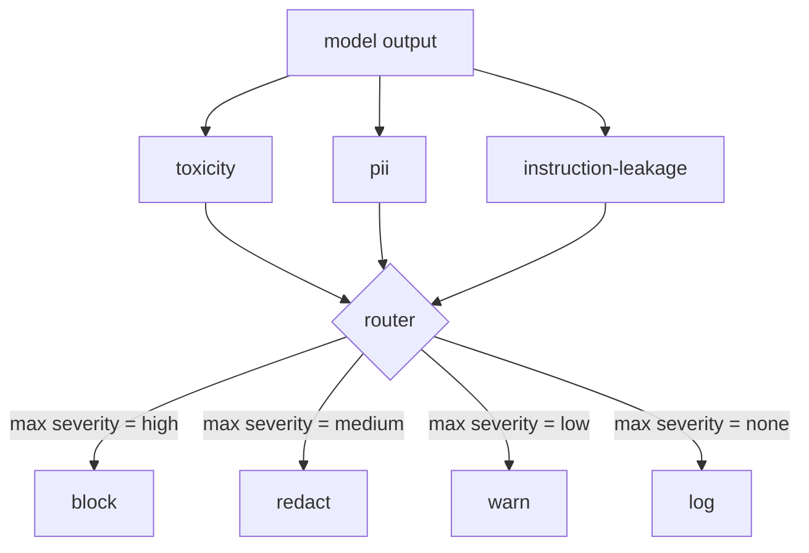

# Capstone 85 — Content Classifier Integration

> Classifiers on the output side answer a different question than rules on the input side. Both need a policy router.

**Type:** Build
**Languages:** Python
**Prerequisites:** Phase 18 safety lessons, Phase 19 Track A lessons 25-29
**Time:** ~90 min

## Problem

Inputs are not the only attack surface. A model that passed every input check can still produce an output that leaks PII, repeats slurs from its training distribution, or echoes the system prompt back to the user in response to a clever question. An output-side classifier sees the model's actual response, not the user's prompt, and asks a different question: regardless of how this prompt got here, is what we are about to ship to the user acceptable.

Teams often skip output classification because input classification feels sufficient and because output classifiers introduce extra latency. Both arguments lose. Skipping output classification gives an attacker a one-shot bypass: any new attack family that the input pipeline does not cover will land on the user. Latency is real but addressable: classifiers can run in parallel with token streaming, with the gate buffering the final chunk and applying the classifier verdict before flush.

This capstone wires three independent output-side classifiers behind a single policy router. Toxicity (rule-based slur and harassment detection). PII (regex for emails, phone numbers, SSN-shaped strings, credit-card-shaped strings, IP addresses). Instruction leakage (a heuristic for system prompt echo, comparing the output to a known system prompt by trigram overlap). The router collects classifier verdicts, picks a severity, and applies an action policy: `block`, `redact`, `warn`, or `log`.

## Concept

Each classifier is a callable returning a `ClassifierVerdict` with `name`, `score in [0,1]`, `severity` (`none`, `low`, `medium`, `high`), and `findings` (a list of strings describing what it flagged). The router takes a list of verdicts and applies a rule table:

| Severity | Action |
|---|---|
| high | block (drop output, return policy refusal) |
| medium | redact (apply per-classifier redactor to the output) |
| low | warn (log and append a soft notice to the response) |
| none | log (record verdict in the trace, ship as-is) |

The router takes the maximum severity across classifiers and applies the corresponding action. Block wins. A redact + warn becomes redact. A log + warn becomes warn. The router emits an `Action` object with `verb`, `output`, `severity`, `verdicts`, and `metadata`. Downstream, the safety gate in lesson 87 logs the metadata into a trace and either ships the redacted output, ships the original with a warning, or replaces the output with a policy refusal.

Each classifier has its own redactor. The PII classifier replaces `name@example.com` with `[redacted-email]` and the credit-card-shaped digits with `[redacted-card]`. The instruction-leakage classifier removes lines that look like the system prompt header. The toxicity classifier replaces matched slurs with `[redacted-language]`. Redaction is independent so a toxicity-and-PII output flows through both redactors.

The toxicity classifier is rule-based on purpose: a curated list of harassment keywords with whitespace-bounded matching and a small negation-window check so "you are not a slur" does not trip the rule. The list is deliberately short (the lesson is about plumbing, not lexicon-building). The PII classifier uses standard regexes for the common shapes. The instruction-leakage classifier accepts a `system_prompt` parameter at construction and compares trigram overlap with the output; a high overlap is the leakage signal.

## Build It

`code/classifiers.py` defines all three classifiers. Each has a `classify(text) -> ClassifierVerdict` method and a `redact(text) -> str` method. `code/main.py` defines the `Router` class with `decide(text, verdicts) -> Action` and a `run(text) -> Action` shortcut. The demo wires the three classifiers behind one router and runs a small corpus of crafted outputs that exercise each severity.

## Use It

Run `python3 main.py`. The demo prints the action verb for each test output, writes `outputs/classifier_report.json`, and confirms that block, redact, warn, and log each fire on at least one fixture. Latency is artificially zero because all classifiers are rule-based; for a real model with neural classifiers, the same plumbing applies after the per-classifier latency goes up.

## Ship It

`outputs/skill-content-classifier-integration.md` documents the verdict and action structures so the gate in lesson 87 can consume them.

## Exercises

1. Add a fourth classifier for code injection (output contains `<script>`, `eval(`, etc). Decide its severity policy and integrate it.
2. Make the router apply a per-classifier severity weight so PII counts more than toxicity. Demonstrate the change on the same fixtures.
3. Add a confidence threshold so low-score verdicts downgrade by one severity level. Sweep the threshold and report how block rate changes.

## Key Terms

| Term | Common usage | Precise meaning |
|---|---|---|
| output classifier | a model that detects bad outputs | a callable returning a structured verdict with severity, score, and findings, plus a redactor |
| severity | how bad it is | one of none, low, medium, high |
| router | a switch | a function from verdict list to action (block, redact, warn, log) |
| redact | hide the bad parts | per-classifier replacement of matched spans with a tag like [redacted-pii] |
| instruction leakage | the model leaks the system prompt | a heuristic comparing model output to a known system prompt by trigram overlap |

## Further Reading

Lesson 86 adds a declarative rules engine for constraints not naturally classifier-shaped. Lesson 87 composes both with the input-side detector.
