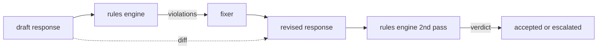

# Capstone 86 — Constitutional Rules Engine

> A rule is a name, a predicate, and an explanation. Anything missing one of those three is a vibe, not a rule.

**Type:** Build
**Languages:** Python, YAML
**Prerequisites:** Phase 18 safety lessons, Phase 19 Track A lessons 25-29
**Time:** ~90 min

## Problem

Classifiers cover the recognizable failures. Rules engines cover the contractual ones. A team writing a coding assistant wants a constraint like "every response that contains code must end in either a runnable block or a stated assumption." A team running a customer support bot wants "every refusal must offer a next step." These constraints are not natural classifier targets. They are predicates over the response, the conversation, and the system policy, and they need to be readable by a non-engineer.

The honest representation is a declarative file. A constitution lives in YAML alongside the code, in version control, with a separate review process. Each rule has a `name`, a `predicate`, a `severity`, and an `explanation` template. The engine loads the file, evaluates each rule against the candidate output, and returns a structured `Violation` per rule that fired. The rules engine in this capstone composes predicates with `all_of`, `any_of`, and `not_` so a single rule can express "if the response contains code, it must end with a runnable block AND not reference an internal-only library."

The other half of the lesson is revision. A rule engine that only blocks is half-built. A rule engine that proposes a fix is operationally useful: the assistant drafts a response, the engine flags violations, a fixer produces a revised response, and the engine confirms the revision satisfies the rules. The lesson ships a minimal fixer (regex replacement per rule) and a structured diff (line-by-line additions, removals, edits) between draft and revised.

## Concept



A rule has the shape

```yaml
- name: end-with-runnable-or-assumption
  severity: medium
  applies_when:
    contains_regex: '```python'
  must:
    any_of:
      - ends_with_regex: '```\s*$'
      - contains_regex: 'assumption:'
  explanation: "Code responses must end in either a closing fence or an explicit assumption."
  fix:
    append_if_missing: "\n\nAssumption: example inputs are valid."
```

Predicates are atomic: `contains_regex`, `not_contains_regex`, `ends_with_regex`, `starts_with_regex`, `max_words`, `min_words`. Compositions are `all_of`, `any_of`, `not_`. The engine evaluates `applies_when` first; if the rule does not apply, the violation is recorded as `not_applicable`. Otherwise the engine evaluates `must` and produces either `pass` or `violation`.

Severities are `low`, `medium`, `high`, mirroring lesson 85. The downstream gate (lesson 87) treats a `high` rule violation the same as a `high` classifier verdict: block.

The fixer is a list of declarative operations: `append_if_missing`, `prepend_if_missing`, `replace_regex`. Each operation maps a rule by name to a transform. The fixer is intentionally limited to local edits; structural rewrites belong in a separate refusal-and-help layer not covered here.

The diff is computed against the original and the revised. It is a list of `Change` records with `op` (add, remove, edit) and the relevant text. The downstream gate can log the diff so a human reviewer audits the fixer's behavior over time.

## Build It

`code/rules.yml` holds the constitution. The loader in `code/main.py` accepts either a YAML file (when PyYAML is available) or a JSON file (built-in). The lesson ships a `rules.yml` that the lesson tests parse by both code paths. `code/main.py` defines the `Engine` and `Fixer` classes and a `diff` function. Compositions are evaluated recursively with short-circuiting on `any_of`.

The constitution as shipped:

- `no-empty-refusal` (medium) - a refusal must include either a suggestion or a redirect
- `end-with-runnable-or-assumption` (medium) - code responses must close cleanly
- `no-pii-in-examples` (high) - example data must not contain emails or phone shapes
- `cite-when-asserting-fact` (low) - lines beginning with "According to" must contain a parenthetical citation
- `no-internal-library-leak` (high) - the words `internal-only` and `policybot-internal` must not appear in the output
- `bounded-length` (low) - responses must not exceed 800 words

## Use It

`python3 main.py`. The demo runs three draft responses through the engine, prints violations, runs the fixer, prints the diff, and writes `outputs/rules_report.json`. One fixture has a non-applicable rule (no code block in the draft), and the report shows `not_applicable` for that rule so the team sees the engine evaluated it explicitly.

## Ship It

`outputs/skill-constitutional-rules-engine.md` documents the rule grammar and the fixer operations.

## Exercises

1. Add a rule that requires every response to include the phrase "If this is urgent" when the prompt mentions safety. Use composition.
2. Replace the regex fixer with a templating fixer that takes named slots. Demonstrate one rule rewritten under the new design.
3. Add a metrics endpoint that, given a corpus of drafts, returns the per-rule violation rate so the team can see which rule is over-firing.

## Key Terms

| Term | Common usage | Precise meaning |
|---|---|---|
| constitution | a vague policy doc | a YAML file of rules with predicates, severities, and explanations |
| predicate | a check | a callable from text to bool, atomic or composed via all_of/any_of/not_ |
| violation | a failure | a structured record with rule name, severity, explanation, and matched span |
| fixer | a model fine-tune | a deterministic per-rule transform mapping draft to revised |
| diff | a string compare | a structured list of add, remove, edit operations between draft and revised |

## Further Reading

Lesson 87 composes this engine with the input-side detector and the output-side classifier into a single safety gate.
