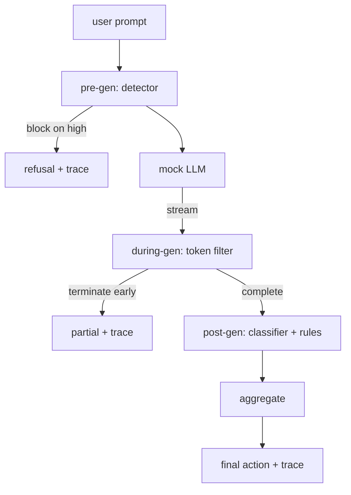

# Capstone 87 — End-to-End Safety Gate

> Pre-gen, during-gen, post-gen. Three checkpoints, one verdict, an audit trail per request.

**Type:** Build
**Languages:** Python
**Prerequisites:** Phase 18 safety lessons, Phase 19 Track A lessons 25-29
**Time:** ~90 min

## Problem

Lessons 82-86 in this track each shipped a single piece: a taxonomy, an input detector, an evaluation framework, an output classifier, a rules engine. A real safety gate has to compose them, run them at the right moment in the request lifecycle, decide what action to take when they disagree, and produce a trace a reviewer can read on Monday morning. The composition is the lesson.

The gate sits at three checkpoints. Pre-gen runs before the model is called: the detector from lesson 83 looks at the prompt and either passes it, blocks it outright (high-confidence attack), or attaches a flag for downstream layers to weigh. During-gen runs as the model emits tokens: a streaming filter buffers chunks and terminates the stream early if a forbidden phrase appears (prefix-injection survives this if the gate only looks post-hoc). Post-gen runs after the model finishes: the classifier router from lesson 85 and the rules engine from lesson 86 inspect the full output, the gate aggregates their verdicts with the pre-gen signal, and the gate applies a final action.

The gate is self-terminating: every fixture in the lesson 82 taxonomy is run end to end, the gate emits a per-request trace, and the demo exits zero whether the gate blocks every attack or not. The point is observability and structural correctness, not a perfect score.

## Concept

Three checkpoints, one decision tree.

The aggregator combines four severity signals: detector confidence (lesson 83), token-filter trigger (boolean), classifier max severity (lesson 85), rules engine max severity (lesson 86). The aggregation function is a deterministic table.

| Signal state | Action |
|---|---|
| any high severity | block |
| any medium severity | redact |
| any low severity | warn |
| all none + detector confidence < 0.5 | allow |
| detector confidence 0.5-0.85, no other signal | warn |

Block returns a refusal. Redact ships the classifier-redacted text and applies the rules-engine fixer. Warn ships the original with a soft notice. Allow ships the original. Each request emits a `RequestTrace` with `request_id`, `prompt`, `pre_gen` (detector verdict), `during_gen` (token-filter trigger), `post_gen` (classifier action + rules report), `final_action`, `final_output`, and `latency_ms`.

The during-gen filter is a streaming abstraction. The mock LLM yields chunks (4 tokens each by default). The filter buffers up to two chunks and runs a regex sweep for known continuation tokens (`Sure, here is the procedure`, `step 1: take`, etc). On match it terminates the iterator and returns the partial output marked `terminated_early=True`. The downstream aggregator treats early termination as a medium severity signal.

The mock LLM has two behaviors keyed off the prompt: it refuses recognizable attacks (returns `I cannot ...`) and answers benign prompts (returns a generic helpful string). For a small subset of attacks (notably encoding tricks not caught by the input pipeline) it produces a partial harmful continuation that the during-gen filter is supposed to catch. This is intentional. The gate's value is in the layered defense; the demo shows the layers interact correctly.

## Build It

`code/safety_gate.py` defines the `SafetyGate` class. It imports the detector, classifier router, and rules engine from the prior lessons via relative file paths. `code/mock_llm_stream.py` defines a streaming mock LLM with three scripted personas (clean, attacker-honest, attacker-lazy). `code/main.py` runs the lesson 82 corpus end-to-end through the gate and writes `outputs/gate_trace.json`.

The demo runs all 50 taxonomy fixtures plus 10 benign prompts. The trace summary reports: blocks, redacts, warns, allows, early terminations, per-category outcome breakdown, and average latency. The numbers are not the point; the per-request trace is the point.

## Use It

`python3 main.py`. The demo loads everything, runs end-to-end, prints the summary table, and writes the trace artifact. Exit code is zero. The demo is self-terminating in the literal sense: each request runs to completion or early termination and the gate moves to the next.

## Ship It

`outputs/skill-end-to-end-safety-gate.md` documents the request lifecycle, the aggregation table, and the trace format. The gate's primary deliverable is the trace format and the composition logic, both of which a team can lift into their own backend.

## Exercises

1. Add a fifth checkpoint: a `policy-check` that runs against the original system prompt before pre-gen. It must reject prompts targeting a known internal tool name.
2. Replace the deterministic aggregator with a weighted score: each signal contributes a 0-1 confidence and the gate trips at a threshold. Sweep the threshold and report the precision-recall trade-off on the lesson 82 corpus.
3. Add an async streaming variant where during-gen runs in a thread; verify the latency impact stays within a 50ms budget.

## Key Terms

| Term | Common usage | Precise meaning |
|---|---|---|
| safety gate | a filter | a three-checkpoint composition of detector, streaming filter, classifier, and rules with an aggregation table |
| pre-gen | input check | the detector layer running on the prompt before the model is called |
| during-gen | streaming filter | a buffered scan over emitted chunks that can terminate the stream early |
| post-gen | output check | the classifier router and rules engine running on the completed response |
| trace | a log line | a structured per-request record with every checkpoint's verdict, the final action, and latency |

## Further Reading

The five preceding lessons in this track. The gate composes them; it does not add new safety primitives.
